# TEMI-MCBV2

TEMI-MCBV2 應用

* #### MCBV2 TEMI版本 Ardublockly ，下載:[ArdublocklyMCBV2_2024-01-17_00.06.7z](https://drive.google.com/file/d/16wYj615pZL6utVNvYcV8ZWpc-PMTv89q/view?usp=drive_link)
* #### MCBV2 TEMI版本 arduino-1.8.19，下載:[arduino-1.8.19.7z](https://drive.google.com/file/d/1gBT4O8TjW2iJ1k9kBNFgxLv_6CsR1o17/view?usp=drive_link)

### [基礎_點亮LED燈 積木程式練習](基礎_點亮LED燈/)

### [基礎_DC直流馬達控制 積木程式練習](基礎_DC直流馬達控制/)

### [基礎_S50伺服馬達 積木程式練習](基礎_S50伺服馬達/)

### [基礎_連接PS2無線搖桿控制器](基礎_連接PS2無線搖桿控制器/)

### [專題_PS2無線搖桿控制小龍舟](專題_PS2無線搖桿控制小龍舟/)

### [專題_PS2無線搖桿控制T1智能賽車(T1)](專題_PS2無線搖桿控制T1智能賽車(T1)/)

### [專題_PS2無線搖桿控制TBOT小車](專題_PS2無線搖桿控制TBOT小車/)

## 適用TEMI協會之MCBV2電路板硬體

### MCBV2 電路板硬體簡介

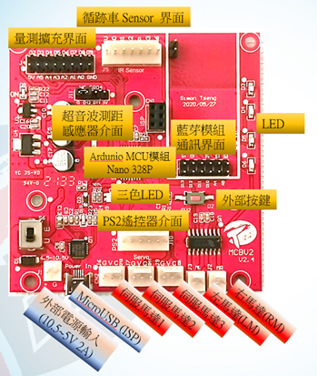

### 電路板相關介面功能:

► R、G、B三色LED燈
► 2軸DC有刷馬達驅動，輸入最大電壓DC10.5V
► 3個伺服馬達控制介面(與HC SR-02共用接腳)
► SPI BUS、PS2搖桿介面
► HC SR-04 超音波介面(與伺服馬達控制介面共用接腳)
► 循跡用紅外線 反射式光遮斷器介面，5個類比輸入
► HC-06藍芽模組介面(UART)

#### 電路板、電路圖

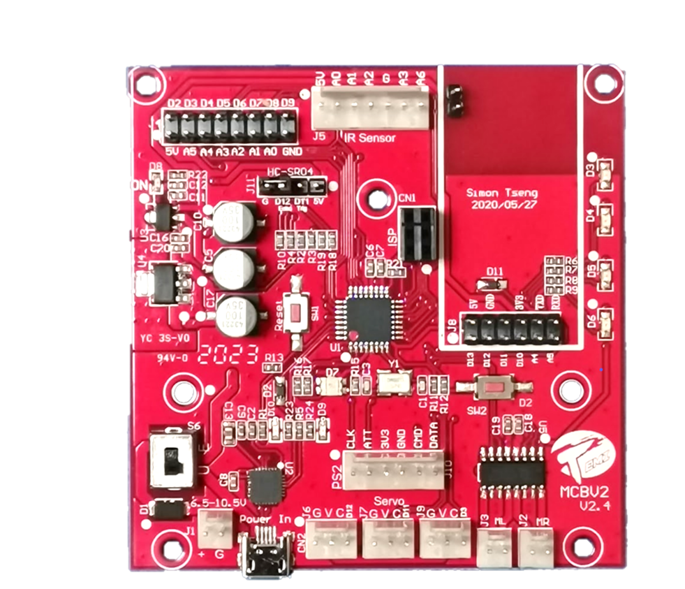

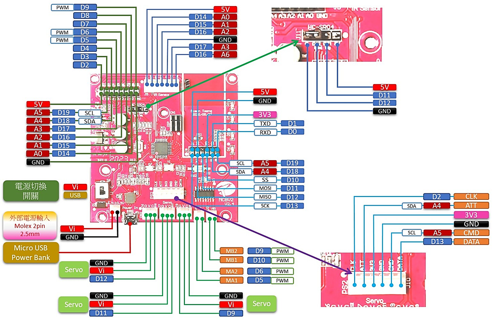

#### MCU區塊

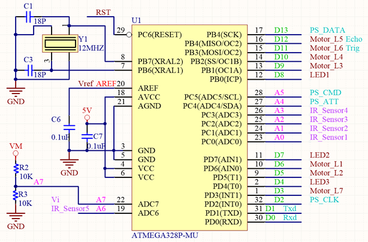

► R、G、B三色LED燈
LED-R : D4
LED-G : D7
LED-B : D8

► 2軸DC有刷馬達驅動，輸入最大電壓DC10.5V
右馬達: D9、D10
左馬達: D6、D5

► 3個伺服馬達控制介面(與HC SR-02共用接腳)
伺服馬達 J9: D3
伺服馬達 J7: D11  (共用Trig)
伺服馬達 J6: D12  (共用Echo)

► SPI BUS、PS2搖桿介面
PS_Att:  D18
PS_CLK:  D2  (與按鍵共用)
PS_CMD:  D13
PS_Data: D19

► HC SR-04 超音波介面(與伺服馬達控制介面共用接腳)
Echo:  D12  (共用伺服馬達 J6)
Trig:  D11  (共用伺服馬達 J7)

► 紅外線循跡感測模組介面
循跡用紅外線 反射式光遮斷器介面，5個類比輸入
IR_Sensor1:  A0
IR_Sensor2:  A1
IR_Sensor3:  A2
IR_Sensor4:  A3
IR_Sensor5:  A6

► 按鍵(SW2)
按鍵(SW2):  D2 (共用 PS2_CLK)

► HC-06藍芽模組介面(UART)
UART_TXD:  D1 # 與USB COM Port連接再一起 #
UART_RXD:  D0 # 與USB COM Port連接再一起 #

### 馬達驅動

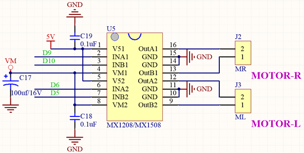

### 紅外線循跡感測模組介面

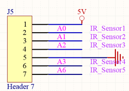

### RGB LED及PS2搖桿介面

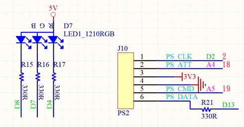

### HC-SR04超音波測距模組介面(部分訊號與伺服馬達共用)

### 伺服馬達介面(部分訊號與超音波測距模組共用)

### 藍芽模組擴充介面

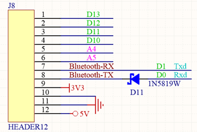

### 量測擴充介面

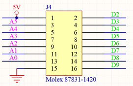

## 工作軟體環境需求

### 電腦及軟體作業系統

✧ MS WIN10/11 以上版本
✧ 下載後，使用7Z軟體，解壓縮檔案，解壓縮後的路徑，不可以有中文字

適用於MCBV2電路板的 下載 [Ardublockly](https://drive.google.com/file/d/16wYj615pZL6utVNvYcV8ZWpc-PMTv89q/view?usp=drive_link)

Ardublockly 需搭配對應的Arduino IDE，才能將積木程式轉換成Arduino 程式後，編譯下載到MCBV2電路板
適用於MCBV2電路板的下載 [Arduino IDE](https://drive.google.com/file/d/1gBT4O8TjW2iJ1k9kBNFgxLv_6CsR1o17/view?usp=drive_link)
修改自GOOGLE Ardublockly，新增許多積木，以符合在MCBV2 電路板的應用所需，增加的部分，包含感測器、RTOS函數、串列介面應用、PS2無線搖桿、內建藍芽韌體，WIFI連線功能，外接LORA通訊模組，OLED顯示等。

[相關的範例及說明檔案下載](https://drive.google.com/drive/folders/1OZ5nXLAvp6lubVa2kGSBstIZNfhJXf_o?usp=drive_link)

TEMI協會將Ardublockly搭配 Arduino應用所需要的程式庫已經安裝整合，避免程式開發過程中，缺少程式庫或電路板設定錯誤，無法順利執行。

下載並解壓縮Ardublockly及Arduino IDE。解壓縮後可以修改目錄名稱，但路徑不要有中文字，不要將程式解壓縮於桌面。

建議
路徑為: C:\ ardublockly 及 C:\arduino-1.8.19

# 啟動及設定Ardublockly

下載並解壓縮Ardublockly，可修改目錄名稱，但路徑不要有中文字，不要將程式解壓縮於桌面。

利用檔案總管，點擊開啟Ardublockly 目錄

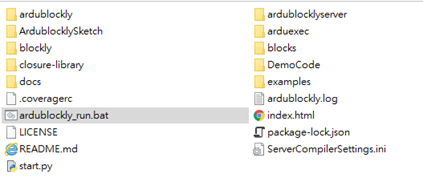

點選啟動 ardublockly_run.bat:

Image

正常啟動軟體出現畫面：

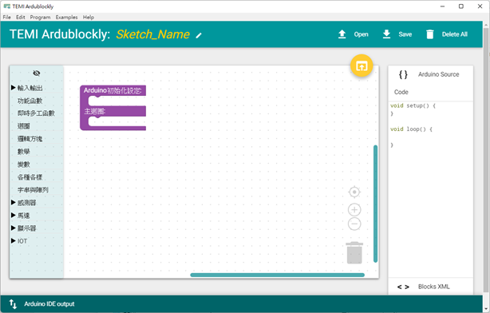

#### 偏好設定(EDIT--> Preference --> Setting)

　必須設定選用正確的Ａrduino IDE(arduino.exe)當作Compiler及正確的電路板TEMI MCBV2，如果選擇錯誤表示使用錯誤的版本，那產生的Arduino程式碼將無法正確編譯下載至MCBV2電路板中運行。

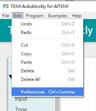

#### Ardublockly軟體版面介紹

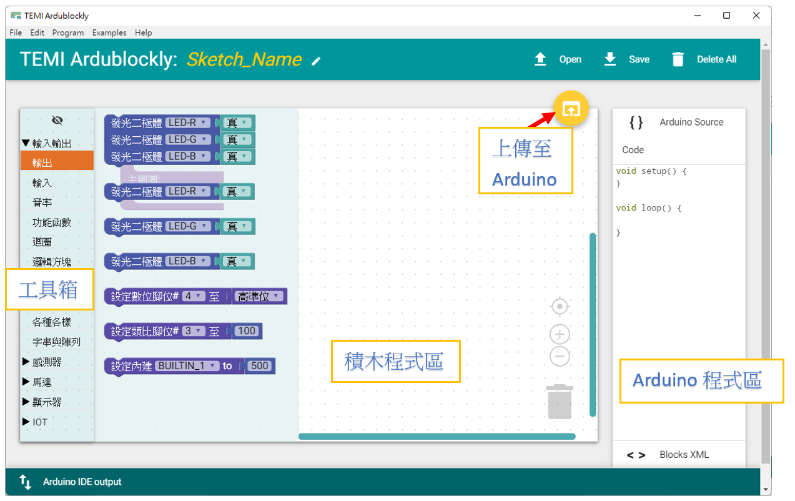

### 工具箱: 提供創作程式所需要的積木

積木程式區: 創作積木程式的工作平台
滑鼠於積木程式區:
左鍵在積木上按下，可拖曳積木;左鍵在沒有積木的位置按下，可拖曳積木程式區平台。
左鍵在積木上按下，可拖曳積木;左鍵在沒有積木的位置按下，可拖曳積木程式區平台。
右鍵在積木上按下，在所選的積木出現黃色框下拉視窗工作表，可選用對應動作。

複製: 複製所選的積木
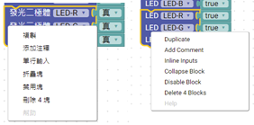

添加注釋: 非程式的說明文字，用來註解程式的功能

單行輸出/外部輸出

摺疊塊/展開塊

禁用塊/啟用塊

會移除積木的Arduino程式碼，但不移除積木，用於偵錯。

刪除 ? 塊，也可利用DEL鍵刪除塊

### 上傳至Arduino IDE

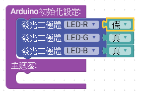

請點選此符號，啟動開啟Arduino IDE程式，並將原始碼同時上傳到Arduino IDE
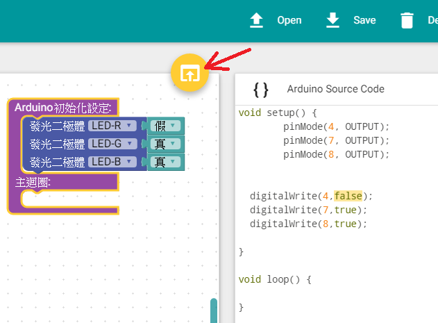

當滑鼠移動至符號上方，變成藍色，點擊啟動。

如果點選Image沒有啟動Ａrduino IDE時，表示偏好設定(EDIT--> Preference --> Setting)中的Compiler Locations設定錯誤或未設定選擇正確的arduino.exe
目前TEMI協會版本的Arduino IDE,底色為黑色，如果開啟的Arduino IDE底色為白色時，表示載入的版本有誤。
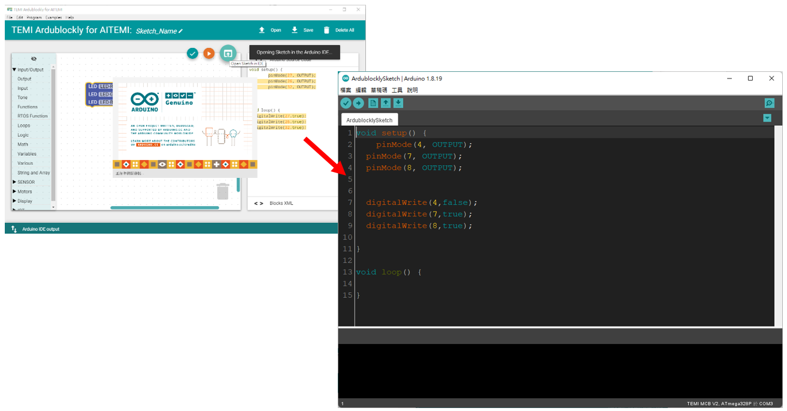

<a href="LED_R.xml">下載積木程式檔 LED_R.xml</a>

## 設定Arduino IDE及編譯上傳程式碼至MCBV2

### 設定Arduino IDE及編譯上傳程式碼至MCBV2

設定Arduino IDE環境
點選功能表 工具

開發板 : “TEMI MCBV2”

序列埠: “COM3” <-- 當電腦USB埠插接MCBV2電路板時，需要安裝USB COM埠的驅動程式，當驅動正確時，會出現對應的埠號。

第五項中的序列埠，必須確認實驗板 USB埠與電腦的USB埠正確連接，並且對應到正確的序列埠編號。
確認方式，可將實驗板 USB線拔除重新點擊工具，觀察序列埠消失哪一個COM編號，重新接上實驗板 USB線，重新點擊工具，觀察序列埠增加哪一個COM編號，消失擊增加的COM編號為實驗板 USB連接到電腦正確的序列埠編號。如果經過一輪插拔
動作，序列埠並沒有增減，表示實驗板USB COM埠在您的電腦中，沒有正確驅動。

arduino-1.8.19\drivers\CP210x_6.7.4 目錄下提供實驗板USB COM埠的驅動程式，請自行參考WIN10 作業系統，硬體驅動的流程。

於桌面，滑鼠移到Image符號上方，點擊滑鼠右鍵🡪 出現系統功能表 點擊 裝置管理員，如果實驗板USB COM埠驅動正確，於連接埠可看到 Silicon Labs CP210x…(COM ?) 裝置，同理插拔實驗板USB線時會出現，消失裝置。
如果插拔都沒有任何裝置變動，表示USB線可能是充電非提供傳輸用途。
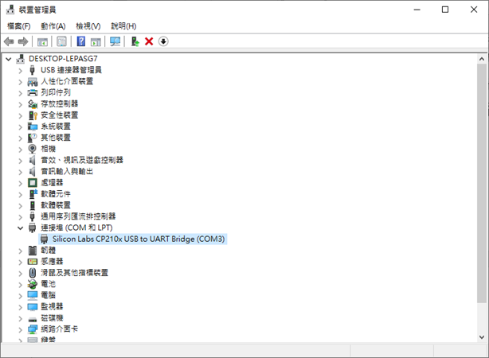

當設定都正確，則可編譯及上傳程式到實驗板上運行。
點擊Arduino IDE中的向右箭頭符號，”上傳”

此時Arduino IDE將進行程式編譯，如過程式碼正確，編譯完成後則啟動上傳燒錄到實驗板上。

#### 檔案 🡪 偏好設定

由於程式碼可能錯誤，建議變更設定Arduino IDE的工作環境。

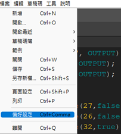

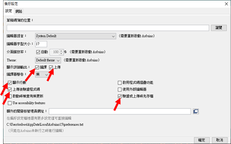

請於箭頭處點選打勾

編譯，編譯過程中，輸出編譯訊息或錯誤訊息，以利Debug

上傳，上傳燒錄過程中的訊息，上傳成功或失敗，避免沒有燒錄訊息，搞不清楚燒錄狀況。

顯示行數，顯示原始碼的行號。

上傳後驗證程式碼，上傳燒錄完成後，送出Reset訊號。

驗證或上傳時先存檔，Arduino IDE環境設定一次後，就會記憶於系統中，下次重新啟動時，會參考。

驗證上傳後，關閉Arduino IDE，因為Ardublockly於每次上傳動作時，會重新開Arduino IDE，並不會自動關閉之前開啟的程序。
