# 說明

 利用MCBV2電路板連接DC直流馬達，控制馬達正反轉，正轉1秒後，反轉1秒，週期運作。

# 馬達控制
## 直流馬達驅動電路
直流有刷馬達，利用電刷將直流電源導入馬達轉子中的線圈，線圈根據電流方向，產生磁場NS與馬達上的定子磁鐵的NS極產生吸引或排斥現象，因此使馬達轉子發生旋轉運動，當轉子上NS極轉到與定子的SN極附近時，因轉子轉動，使電刷接觸到的線圈換到下一組，又轉換磁場位置，吸引轉子繼續轉動。
當提供給轉子線圈的電流越大，產生的磁場也越強，此時吸引力越大，使轉子轉動的速度變大，電流越小，則轉速越小。
當利用電壓，改變轉速時，因電流增加，因電刷切換到不同線圈時，電刷會因此產生火花，減少電刷壽命，並產生熱。當電流大時，產生更大的熱能，常使電刷或電極燒毀。
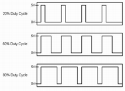
控制馬達轉速，尚可利用PWM(脈波寬調變)，利用不同的工作週期，使線圈得到不同的電流平均值，因此等效產生不同的磁場強度，達到調速的方法。

直流有刷馬達改變馬達旋轉方向，相當簡單，只要電流方向改變，產生的磁場也改變方向，轉動方向也改變。

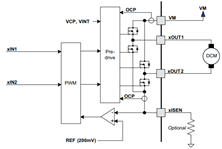

常用直流馬達驅動IC來驅動馬達。DRV8833是TI公司生產的直流馬達電橋驅動IC。內部利用Low side 2個N通道POWER MOSFET開關，及High side 2個P通道POWER MOSFET開關所組成的電橋電路，輸入兩相控制訊號，使xOUTBOT 與xOUT2之間，產生電位差，控制馬達輸入電流方向，改變旋轉方向。MCBV2使用MX1208或MX1508 DC馬達驅動IC，動作原理與DRV8833相同。使用腳位編號: 5、6、9、10
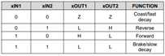
## 直流馬達轉速與正反轉控制
TEMI MCBV2電路板，MX1508直流馬達驅動IC，耐壓DC11.5V，建議輸入電壓不要高於DC10.5V，提供2個DC馬達驅動介面，定義成左馬達(ML)及右馬達(MR)。左馬達控制腳與MCU D5、D6連接，右馬達控制腳與MCU D9、D10連接。以直流馬達控制小車動作來定義積木方塊的功能。
前進、後退、左旋、向右轉、向右退、向左轉、向左退、右旋、停車等9個動作模式。
如果馬達轉向相反，請對調積木中馬達驅動通道A或B的腳位編號或反接馬達訊號線。
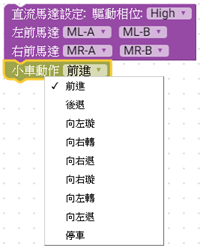
 
 具 PWM 輸入引數之馬達控制積木，可設定PWM數值，控制馬達轉速。
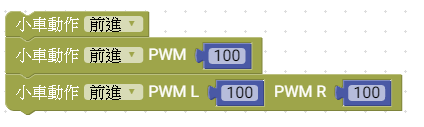

* #### 當啟動伺服馬達時，右馬達將失去PWM控制的功能，僅剩下開或關，前進或後退，無法控制速度。

# 電路圖

## MCBV2馬達驅動說明

1. 馬達5V供電, 耐壓9.5V, 最大2A
2. 可使用PWM 改變工作週期，控制改變馬達耗電流的平均值，進而改變轉速
3. 可接2顆馬達，可控制DC TT馬達正反轉及停止
4. 使用腳位編號: D9、D10，D6、D5共2組。
5. BDC有刷馬達，控制電刷供電相位，可控制馬達正反轉

## MCBV2電路板馬達驅動介面電路
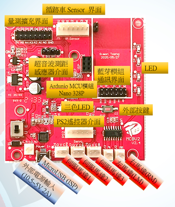
電路板連接埠配置
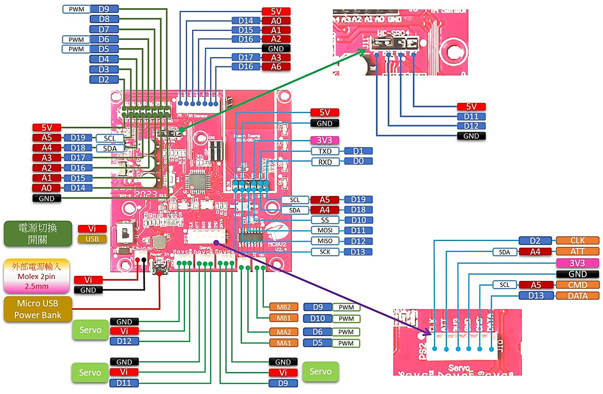
電路板連接埠對應的腳位

## MCBV2電路板馬達驅動介面的位置
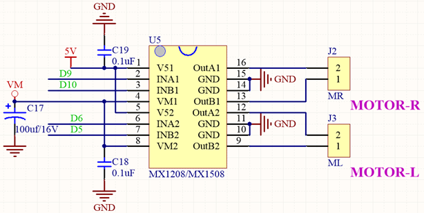

MCBV2一共有2個DC有刷馬達的驅動介面，使用2 pin 2.54mm Molex連接2顆TT直流馬達，做為小車的動力驅動來源，連接埠名稱分別是ML、MR 小車左、右馬達。

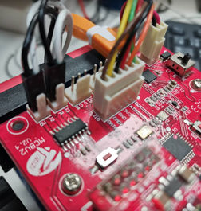

* ### 請注意，練習馬達驅動程式時，必須切換使用外接電源，避免馬達動作時，使USB電流暴衝，損壞。
# Ardublockly 編輯積木程式

*** 注意先把 小車架高，避免練習馬達驅動，造成小車墜落損壞

## 練習一 控制 馬達前進後退
用滑鼠點選工具箱，組裝積木，先令左右馬達前進1秒然後後退1秒。
程式初始化階段，設定馬達介面，程式主迴圈，令小車前進1秒後退1秒，用來測試馬達接線。
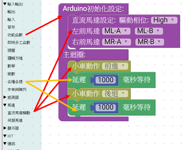
### 直流馬達驅動積木

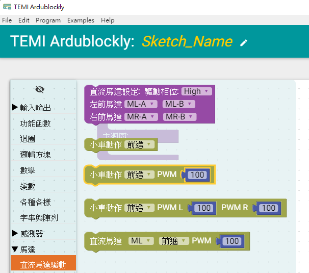
#### 工具列 -> 馬達 -> 直流馬達驅動

### 選擇直流馬達設定方塊放入初始化設定
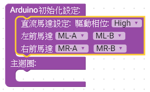
將紫色驅動馬達積木拖曳到Arduino初始化設定即可，積木中馬達驅動腳位預設已經設定正確，可以不用更改，如發生馬達轉向錯誤，則對調錯誤的馬達驅動的A、B腳位

### 選擇直流馬達動作方塊
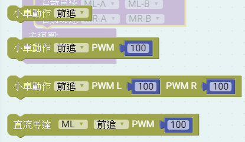
馬達動作積木，分成2軸積木或單軸積木，選用時請注意。
積木後方帶PWM參數的，表示可以對馬達進行PWM調速，數值介於0~255之間，但當數值太小時，馬達可能無法轉動，通常設定的數值大約大於70以上，可以動作。

"直流罵達 ML 前進 PWM 100"積木，他是單馬達動作積木。

### 將方塊放進回圈內，並加入延遲方塊
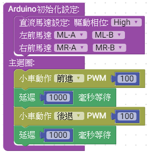
控制馬達動作指令的時間，每一個指令需要動作時間才能達到目的。
<a href="MotorCtrl01.xml">下載積木程式檔 MotorCtrl01.xml</a>

# Arduino IDE上傳到MCBV2電路板

## 在Ardublockly編輯好程式後，點擊上傳到Arduino IDE

### Ardublockly原始程式

  小車馬達連續正反轉1秒的 Arduino 原始程式碼:

<pre><code>
#include "DCMotor.h"  // 使用TEMI版 2軸DC馬達程式庫
#define _DCMotorPWM_Phase 1

DCMotor Motor = DCMotor(_DCMotorPWM_Phase); //建立馬達物件 Motor

void setup() { // Arduino 初始化設定
      //Setup Motor// 如果馬達動作相反，則在錯誤的軸 正負腳位對調
    Motor.setMotorL(5, 6);  //ML 馬達的連接腳位
    Motor.setMotorR(10, 9); //MR 馬達的連接腳位

}

void loop() { // Arduino 主迴圈
  	Motor.Forward(100);  //  Motor  馬達正轉，PWM=100
  delay(1000);           //  延遲1000毫秒(mS)
  	Motor.Reverse(100);  //  Motor  馬達反轉，PWM=100
  delay(1000);           //  延遲1000毫秒(mS)

}

</code></pre>

* 馬達持續正反轉
* 驅動馬達時，因電流大，需要外接電源，請勿直接使用電腦的USB供電，避免電流暴衝
* 使用 小車進行練習時，請將小車墊高，避免馬達動作時，小車發生暴走跌落
