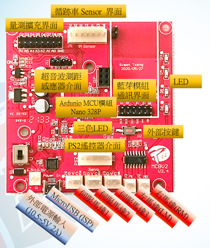
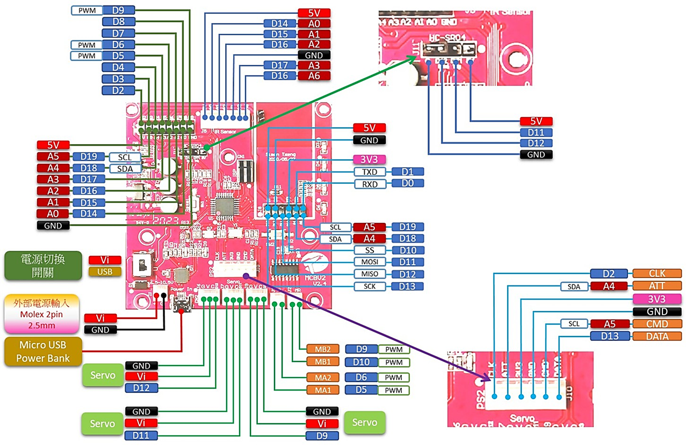
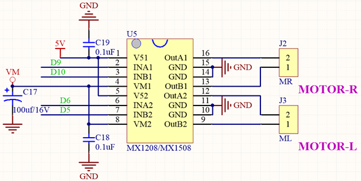
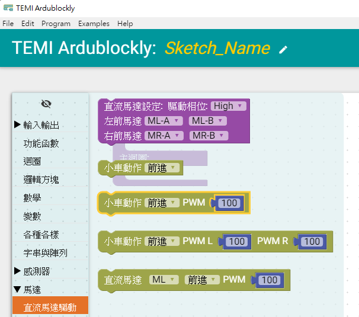
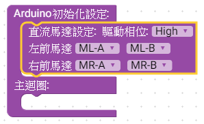
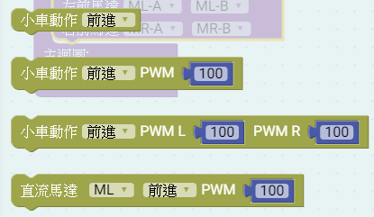
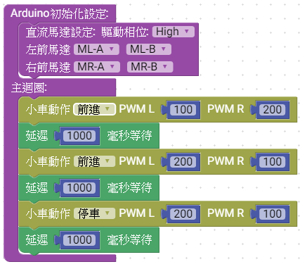

# 說明

 利用MCBV2電路板連接DC直流馬達，控制馬達正反轉，正轉1秒後，反轉1秒，週期運作。
# 電路圖

## MCBV2馬達驅動說明

1. 馬達5V供電, 耐壓9.5V, 最大2A
2. 可使用PWM 改變工作週期，控制改變馬達耗電流的平均值，進而改變轉速
3. 可接2顆馬達，可控制DC TT馬達正反轉及停止
4. 使用腳位編號: D9、D10，D6、D5共2組。
5. BDC有刷馬達，控制電刷供電相位，可控制馬達正反轉

## MCBV2電路板馬達驅動介面電路

電路板連接埠配置

電路板連接埠對應的腳位

## MCBV2電路板馬達驅動介面的位置

MCBV2一共有2個DC有刷馬達的驅動介面，使用2 pin 2.54mm Molex連接2顆TT直流馬達，做為小車的動力驅動來源，連接埠名稱分別是ML、MR 小車左、右馬達。

# Ardublockly 編輯積木程式

*** 注意先把 小車架高，避免練習馬達驅動，造成小車墜落損壞

## 練習一 控制 馬達前進後退

### 直流馬達驅動積木

#### 工具列 -> 馬達 -> 直流馬達驅動

### 選擇直流馬達設定方塊放入初始化設定

將紫色驅動馬達積木拖曳到Arduino初始化設定即可，積木中馬達驅動腳位預設已經設定正確，可以不用更改，如發生馬達轉向錯誤，則對調錯誤的馬達驅動的A、B腳位

### 選擇直流馬達動作方塊

馬達動作積木，分成2軸積木或單軸積木，選用時請注意。
積木後方帶PWM參數的，表示可以對馬達進行PWM調速，數值介於0~255之間，但當數值太小時，馬達可能無法轉動，通常設定的數值大約大於70以上，可以動作。

"直流罵達 ML 前進 PWM 100"積木，他是單馬達動作積木。

### 將方塊放進回圈內，並加入延遲方塊

利用左右馬達不同PWM數值方式，說明PWM調速，如上程式，小車將左扭右扭方式前進。
控制馬達動作指令的時間，每一個指令需要動作時間才能達到目的。
<a href="MotorCtrl02.xml">下載積木程式檔 MotorCtrl02.xml</a>

# Arduino IDE上傳到MCBV2電路板

## 在Ardublockly編輯好程式後，點擊上傳到Arduino IDE

### Ardublockly原始程式

  小車馬達運動 Arduino 原始程式碼:

<pre><code>
#include "DCMotor.h"  // 使用TEMI版 2軸DC馬達程式庫
#define _DCMotorPWM_Phase 1

DCMotor Motor = DCMotor(_DCMotorPWM_Phase); //建立馬達物件 Motor

void setup() { // Arduino 初始化設定
      //Setup Motor// 如果馬達動作相反，則在錯誤的軸 正負腳位對調
    Motor.setMotorL(5, 6);  //ML 馬達的連接腳位
    Motor.setMotorR(10, 9); //MR 馬達的連接腳位

}

void loop() {   // Arduino 主迴圈
  	Motor.Forward(100,200); //  Motor  馬達正轉，左PWM=100，右PWM=200
  delay(1000);           //  延遲1000毫秒(mS)
  	Motor.Forward(200,100);  //  Motor  馬達正轉，左PWM=200，右PWM=100
  delay(1000);           //  延遲1000毫秒(mS)
  	Motor.Stop(200,100);  //  Motor  馬達停止，PWM沒作用
  delay(1000);           //  延遲1000毫秒(mS)

}

</code></pre>

* 馬達持續正轉
* 驅動馬達時，因電流大，需要外接電源，請勿直接使用電腦的USB供電，避免電流暴衝
* 使用 小車進行練習時，請將小車墊高，避免馬達動作時，小車發生暴走跌落
