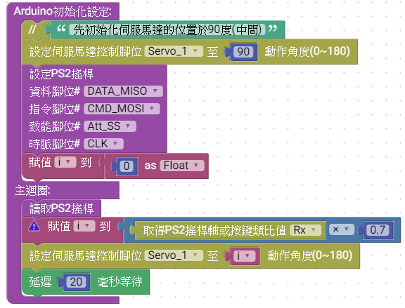

# 說明
     MCBV2 連接S50標準伺服馬達。
*  **練習1.控制命令90度位置，再轉向至0度，再轉向至180度**
*  **練習2.承上練習，改成Servo1、Servo2、Servo3函數，分別控制3個伺服馬達**
*  **練習3.利用PS2搖桿，按鍵控制伺服馬達轉向**

## 5V伺服馬達Servo Motor
因為伺服電機具有回饋訊號控制，與藉由輸入脈沖訊號頻率，相位等，經解碼回饋控制轉速、角度或機構位置。標準型5V伺服馬達，為控制軸心角度，控制範圍0~180度。

#### ► 使用標準型伺服馬達時，請注意不要使用外力直接旋轉軸心，避免損壞伺服馬達內部機構。
#### ► 當機構及伺服馬達動作角度還沒定位前，請勿組裝鎖定。

## MCBV2 伺服馬達連接埠
MCBV2電路板，MCU連接埠為D12、D11及D3，使用前請注意，在硬體部分D12、D11與超音波測距模組介面共用，無法同時使用兩者周邊裝置。

## 電路板電路圖

如上圖所示，MCBV2電路板，一共有3個伺服馬達的接頭
* Sevo1連接MCU的D3
* Sevo2連接MCU的D11,與HC-SR04共用Trig
* Sevo3連接MCU的D12,與HC-SR04共用Echo
#### ► 使用伺服馬達時，請將MCBV2板子上 HC-SR04接頭上的短路器移除

### 電路板外觀

由左至右，分別是 D12(Servo_3)、D11(Servo_2)、D3(Servo_1)

# Ardublockly 編輯積木程式
## 相關積木

MCBV2電路板，MCU連接埠為D12、D11及D3，使用前請注意，在硬體部分D12、D11與超音波測距模組介面共用，無法同時使用兩者周邊裝置。
  **工具列=>馬達=>伺服馬達**

## 練習1.控制命令90度位置，再轉向至0度，再轉向至180度
### 積木程式

如上圖，將S50伺服馬達與MCBV2電路板的Servr_2連接

組裝積木程式，於Arduino 初始化設定，將伺服馬達初始設定在90度位置
於主迴圈，組裝伺服馬達動作
* **請注意設定正確的Servo編號**,<a href="Servo_1.xml">下載積木程式檔 Servo_1.xml</a>

### Arduino IDE上傳到MCBV2電路板

在Ardublockly編輯好程式後，點擊上傳到Arduino IDE，編譯上傳燒錄到MCBV2電路板

**控制命令90度位置，再轉向至0度，再轉向至180度 Arduino 原始程式碼:**
<pre><code>
#include <Servo.h>  //載入伺服馬達程式庫

Servo myServo11;    // 宣告一個伺服馬達物件，名稱為 myServo11

void setup() {
  myServo11.attach(11);  //myServo11伺服馬達物件連接到D11腳

  // "先初始化伺服馬達的位置於90度(中間)"
  myServo11.write(90); 

}

void loop() {
  myServo11.write(90); // "令伺服馬達的位置於90度(中間)"
  delay(1000);         // 給伺服馬達移動的時間
  myServo11.write(0);  // "令伺服馬達的位置於0度"
  delay(1000);         // 給伺服馬達移動的時間 
  myServo11.write(180);  // "令伺服馬達的位置於180度"
  delay(1000);         // 給伺服馬達移動的時間

}
</code>
</pre>

* **由於0度與180度是伺服馬達動的極限值(不同型號有不同的極限)，故於伺服馬達動移動至極限值0度或180度位置附近，馬達會抖動比較嚴重**
* **伺服馬達，上電後不可以外力使其轉動(會使齒輪崩壞)**

## 練習2.承上練習，改成Servo1、Servo2、Servo3函數，分別控制3個伺服馬達
### 積木程式

如上圖，將S50伺服馬達與MCBV2電路板的Servo_1、Servo_2、Servo_3連接
組裝Servo1,Servo2,Servo3函數
組裝積木程式，於Arduino 初始化設定，將伺服馬達初始設定在90度位置
於主迴圈，呼叫Servo1,Servo2,Servo3

* **請注意設定正確的Servo編號**,<a href="Servo_2.xml">下載積木程式檔 Servo_2.xml</a>

### Arduino IDE上傳到MCBV2電路板

在Ardublockly編輯好程式後，點擊上傳到Arduino IDE，編譯上傳燒錄到MCBV2電路板

**改成Servo1、Servo2、Servo3函數，分別控制3個伺服馬達 Arduino 原始程式碼:**
<pre><code>
#include <Servo.h>  //載入伺服馬達程式庫

Servo myServo3;  //建立myServo3伺服馬達物件
Servo myServo11;  //建立myServo11伺服馬達物件
Servo myServo12;  //建立myServo12伺服馬達物件

// 描述該功能...
void Servo1() {
  myServo3.write(90);
  delay(1000);
  myServo3.write(60);
  delay(1000);
  myServo3.write(120);
  delay(1000);
}

// 描述該功能...
void Servo3() {
  myServo12.write(90);
  delay(1000);
  myServo12.write(60);
  delay(1000);
  myServo12.write(120);
  delay(1000);
}

// 描述該功能...
void Servo2() {
  myServo11.write(90);
  delay(1000);
  myServo11.write(60);
  delay(1000);
  myServo11.write(120);
  delay(1000);
}

void setup() {
  myServo3.attach(3);
  myServo11.attach(11);
  myServo12.attach(12);

  // "先初始化伺服馬達的位置於90度(中間)"
  myServo3.write(90);
  myServo11.write(90);
  myServo12.write(90);

}

void loop() {
  Servo1();
  Servo2();
  Servo3();

}
</code>
</pre>

* **60度與120度位置，馬達會抖動比較不明顯**
* **呼叫Servo1()-->Servo2()-->Servo3()每個函數都有延遲3秒，故馬達動作一個循環為9秒**

## 練習3.利用PS2的右搖桿X軸 ，控制Servo_1伺服馬達
### 積木程式

如上圖，將S50伺服馬達與MCBV2電路板的Servo_1連接,並連接好PS2無線無線搖桿
組裝積木程式，於Arduino 初始化設定，將伺服馬達初始設定在90度位置，並初始化PS2搖桿
新增一個folat型別的i變數，用來轉換PS2 RX軸的數據 0~255轉換成 0~180
於主迴圈，呼叫讀取PS2搖桿，換算PS2 RX軸的數據 0~255轉換成 0~180(大約是0.7倍)
將i傳給伺服馬達物件
延遲20mS給馬達及PS2搖桿動作

* **請注意設定正確的Servo編號**,<a href="Servo_3.xml">下載積木程式檔 Servo_3.xml</a>

### Arduino IDE上傳到MCBV2電路板

在Ardublockly編輯好程式後，點擊上傳到Arduino IDE，編譯上傳燒錄到MCBV2電路板

**利用PS2的右搖桿X軸 ，控制Servo_1伺服馬達 Arduino 原始程式碼:**
<pre><code>
#include <Servo.h>     //載入伺服馬達程式庫
#include  <PS2X_lib_temi.h>  //載入 PS2搖桿程式庫

float i;   //建立一個 i變數
PS2X ps2x; // create PS2 Controller Class
byte  ps2x_vibrate = 0;

Servo myServo3;

void setup() {
  myServo3.attach(3);
  ps2x.config_gamepad(2, 19, 18, 13, 0, 0);  //Setup PS2 Remote controller

  // "先初始化伺服馬達的位置於90度(中間)"
  myServo3.write(90);
  i = (float)(0);

}

void loop() {
      ps2x.read_gamepad(0, ps2x_vibrate);  //DualShock Controller
  i = ps2x.Analog(PSS_RX) * 0.7;  //轉換數據
  myServo3.write(i);              //輸出到伺服馬達
  delay(20);                      //延遲20mS 

}
</code>
</pre>

