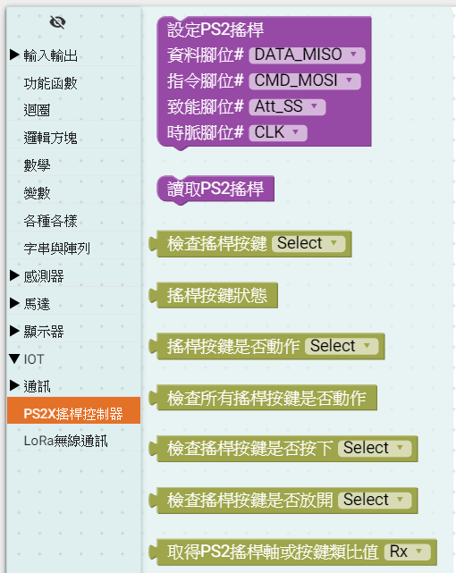

## 說明

    利用MCBV2的PS2 連接埠，與無線PC2 搖桿接收器連接，韌體驅動PS2搖桿後，定時讀取PS2搖桿接收器，讀取間隔時間大約16mS(每秒低於60次)以獲取遠端搖桿的按鍵與左右搖桿XY軸的數據。
	第一個練習驅動PS2搖桿後定時讀取數據後，判斷按下的按鍵，如果 UP方向鍵按下時，點亮紅色LED燈；
	第二個練習承上，改判斷三角形按鍵(綠色)按下時點亮綠色LED燈,判斷圓形按鍵(紅色)按下時點亮紅色LED燈,判斷X形按鍵(藍色)按下時點亮藍色LED燈；
	第三個練習承上，撰寫一個函數，將左右搖桿的XY數據，輸出到電腦的COM埠上；
	第四個練習承上，撰寫函數，將左右搖桿的XY數據，控制MCBV2的DC直流馬達驅動埠，利用左搖桿的XY數據，控制控制 小車，前進、後退、左轉、右轉....等功能
## 電路圖

### MCBV2 MCU區塊

### MCBV2 LED電路

電路中使用RGB共陽極之三色LED燈，
R、G、B LED的陽極連接330 歐姆的電阻，與MCBV2 MCU的 D4、D7、D8連接

故韌體程式令D4、D7、D8其中一腳輸出低準位(0、LOW、false)，即可使對應的LED亮。
其中:
紅色LED燈為LED_R ，接於D4
綠色LED燈為LED_G ，接於D7
藍色LED燈為LED_B ，接於D8

### MCBV2 PS2 搖桿介面電路

PS2遙桿Dongle使用DC3.3V電源，通訊協定使用4PIN通訊腳，PS_ATT為通訊致能腳，當PS_ATT(A4、D18)=Low，啟動通訊，PS_CLK(D2)為資料同步脈衝，PS_CMD(A5、D19)為MCU 的指令資料輸出腳，PS_DATA(D13)為PS2遙桿Dongle的資料輸出腳。
PS2搖桿內部使用MCU或ASIC處理晶片，讀取按鍵及搖桿軸需要時間，主機端不能一直訪問搖桿，訪問至少間隔16mS，讓搖桿接收器處裡收發遠端搖桿的數據。

PS_CLK  :   D2
PS_Att  :   D18
PS_CMD  :   D19
PS_Data :   D13
  
###  
* **無線PS2搖桿與MCBV2連接**

PS2無線搖桿接收器與MCBV2電路板，利用連接器串接起來，接線與插接接收器時，須注意腳位方向，錯誤的方向，會使接收器燒毀。

 

## PS2搖桿積木與操作
* **無線PS2搖桿積木**

無線PS2搖桿積木，於工具列 ==> IOT ==> 通訊 ==> PS2X搖桿控制器中，首先使用"設定PS2搖桿"，驅動MCBV2與PS2接收器連接，再使用"讀取PS2搖桿"獲取最新的搖桿狀態，最後利用檢查的積木，取出搖桿對應的按鍵或軸的數據，進行操作。

## 讀取PS2X Game PAD(協議通訊)

PS2無線搖桿接收器在Arduino初始化設定區塊，驅動MCBV2與接收器連接的腳位，使用預設即可。主迴圈安排讀取PS2積木，每次讀取後，需要延遲一段時間(大約16ms)，讓PS2搖桿接收器有時間與遠端的搖桿通訊，取得最新的狀態。

<a href="PS2_1.xml">下載積木程式檔 PS2_1.xml</a>

讀取PS2X Game PAD, Arduino 原始程式碼:

<pre><code>
#include  <PS2X_lib_temi.h>  // TEMI協會修改版本，PS2搖桿程式庫

PS2X ps2x; // create PS2 Controller Class //建立ps2x物件
byte  ps2x_vibrate = 0;  //ps2x搖桿振動變數，預設0不振動

void setup() {
  // 設定ps2x物件，輸入引數為接收器與MCBV2連接的腳位	
  ps2x.config_gamepad(2, 19, 18, 13, 0, 0);  //Setup PS2 Remote controller

}

void loop() {
      ps2x.read_gamepad(0, ps2x_vibrate);  //DualShock Controller//讀取PS2搖桿接收器的數據
  delay(16); //延遲16毫秒，給PS2接收器與搖桿通訊

}
</code></pre>

## 練習
### 第一個練習驅動PS2搖桿後定時讀取數據後，判斷按下的按鍵，如果 UP方向鍵按下時，點亮紅色LED燈

當讀取PS2搖桿後，即可利用取得的數據，判斷遠端PS2搖桿是否按下UP按鍵，當按下UP按鍵按下時，UP按鍵數據為1，反之為0，故當UP按鍵數據為1時，點亮紅色LED燈，否則則關閉紅色LED燈。處裡PS2搖桿的數據後，延遲16毫秒，給PS2搖桿接收器與搖桿通訊。

<a href="PS2_2.xml">下載積木程式檔 PS2_2.xml</a>

PS2搖桿控制紅色LED燈亮滅 Arduino 原始程式碼:

<pre><code>
#include  <PS2X_lib_temi.h>  // TEMI協會修改版本，PS2搖桿程式庫

PS2X ps2x; // create PS2 Controller Class //建立ps2x物件
byte  ps2x_vibrate = 0;  //ps2x搖桿振動變數，預設0不振動

void setup() {
  // 設定ps2x物件，輸入引數為接收器與MCBV2連接的腳位	
  ps2x.config_gamepad(2, 19, 18, 13, 0, 0);  //Setup PS2 Remote controller

  	pinMode(4, OUTPUT);
	pinMode(7, OUTPUT);
	pinMode(8, OUTPUT);

  	pinMode(4, OUTPUT);
  //初始化設定 LED燈，不亮
  digitalWrite(4,true);  //共陽極，給HIGH 不亮
  digitalWrite(7,true);
  digitalWrite(8,true);

}

void loop() {
      ps2x.read_gamepad(0, ps2x_vibrate);  //DualShock Controller//讀取PS2搖桿接收器的數據
  if (ps2x.Button(PSB_PAD_UP)) { // 判斷PS2搖桿數據，如果UP按鍵為1
    digitalWrite(4,false );      //    點亮紅色LED燈(共陽極，給LOW亮)
  } else {                       // 否則
    digitalWrite(4,true );      //    關閉紅色LED燈  
  }
  delay(16);                    //延遲16毫秒，給PS2接收器與搖桿通訊

}

</code></pre>

### 第二個練習承上，改判斷三角形按鍵(綠色)按下時點亮綠色LED燈,判斷圓形按鍵(紅色)按下時點亮紅色LED燈,判斷X形按鍵(藍色)按下時點亮藍色LED燈
 

當取得PS2搖桿接收器的數據後，判斷遠端PS2搖桿是否按下UP按鍵，當按下圓(紅)按鍵、三角形(綠)按鍵、X(藍)按鍵按下時，分別控制RGB 三色LED燈。

<a href="PS2_3.xml">下載積木程式檔 PS2_3.xml</a>

PS2搖桿控制R、G、B LED燈 Arduino 原始程式碼:

<pre><code>
#include  <PS2X_lib_temi.h>  // TEMI協會修改版本，PS2搖桿程式庫

PS2X ps2x; // create PS2 Controller Class //建立ps2x物件
byte  ps2x_vibrate = 0;  //ps2x搖桿振動變數，預設0不振動

void setup() {
  ps2x.config_gamepad(2, 19, 18, 13, 0, 0);  //Setup PS2 Remote controller

  	pinMode(4, OUTPUT);
  	pinMode(7, OUTPUT);
  	pinMode(8, OUTPUT);
}

void loop() {
      ps2x.read_gamepad(0, ps2x_vibrate);  //DualShock Controller
  if (ps2x.Button(PSB_CIRCLE)) {// 判斷PS2搖桿數據，如果CIRCLE按鍵為1
    digitalWrite(4,false );
  } else {
    digitalWrite(4,true );
  }
  if (ps2x.Button(PSB_TRIANGLE)) { // 判斷PS2搖桿數據，如果TRIANGLE按鍵為1
    digitalWrite(7,false );
  } else {
    digitalWrite(7,true );
  }
  if (ps2x.Button(PSB_CROSS)) {  // 判斷PS2搖桿數據，如果CROSS按鍵為1
    digitalWrite(8,false );
  } else {
    digitalWrite(8,true );
  }
  delay(16);

}

</code></pre>

由於PS2按鍵各自獨立有自己的數據，故三色LED燈可獨自控制亮滅，按鍵按下與釋放的組合，可控制LED燈有紅、綠、藍、黃、青、紫、白7種顏色的變化。

## 第三個練習承上，撰寫一個函數，將左右搖桿的XY數據，輸出到電腦的COM埠上

當取得PS2搖桿接收器的數據後，左、右側搖桿，分別是X及Y方向的可變電阻的位置數據。

其數據的範圍為0~255
X軸由左至右數據0~255變化，中間值為127
Y軸由上至下數據0~255變化，中間值為127
XY軸，可同時動作，依據位置拆解出X、Y值。

由於X、Y的數據是根據位置不同，數據動態變化，故本練習使用序列埠物件來將數據傳送到電腦以利觀察，並且建立一個 SerialPrintXY函數，來處理搖桿數據。

序列埠的通訊協定為500K BPS。

<a href="PS2_4.xml">下載積木程式檔 PS2_4.xml</a>

PS2搖桿左側X、Y軸數據傳送到電腦， Arduino 原始程式碼:

<pre><code>
#include  <PS2X_lib_temi.h>  // TEMI協會修改版本，PS2搖桿程式庫

PS2X ps2x; // create PS2 Controller Class //建立ps2x物件
byte  ps2x_vibrate = 0;  //ps2x搖桿振動變數，預設0不振動

// Describe this function...
void SerialPrintXY() {   //SerialPrintXY 函數
  // "輸出搖桿值"
  Serial.print(" LX:");                  // 序列埠傳送 " LX:" 字串
  Serial.print((ps2x.Analog(PSS_LX)));   // 序列埠PSS_LX軸數據(左X 0~255)
  Serial.print("       LY:");            // 序列埠傳送 "       LY:" 字串
  Serial.print((ps2x.Analog(PSS_LY)));   // 序列埠PSS_LY軸數據(左Y 0~255)
  Serial.print("      RX:");             // 序列埠傳送 "      RX:" 字串
  Serial.print((ps2x.Analog(PSS_RX)));   // 序列埠PSS_RX軸數據(右X 0~255)
  Serial.print("      RY:");             // 序列埠傳送 "      RY:" 字串
  Serial.println((ps2x.Analog(PSS_RY))); // 序列埠PSS_RY軸數據(右X 0~255)，並送出換行符號
}

void setup() {
  ps2x.config_gamepad(2, 19, 18, 13, 0, 0);  //Setup PS2 Remote controller

  Serial.begin(500000);   // 設定序列埠使用500000BPS來收發資料
}

void loop() {
      ps2x.read_gamepad(0, ps2x_vibrate);  //DualShock Controller
  SerialPrintXY();  // 呼叫SerialPrintXY函數
  delay(20);

}
</code></pre>

#### 編譯上傳程式到MCBV2電路板之後，啟動Arduino 的序列埠監控視窗

啟動後，點選 500000 bund

#### 可觀察收到PS2搖桿的左右搖桿的數據

#### 當改變PS2搖桿的左右搖桿的數據位置時，可觀察到數據變化。

## 第四個練習承上，撰寫函數，將左右搖桿的XY數據，控制MCBV2的DC直流馬達驅動埠，利用左搖桿的XY數據，控制控制 小車，前進、後退、左轉、右轉....等功能

### 定義PS2搖桿控制  小車運動方向

在操作PS2搖桿時，由於機構的關係，在搖桿中間區域，存在一些搖桿已經推動，但搖桿數據沒有變化的
死區，在搖桿上下，左右極限區域也同樣存在死區，為了讓搖桿控制 小車能夠更明確，如下表所示

將搖桿X、Y數據，個切割成3的區塊分別是左、中、右與上、中、下等，於是在搖桿操作範圍中，切割出9個動作區塊，以X、Y組合，分別是中上、中中、中下(X為中)，左上、左中、左下(X為左)，右上、右中、右下(X為右)，如將這九個區域，對應到電腦鍵盤數字鍵區的1~9。

修改上表，對應控制 的功能如下

* **對應數字 1、2、3，分別是左退、後退與右退；**
  
  插入控制 小車的積木，條件判斷式根據Y軸數據，當Y數據大於200時，即為Y軸處於下半區域數字1、2、3的位置，在判斷X軸的數值，X小於50時為左部(1)，X大於2000時為右部(3)，反之為中間(2)。
* **對應數字 7、8、9，分別是左轉、前進與右轉；**
  
    插入控制 小車的積木，條件判斷式根據Y軸數據，當Y數據小於50時，即為Y軸處於上半區域數字7、8、9的位置，在判斷X軸的數值，X小於50時為左部(7)，X大於2000時為右部(9)，反之為中間(8)。
* **對應數字 4、5、6，為停車；**

插入控制 小車的積木，條件判斷式根據Y軸數據，當Y數據介於50～200時，即為Y軸處於中間區域數字4、5、6的位置，在判斷X軸的數值，X小於50時為左部(4)，X大於2000時為右部(6)，反之為中間(5)。
### 完整的積木程式

<a href="PS2_5.xml">下載積木程式檔 PS2_5.xml</a>

PS2搖桿控制  小車 Arduino 原始程式碼:

<pre><code>
#include  <PS2X_lib_temi.h>

#include "DCMotor.h"
#define _DCMotorPWM_Phase 1

PS2X ps2x; // create PS2 Controller Class
byte  ps2x_vibrate = 0;
DCMotor Motor = DCMotor(_DCMotorPWM_Phase);

// 描述該功能...
void CheckRXY() {
  if (ps2x.Analog(PSS_RY) <= 50) {
    // "上部789"
    if (ps2x.Analog(PSS_RX) <= 50) {
      // "左部"
      	Motor.RightForward(100);
    } else if (ps2x.Analog(PSS_RX) >= 200) {
      // "右部"
      	Motor.LeftForward(100);
    } else {
      // "中部"
      	Motor.Forward(100);
    }
  } else if (ps2x.Analog(PSS_RY) >= 200) {
    // "下部123"
    if (ps2x.Analog(PSS_RX) <= 50) {
      // "左部"
      	Motor.RightReverse(100);
    } else if (ps2x.Analog(PSS_RX) >= 200) {
      // "右部"
      	Motor.LeftReverse(100);
    } else {
      // "中部"
      	Motor.Reverse(100);
    }
  } else {
    // "中部456"
    if (ps2x.Analog(PSS_RX) <= 50) {
      // "左部"
      	Motor.Stop(100);
    } else if (ps2x.Analog(PSS_RX) >= 200) {
      // "右部"
      	Motor.Stop(100);
    } else {
      // "中部"
      	Motor.Stop(100);
    }
  }
}

void setup() {
  ps2x.config_gamepad(2, 19, 18, 13, 0, 0);  //Setup PS2 Remote controller

  Serial.begin(500000);
      //Setup Motor
    Motor.setMotorL(5, 6);
    Motor.setMotorR(10, 9);

}

void loop() {
      ps2x.read_gamepad(0, ps2x_vibrate);  //DualShock Controller
  CheckRXY();
  delay(16);

}
</code></pre>

### 利用左右搖桿控制小車，左搖桿快，右搖桿慢

<a href="PS2_6.xml">下載積木程式檔 PS2_6.xml</a>

PS2搖桿控制小車，左右搖桿不同車速 Arduino 原始程式碼:

<pre><code>
#include  <PS2X_lib_temi.h>

#include "DCMotor.h"
#define _DCMotorPWM_Phase 1

PS2X ps2x; // create PS2 Controller Class
byte  ps2x_vibrate = 0;
DCMotor Motor = DCMotor(_DCMotorPWM_Phase);

// 描述該功能...
void CheckRXY() {
  if (ps2x.Analog(PSS_RY) <= 50) {
    // "上部789"
    if (ps2x.Analog(PSS_RX) <= 50) {
      // "左部"
      	Motor.RightForward(100);
    } else if (ps2x.Analog(PSS_RX) >= 200) {
      // "右部"
      	Motor.LeftForward(100);
    } else {
      // "中部"
      	Motor.Forward(100);
    }
  } else if (ps2x.Analog(PSS_RY) >= 200) {
    // "下部123"
    if (ps2x.Analog(PSS_RX) <= 50) {
      // "左部"
      	Motor.RightReverse(100);
    } else if (ps2x.Analog(PSS_RX) >= 200) {
      // "右部"
      	Motor.LeftReverse(100);
    } else {
      // "中部"
      	Motor.Reverse(100);
    }
  } else {
    // "中部456"
    if (ps2x.Analog(PSS_RX) <= 50) {
      // "左部"
      	Motor.Left(100);
    } else if (ps2x.Analog(PSS_RX) >= 200) {
      // "右部"
      	Motor.Right(100);
    } else {
      // "中部"
      CheckLXY();
    }
  }
}

// 描述該功能...
void CheckLXY() {
  if (ps2x.Analog(PSS_LY) <= 50) {
    // "上部789"
    if (ps2x.Analog(PSS_LX) <= 50) {
      // "左部"
      	Motor.RightForward(255);
    } else if (ps2x.Analog(PSS_LX) >= 200) {
      // "右部"
      	Motor.LeftForward(255);
    } else {
      // "中部"
      	Motor.Forward(255);
    }
  } else if (ps2x.Analog(PSS_LY) >= 200) {
    // "下部123"
    if (ps2x.Analog(PSS_LX) <= 50) {
      // "左部"
      	Motor.RightReverse(255);
    } else if (ps2x.Analog(PSS_LX) >= 200) {
      // "右部"
      	Motor.LeftReverse(255);
    } else {
      // "中部"
      	Motor.Reverse(255);
    }
  } else {
    // "中部456"
    if (ps2x.Analog(PSS_LX) <= 50) {
      // "左部"
      	Motor.Left(255);
    } else if (ps2x.Analog(PSS_LX) >= 200) {
      // "右部"
      	Motor.Right(255);
    } else {
      // "中部"
      	Motor.Stop(255);
    }
  }
}

void setup() {
  ps2x.config_gamepad(2, 19, 18, 13, 0, 0);  //Setup PS2 Remote controller

  Serial.begin(500000);
      //Setup Motor
    Motor.setMotorL(5, 6);
    Motor.setMotorR(10, 9);

}

void loop() {
      ps2x.read_gamepad(0, ps2x_vibrate);  //DualShock Controller
  CheckRXY();
  delay(16);

}
</code></pre>

