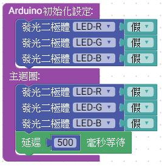
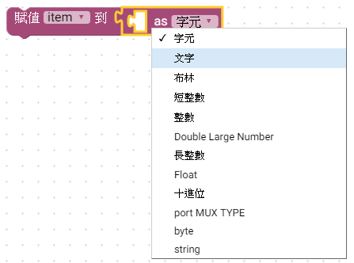
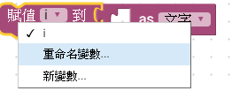
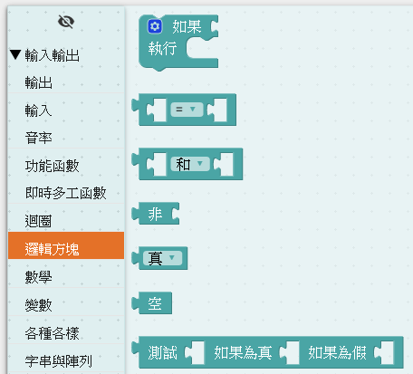
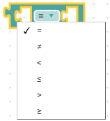
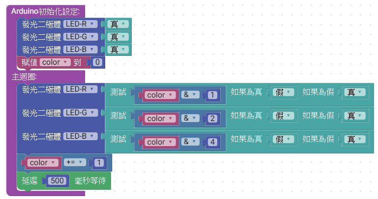

# 2_LED燈7種顏色變化說明

MCBV2 電路板，三色LED燈，積木程式利用一個byte型別的變數(color)，當主迴圈每次一個循環時，遞增color變數。

*color變數的bit0的狀態，對應輸出控制紅色LED燈(LED_R)
*color變數的bit1的狀態，對應輸出控制綠色LED燈(LED_G)
*color變數的bit2的狀態，對應輸出控制藍色LED燈(LED_B)

## 電路圖

電路中使用RGB共陽極之三色LED燈，
R、G、B LED的陽極連接330 歐姆的電阻，與MCBV2 MCU的 D4、D7、D8連接

故韌體程式令D4、D7、D8其中一腳輸出低準位(0、LOW、false)，即可使對應的LED亮。
其中:
紅色LED燈為LED_R ，接於D4
綠色LED燈為LED_G ，接於D7
藍色LED燈為LED_B ，接於D8

## Ardublockly 編輯積木程式

### 拖曳三色LED積木及時間延遲積木

拖曳積木，利用Windows 熱鍵 "Ctrl + C" 複製 及 "Ctrl + V" 貼上功能，加速產生重複的積木

### 拖曳變數積木

變數積木在工具列中，
，取出變數數值；
 賦予變數數值；
，賦予變數特定型別的數值；
 ，賦予變數特定型別有字元(char),文字串(string)；布林(bool)....，為C++語言中常用的資料型態。

在變數名稱上，按下滑鼠左鍵，可將變數重新命名或產生新的變數，此練習選擇 "新變數"後，重新命名變數名稱。

 ==> 

### 拖曳邏輯方塊積木

為條件判斷式積木，點選齒輪

拖曳可以增加判斷選項

數值比較積木，可以更改比較的條件，比較輸出布林值結果(true 或 false)真(1)或假(0)

布林邏輯運算

測試方程式輸出對應結果值<== 此練習使用

## 完整的積木程式

#### 儲存積木程式

"Save" 為儲存積木程式，"Open" 為開啟積木程式檔案。
設定存檔檔名為"<a href="LED_RGB_7.xml">LED_RGB_7.xml</a>"

## 上傳積木程式至Arduino IDE

，符號變成籃底，點擊後，即啟動Arduino IDE，並將原始碼同步上傳到Arduino IDE中。

### 無法啟動

如果無法啟動Arduino IDE，請檢查EDIT-> preferences 中Compiler Location設定，沒有指定到正確的Arduino IDE程式。

* <a href="https://drive.google.com/file/d/1gBT4O8TjW2iJ1k9kBNFgxLv_6CsR1o17/view?usp=drive_link">Arduino IDE需要使用TEMI協會壓縮的版本,下載適用於MCBV2電路板的Arduino IDE </a>

## Arduino IDE 編譯及上傳

### 編譯及上傳

 Arduino 原始程式碼:

<pre><code>
int color;   //color全域變數

void setup() {
  	pinMode(4, OUTPUT);   //初始化驅動LED
	pinMode(7, OUTPUT);
	pinMode(8, OUTPUT);

  digitalWrite(4,true);   //初始化LED預設不亮
  digitalWrite(7,true);
  digitalWrite(8,true);
  color = 0;

}

void loop() {
  digitalWrite(4,(color & 1 ? false : true));  //判斷color變數的bit0狀態，設定LED-R
  digitalWrite(7,(color & 2 ? false : true));  //判斷color變數的bit1狀態，設定LED-G
  digitalWrite(8,(color & 4 ? false : true));  //判斷color變數的bit2狀態，設定LED-B
  color += 1;  // color變數+1
  delay(500);  //延遲0.5秒

}

</code></pre>

當上傳完成後，在Arduino IDE下部，出現"上傳完畢"訊息，以及訊息框中出現
表示設定正確，此時MCBV2電路板 紅色、綠色、黃色、藍色、紫色、青色、白色、不亮，LED燈持續 0.5秒變化

#### 如果設定正確運行，欲修改積木程式，進行下個練習時，請關閉Arduino IDE ，此時Arduino IDE 會記錄當前設定，以備下回啟動時引用。
