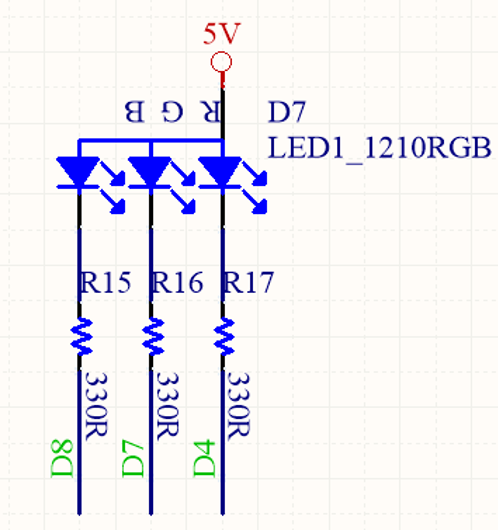
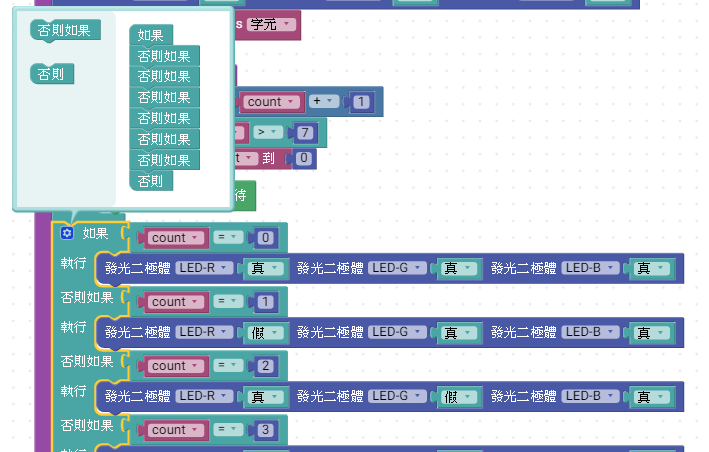

# 3_LED燈_輸出輸入練習

MCBV2 電路板，三色LED燈，積木程式利用一個byte型別的變數(color)，當主迴圈每次一個循環時，遞增color變數。

*color變數的bit0的狀態，對應輸出控制紅色LED燈(LED_R)
*color變數的bit1的狀態，對應輸出控制綠色LED燈(LED_G)
*color變數的bit2的狀態，對應輸出控制藍色LED燈(LED_B)

再利用MCBV2 電路板，按鈕開關(D2)來改變變數數值，由於機械開關動作時，會產生彈跳現象，故使用軟體技巧來達到去彈跳以及單擊等功能

## 電路圖

電路中使用RGB共陽極之三色LED燈，
R、G、B LED的陽極連接330 歐姆的電阻，與MCBV2 MCU的 D4、D7、D8連接

故韌體程式令D4、D7、D8其中一腳輸出低準位(0、LOW、false)，即可使對應的LED亮。
其中:
紅色LED燈為LED_R ，接於D4
綠色LED燈為LED_G ，接於D7
藍色LED燈為LED_B ，接於D8

SW2外部按鍵，與MCU的D2連接

## 積木程式
#### 紅色LED + 0.5亮0.5滅閃爍
#### 以[LED_R_Btn_00.xml](LED_R_Btn_00.xml)積木程式，進行擴充

### Arduino 原始程式碼:

<pre><code>
void setup() {  //初始化驅動RGB-LED與設定
  	pinMode(4, OUTPUT);
	pinMode(7, OUTPUT);
	pinMode(8, OUTPUT);

  digitalWrite(4,true);
  digitalWrite(7,true);
  digitalWrite(8,true);

}

void loop() {
  digitalWrite(4,false);   //令LED-R亮
  digitalWrite(7,true);
  digitalWrite(8,true);
  delay(500);
  digitalWrite(4,true);  //令LED-R、G、B不亮
  digitalWrite(7,true);
  digitalWrite(8,true);
  delay(500);

}

</code></pre>

#### 當按下SW2外部按鍵時，紅色LED亮，放開SW2外部按鍵時，紅色LED暗
#### 以[LED_R_Btn_01.xml](LED_R_Btn_01.xml)積木程式

### Arduino 原始程式碼:

<pre><code>
void setup() {
  	pinMode(4, OUTPUT); // 初始化驅動RGB-LED
	pinMode(7, OUTPUT);
	pinMode(8, OUTPUT);

  pinMode(2, INPUT);       // 初始化SW2連接到MCU的D2腳位為輸入
    digitalWrite(2,HIGH);  // Pull High

  digitalWrite(4,true); //初始化設定RGB-LED
  digitalWrite(7,true);
  digitalWrite(8,true);

}

void loop() {
  digitalWrite(4,digitalRead(2));   //讀取SW2按鍵的狀態，輸出至LED-R燈，按下為LOW，放開為HIGH，剛好符合LED-R亮滅的狀態
  digitalWrite(7,true); //令LED-G、B不亮
  digitalWrite(8,true);

}

</code></pre>

#### 利用條件判斷，如果執行，當按下SW2外部按鍵時，條件成立，紅色LED亮，否則放開SW2外部按鍵時，紅色LED暗
#### 以[LED_R_Btn_02.xml](LED_R_Btn_02.xml)積木程式

由於按鍵按下時，得到按鍵2狀態為0，釋放時狀態為1，為了使按下時，符合如果的執行條件，因此按鍵2輸出的數據插入"非"積木，將按鍵2狀態按下時為1，釋放時狀態為0

#### 如果執行積木: 工具列 -> 邏輯方塊 -> 如果 (點選齒輪，利用滑鼠拖曳，可擴充或縮減條件判斷式)
#### "非"積木: 工具列 -> 邏輯方塊 -> 非

### Arduino 原始程式碼:

<pre><code>
void setup() {
  	pinMode(4, OUTPUT); // 初始化驅動RGB-LED
	pinMode(7, OUTPUT);
	pinMode(8, OUTPUT);

  pinMode(2, INPUT);       // 初始化SW2連接到MCU的D2腳位為輸入
    digitalWrite(2,HIGH);  // Pull High

  digitalWrite(4,true); //初始化設定RGB-LED
  digitalWrite(7,true);
  digitalWrite(8,true);

}

void loop() {
  if (!digitalRead(2)) {  //讀取SW2按鍵的狀態(按下LOW，放開HIGH)，反相後(按下HIGH，放開LOW)，當如果判斷條件為 true(HIGH或1)時，條件成立，執行 if的陳述句，不成立則執行 else的陳述句
    digitalWrite(4,false);   //令LED-R亮
    digitalWrite(7,true);
    digitalWrite(8,true);
  } else { // else的陳述句
    digitalWrite(4,true);   // 令LED-R、G、B不亮
    digitalWrite(7,true);
    digitalWrite(8,true);
  }

}
</code></pre>

動作與LED_R_Btn_01.xml積木程式相同

#### 按鍵單擊應用
##### 利用count變數內容0~7來控制RGB-LED產生7種不同光的顏色；如果執行條件判斷式，當按下SW2外部按鍵時，使條件成立，count 變數內容+1，如果count 變數內容大於7時，令count 變數內容為0，延遲500毫秒後，才離開陳述句；利用條件判斷，如果執行，擴充6個否則如果及否則，一共8項，可以依據count 變數內容0~7，分別控制LED燈要亮的顏色

#### 以[LED_R_Btn_03.xml](LED_R_Btn_03.xml)積木程式

由於按鍵按下時，得到按鍵2狀態為0，釋放時狀態為1，為了使按下時，符合如果的執行條件，因此按鍵2輸出的數據插入"非"積木，將按鍵2狀態按下時為1，釋放時狀態為0

##### 如果執行積木: 工具列 -> 邏輯方塊 -> 如果 (點選齒輪，利用滑鼠拖曳，可擴充或縮減條件判斷式)

##### "非"積木: 工具列 -> 邏輯方塊 -> 非

#### 按鍵處裡

當按下SW2外部按鍵時，"非"使條件成立，count 變數內容+1
如果count 變數內容大於7時，令count 變數內容為0
延遲500毫秒後，才離開陳述句，因此當按下SW2外部按鍵按下時間低於0.5秒，這個程式區塊還是會等0.5秒才離開，改變LED燈的顏色，由於0.5秒才離開的緣故，程式避掉按鍵按下時，短暫發生的彈跳現象，不會發生誤動作。
當按下SW2外部按鍵按下時間高於於0.5秒時，程式延遲0.5秒後，設定LED顏色後，因按鍵尚未釋放，所以會重新執行這段程式，另count+1.....,使LED燈改變顏色，所以當SW2外部按鍵按下不放，每0.5秒，會改變一次LED燈的顏色循環下去。

#### 利用count變數，處裡LED燈顏色(如果、否則如果、否則)

利用如果、否則如果、否則來判斷count變數的內容0~7
* 如果count =0時，令LED R、G、B都不亮(暗)
* 否則如果count =1時，令LED R亮,G、B不亮(紅色)
* 否則如果count =2時，令LED G亮,R、B不亮(綠色)
* 否則如果count =3時，令LED R、G亮,B不亮(黃色)
* 否則如果count =4時，令LED B亮,R、G不亮(藍色)
* 否則如果count =5時，令LED R、B亮,G不亮(紫色)
* 否則如果count =6時，令LED B、G亮，R不亮(青色)
* 否則(由於count= 0~7，故這裡只可能是count= 7)，令LED R、G、B都全亮(白色)

### 按鍵控制LED燈7彩變化， Arduino 原始程式碼:

<pre><code>
char count;   // 註冊字元型別的count 全域變數

void setup() {
  	pinMode(4, OUTPUT); // 初始化驅動RGB-LED
	pinMode(7, OUTPUT);
	pinMode(8, OUTPUT);

  pinMode(2, INPUT);       // 初始化SW2連接到MCU的D2腳位為輸入
    digitalWrite(2,HIGH);  // Pull High

  digitalWrite(4,true); //初始化設定RGB-LED
  digitalWrite(7,true);
  digitalWrite(8,true);
  count = (char)(0);    //初始化設定count變數為0

}

void loop() {
  if (!digitalRead(2)) {   // 處裡按鍵按下時
    count = count + 1;     // count變數 +1    
    if (count > 7) {       // 當 count變數內容大於7時
      count = 0;           // 令count變數 =0
    }
    delay(500);            // 按鍵按下時，延遲0.5秒
  }
  if (count == 0) {        // 當 count變數內容=0 時
    digitalWrite(4,true);  //LED R、G、B全部不亮 
    digitalWrite(7,true);
    digitalWrite(8,true);
  } else if (count == 1) {  // 否則 當 count變數內容=1 時
    digitalWrite(4,false);  //LED R亮
    digitalWrite(7,true);
    digitalWrite(8,true);
  } else if (count == 2) {  // 否則 當 count變數內容=2 時
    digitalWrite(4,true);
    digitalWrite(7,false);  //LED G亮  ==> 綠色
    digitalWrite(8,true);
  } else if (count == 3) {  // 否則 當 count變數內容=3 時
    digitalWrite(4,false);  //LED R亮
    digitalWrite(7,false);  //LED G亮  ==> RG混色成黃色
    digitalWrite(8,true);
  } else if (count == 4) {  // 否則 當 count變數內容=4 時
    digitalWrite(4,true);
    digitalWrite(7,true);
    digitalWrite(8,false);  //LED B亮  ==> 藍色
  } else if (count == 5) {  // 否則 當 count變數內容=5 時
    digitalWrite(4,false);  //LED R亮
    digitalWrite(7,true);
    digitalWrite(8,false);  //LED B亮  ==> RB混色成紫色
  } else if (count == 6) {  // 否則 當 count變數內容=6 時
    digitalWrite(4,true);
    digitalWrite(7,false);  //LED G亮
    digitalWrite(8,false);  //LED B亮  ==> GB混色成青色
  } else {                  // 否則表示count內容不等於0~6其中之1
    digitalWrite(4,false);
    digitalWrite(7,false);
    digitalWrite(8,false);  //LED R、G、B亮  ==> RGB混色成白色
  }

}
</code></pre>

#### 按鍵單擊應用，當按鍵按下時，鎖住按鍵至放開
功能與上一個練習LED_R_Btn_03.xml積木程式相同，但原按下按鍵後，基本會延遲0.5秒，改成按下時鎖住，所以快速按鍵時，也能快速改變LED燈顏色，不受0.5秒延遲的影響

#### 以[LED_R_Btn_03B.xml](LED_R_Btn_03B.xml)積木程式

#### 與上一個按鍵處裡差異

原來延遲0.5秒的積木，改用"重複當"積木(while 迴圈)，"重複當"積木的判斷式，與如果 <-非 <-按鍵2一樣，當按鍵持續按下時，"重複當"積木條件成立，執行延遲20毫秒，由於一般按鍵按下時產生的彈跳現象，通常在20毫秒結束，故可避開。

##### "重複當"積木(while 迴圈) : 工具列 -> 迴圈 -> 重複當執行

### 按鍵控制(鎖住)LED燈7彩變化， Arduino 原始程式碼:

<pre><code>
char count;   // 註冊字元型別的count 全域變數

void setup() {
  	pinMode(4, OUTPUT); // 初始化驅動RGB-LED
	pinMode(7, OUTPUT);
	pinMode(8, OUTPUT);

  pinMode(2, INPUT);       // 初始化SW2連接到MCU的D2腳位為輸入
    digitalWrite(2,HIGH);  // Pull High

  digitalWrite(4,true); //初始化設定RGB-LED
  digitalWrite(7,true);
  digitalWrite(8,true);
  count = (char)(0);    //初始化設定count變數為0

}

void loop() {
  if (!digitalRead(2)) {   // 處裡按鍵按下時
    count = count + 1;     // count變數 +1    
    if (count > 7) {       // 當 count變數內容大於7時
      count = 0;           // 令count變數 =0
    }
    while (!digitalRead(2)) {  // while迴圈，當按鍵釋放後，條件不成立才離開
      delay(20);               // while迴圈條件成立，執行延遲20毫秒
    }
  }
  if (count == 0) {        // 當 count變數內容=0 時
    digitalWrite(4,true);  //LED R、G、B全部不亮 
    digitalWrite(7,true);
    digitalWrite(8,true);
  } else if (count == 1) {  // 否則 當 count變數內容=1 時
    digitalWrite(4,false);  //LED R亮
    digitalWrite(7,true);
    digitalWrite(8,true);
  } else if (count == 2) {  // 否則 當 count變數內容=2 時
    digitalWrite(4,true);
    digitalWrite(7,false);  //LED G亮  ==> 綠色
    digitalWrite(8,true);
  } else if (count == 3) {  // 否則 當 count變數內容=3 時
    digitalWrite(4,false);  //LED R亮
    digitalWrite(7,false);  //LED G亮  ==> RG混色成黃色
    digitalWrite(8,true);
  } else if (count == 4) {  // 否則 當 count變數內容=4 時
    digitalWrite(4,true);
    digitalWrite(7,true);
    digitalWrite(8,false);  //LED B亮  ==> 藍色
  } else if (count == 5) {  // 否則 當 count變數內容=5 時
    digitalWrite(4,false);  //LED R亮
    digitalWrite(7,true);
    digitalWrite(8,false);  //LED B亮  ==> RB混色成紫色
  } else if (count == 6) {  // 否則 當 count變數內容=6 時
    digitalWrite(4,true);
    digitalWrite(7,false);  //LED G亮
    digitalWrite(8,false);  //LED B亮  ==> GB混色成青色
  } else {                  // 否則表示count內容不等於0~6其中之1
    digitalWrite(4,false);
    digitalWrite(7,false);
    digitalWrite(8,false);  //LED R、G、B亮  ==> RGB混色成白色
  }

}
</code></pre>

#### 按鍵單擊應用，當按鍵按下時，立即改變LED燈顏色
功能與上一個練習LED_R_Btn_03B.xml積木程式相同，但原按下按鍵後，積木程式會鎖住等待按鍵釋放時，才會改變LED的顏色，明顯與直覺按下就改變LED燈顏色不同，本練習利用旗標變數，來記憶按鍵狀態，判斷按鍵狀態，使否在按鍵按下當下，才允許對count變數+1，當按鍵持續按下時，則跳過count+1的動作，故LED_R_Btn_03B.xml程式中"重複當"積木(while 迴圈)，改由"如果"判斷按鍵旗標取代

#### 以[LED_R_Btn_04.xml](LED_R_Btn_04.xml)積木程式

#### 與上一個按鍵處裡差異

在初始化設定中，新增一個變數"btnFlag",按鍵旗標，其型別為"布林"(boolean),boolean變數只有"真"(true)及"假"(false)兩個數值，預設btnFlag變數值為假(false)，用來記憶按鍵為釋放狀態，即用來記憶按鍵按下是否已經處裡過，
##### 主迴圈中:
當按鍵按下時，"如果<-非<-按鍵2"條件成立，執行如果的陳述句"如果<-非<-btnFlag"，因初始設定btnFlag為假，經過"非"積木後，"如果<-非<-btnFlag"條件成立，執行count+1的相關動作，count+1後，延遲20毫秒，避開按鍵彈跳，離開 "如果<-非<-btnFlag"執行區塊，此時因為已經執行過按鍵2暗下的動作，則設定btnFlag變數為"真"，當按鍵持續按下時，重新執行主迴圈，"如果<-非<-按鍵2"條件成立，但因為btnFlag變數為"真"，所以"如果<-非<-btnFlag"條件不成立，故不執行count+1的程序，等待按鍵2釋放時，"如果<-非<-按鍵2"條件不成立，此時將執行否則陳述句中將設定btnFlag變數為"假"，等待下次按鍵2按下。
由上程式，按鍵2按下時，只會在按鍵處裡程式中，逗留20毫秒就會離開

##### 使用布林變數

### 按鍵控制(鎖住)LED燈7彩變化， Arduino 原始程式碼:

<pre><code>
char count;   // 註冊字元型別的count 全域變數
boolean btnFlag;  // 註冊布林型別的btnFlag 全域變數

void setup() {
  	pinMode(4, OUTPUT); // 初始化驅動RGB-LED
	pinMode(7, OUTPUT);
	pinMode(8, OUTPUT);

  pinMode(2, INPUT);       // 初始化SW2連接到MCU的D2腳位為輸入
    digitalWrite(2,HIGH);  // Pull High

  digitalWrite(4,true);    // 初始化設定RGB-LED
  digitalWrite(7,true);
  digitalWrite(8,true);
  count = (char)(0);           // 初始化設定count變數為0
  btnFlag = (boolean)(false);  // 初始化設定btnFlag變數為false 
}

void loop() {
  if (!digitalRead(2)) {   // 處裡按鍵按下時
    if (!btnFlag) {        // 當btnFlag變數為false(因為反相使條件成立)時,執行
      count = count + 1;     // count變數 +1    
      if (count > 7) {       // 當 count變數內容大於7時
        count = 0;           // 令count變數 =0
      }    
      delay(20);             // 延遲20毫秒
    }
    btnFlag = (boolean)(true);  // 按鍵按下已經執行過，將btnFlag設定為true
  } else {
    btnFlag = (boolean)(false);  // 按鍵釋放，將btnFlag設定為flase，復原狀態
  }
  if (count == 0) {        // 當 count變數內容=0 時
    digitalWrite(4,true);  //LED R、G、B全部不亮 
    digitalWrite(7,true);
    digitalWrite(8,true);
  } else if (count == 1) {  // 否則 當 count變數內容=1 時
    digitalWrite(4,false);  //LED R亮
    digitalWrite(7,true);
    digitalWrite(8,true);
  } else if (count == 2) {  // 否則 當 count變數內容=2 時
    digitalWrite(4,true);
    digitalWrite(7,false);  //LED G亮  ==> 綠色
    digitalWrite(8,true);
  } else if (count == 3) {  // 否則 當 count變數內容=3 時
    digitalWrite(4,false);  //LED R亮
    digitalWrite(7,false);  //LED G亮  ==> RG混色成黃色
    digitalWrite(8,true);
  } else if (count == 4) {  // 否則 當 count變數內容=4 時
    digitalWrite(4,true);
    digitalWrite(7,true);
    digitalWrite(8,false);  //LED B亮  ==> 藍色
  } else if (count == 5) {  // 否則 當 count變數內容=5 時
    digitalWrite(4,false);  //LED R亮
    digitalWrite(7,true);
    digitalWrite(8,false);  //LED B亮  ==> RB混色成紫色
  } else if (count == 6) {  // 否則 當 count變數內容=6 時
    digitalWrite(4,true);
    digitalWrite(7,false);  //LED G亮
    digitalWrite(8,false);  //LED B亮  ==> GB混色成青色
  } else {                  // 否則表示count內容不等於0~6其中之1
    digitalWrite(4,false);
    digitalWrite(7,false);
    digitalWrite(8,false);  //LED R、G、B亮  ==> RGB混色成白色
  }

}
</code></pre>

修改後的程式，按下按鍵，LED燈立即改變顏色，按一次只改一次

#### 按鍵單擊應用，當按鍵按下時，立即改變LED燈顏色，將LED_R_Btn_04.xml積木程式，改成函數方式呈現
功能與上一個練習LED_R_Btn_04.xml積木程式相同修改主迴圈的積木程式，將處裡按鍵的程式，與R、G、B LED顯示的程式移出，變成2個各自獨立的函數

#### 以[LED_R_Btn_05.xml](LED_R_Btn_05.xml)積木程式

#### 按鍵2處理函數

新增一個功能函數，並命名"ReadButton"，當重新命名後，可在工具列-功能函數表中，找到名為ReadButto的功能函數積木，
把原來主迴圈，處理按鍵的積木，抓取到ReadButton函數積木中。

#### LED顯示函數

新增一個功能函數，並命名"ShowLed"，當重新命名後，可在工具列-功能函數表中，找到名為ShowLed的功能函數積木，
把原來主迴圈，判斷count1變數改變LED燈顏色的積木，抓取到ShowLed函數積木中。。

##### 工具列->功能函數-> "至 做點什麼" 積木 -> 修改積木中"做點什麼"改為英文字母為主的函數名稱

##### 主迴圈中:

工具列->功能函數中，可以找到如上新增的2個功能函數積木，拖曳依序到迴圈中

##### 使用布林變數

### 按鍵控制(鎖住)LED燈7彩變化， Arduino 原始程式碼:

<pre><code>
char count;   // 註冊字元型別的count 全域變數
boolean btnFlag;  // 註冊布林型別的btnFlag 全域變數

// 描述該功能...
void ShowLed() {     // ShowLed 函數
  if (count == 0) {        // 當 count變數內容=0 時
    digitalWrite(4,true);  //LED R、G、B全部不亮 
    digitalWrite(7,true);
    digitalWrite(8,true);
  } else if (count == 1) {  // 否則 當 count變數內容=1 時
    digitalWrite(4,false);  //LED R亮
    digitalWrite(7,true);
    digitalWrite(8,true);
  } else if (count == 2) {  // 否則 當 count變數內容=2 時
    digitalWrite(4,true);
    digitalWrite(7,false);  //LED G亮  ==> 綠色
    digitalWrite(8,true);
  } else if (count == 3) {  // 否則 當 count變數內容=3 時
    digitalWrite(4,false);  //LED R亮
    digitalWrite(7,false);  //LED G亮  ==> RG混色成黃色
    digitalWrite(8,true);
  } else if (count == 4) {  // 否則 當 count變數內容=4 時
    digitalWrite(4,true);
    digitalWrite(7,true);
    digitalWrite(8,false);  //LED B亮  ==> 藍色
  } else if (count == 5) {  // 否則 當 count變數內容=5 時
    digitalWrite(4,false);  //LED R亮
    digitalWrite(7,true);
    digitalWrite(8,false);  //LED B亮  ==> RB混色成紫色
  } else if (count == 6) {  // 否則 當 count變數內容=6 時
    digitalWrite(4,true);
    digitalWrite(7,false);  //LED G亮
    digitalWrite(8,false);  //LED B亮  ==> GB混色成青色
  } else {                  // 否則表示count內容不等於0~6其中之1
    digitalWrite(4,false);
    digitalWrite(7,false);
    digitalWrite(8,false);  //LED R、G、B亮  ==> RGB混色成白色
  }
}

// 描述該功能...
void ReadButton() {   // ReadButton 函數
  if (!digitalRead(2)) {   // 處裡按鍵按下時
    if (!btnFlag) {        // 當btnFlag變數為false(因為反相使條件成立)時,執行
      count = count + 1;     // count變數 +1    
      if (count > 7) {       // 當 count變數內容大於7時
        count = 0;           // 令count變數 =0
      }    
      delay(20);             // 延遲20毫秒
    }
    btnFlag = (boolean)(true);  // 按鍵按下已經執行過，將btnFlag設定為true
  } else {
    btnFlag = (boolean)(false);  // 按鍵釋放，將btnFlag設定為flase，復原狀態
  }
}

void setup() {
  	pinMode(4, OUTPUT); // 初始化驅動RGB-LED
	pinMode(7, OUTPUT);
	pinMode(8, OUTPUT);

  pinMode(2, INPUT);       // 初始化SW2連接到MCU的D2腳位為輸入
    digitalWrite(2,HIGH);  // Pull High

  digitalWrite(4,true);    // 初始化設定RGB-LED
  digitalWrite(7,true);
  digitalWrite(8,true);
  count = (char)(0);           // 初始化設定count變數為0
  btnFlag = (boolean)(false);  // 初始化設定btnFlag變數為false 
}

void loop() {
  ReadButton();   //呼叫ReadButton函數
  ShowLed();      //呼叫ShowLed函數
}
</code></pre>

修改後的程式，利用呼叫函數方式，讓程式可讀性增加。