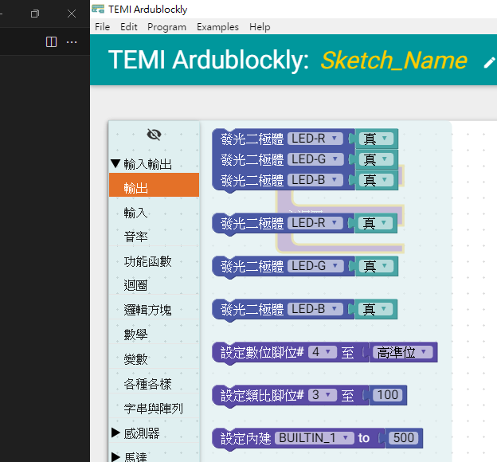

## 說明

點亮LED燈，是一個最基本的入門應用程式，不但生成的速度快，同時也用來檢驗使否正確設定好程式開發環境。

#### <a href="1_點亮LED燈.md">1_點亮LED燈.md</a>

#### <a href="2_LED燈7種顏色變化.md">2_LED燈7種顏色變化.md</a>

#### <a href="3_LED燈_輸出輸入練習.md">3_LED燈_輸出輸入練習.md</a>

## 電路圖

電路中使用RGB共陽極之三色LED燈，
R、G、B LED的陽極連接330 歐姆的電阻，與MCBV2 MCU的 D4、D7、D8連接

故韌體程式令D4、D7、D8其中一腳輸出低準位(0、LOW、false)，即可使對應的LED亮。
其中:
紅色LED燈為LED_R ，接於D4
綠色LED燈為LED_G ，接於D7
藍色LED燈為LED_B ，接於D8

## Ardublockly 編輯

### 產生紅色LED燈亮、滅閃爍的積木程式

點擊 ardublockly_run.bat 批次檔，啟動MCBV2版的Ardublockly應用程式

點擊工具列中的"輸入輸出"展開-> 輸出、輸入、音率

點擊工具列中的"輸出"後，出現可使電路板MCU腳位輸出的積木
拖曳 所需積木到Arduino 程式積木中

#### 拖曳紅色LED積木

拖曳積木，利用Windows 熱鍵 "Ctrl + C" 複製 及 "Ctrl + V" 貼上功能，加速產生重複的積木

修改傳入LED-R腳的立即值，"真"等於"HIGH"等於"true"會將該腳位設定為高準位，"假"等於"LOW"等於"false"會將該腳位設定為低準位。 根據電路圖，LED燈腳位設定為低準位時，LED燈亮，高準位時，LED燈不亮(滅)。

#### 拖曳延遲時間積木

延遲積木在"各種各樣" 工具列中，延遲"毫秒"為延遲 N * 1/1000 秒(千分之1)，延遲"微秒"為延遲 N * 1/1000000 秒

在主迴圈中，增加延遲積木，增加LED燈亮滅的間隔時間

#### 儲存積木程式

"Save" 為儲存積木程式，"Open" 為開啟積木程式檔案。
設定存檔檔名為"<a href="LED_R_Blink.xml">LED_R_Blink.xml</a>"

### 上傳紅色LED燈亮、滅閃爍的積木程式至Arduino IDE

如上圖所示，滑鼠移動到上傳符號時，，符號變成籃底，點擊後，即啟動Arduino IDE，並將原始碼同步上傳到Arduino IDE中。

#### 無法啟動

如果無法啟動Arduino IDE，請檢查EDIT-> preferences 中Compiler Location設定，沒有指定到正確的Arduino IDE程式。

* <a href="https://drive.google.com/file/d/1gBT4O8TjW2iJ1k9kBNFgxLv_6CsR1o17/view?usp=drive_link">Arduino IDE需要使用TEMI協會壓縮的版本,下載適用於MCBV2電路板的Arduino IDE </a>

## Arduino IDE 編譯及上傳

### 設定 Arduino IDE

#### 偏好設定

如上圖中"檔案" 的 "偏好設定"

如上圖，打勾

#### 開發板

開發板選擇 TEMI協會(328) --> TEMI MCBV2
點選後，選擇MCBV2所連接的序列埠

#### 編譯及上傳

紅色LED燈亮滅 Arduino 原始程式碼:

<pre><code>
void setup() {
  	pinMode(4, OUTPUT);

  digitalWrite(4,true );

}

void loop() {
  digitalWrite(4,false );
  delay(500);
  digitalWrite(4,true );
  delay(500);

}
</code></pre>
當設定確後，點選 向右箭頭，Arduino IDE進行程式碼的編譯及上傳。

當上傳完成後，在Arduino IDE下部，出現"上傳完畢"訊息，以及訊息框中出現

avrdude: 974 bytes of flash written
avrdude: verifying flash memory against C:\Users\subwa\AppData\Local\Temp\arduino_build_235287/ArdublocklySketch.ino.hex:
avrdude: load data flash data from input file C:\Users\subwa\AppData\Local\Temp\arduino_build_235287/ArdublocklySketch.ino.hex:
avrdude: input file C:\Users\subwa\AppData\Local\Temp\arduino_build_235287/ArdublocklySketch.ino.hex contains 974 bytes
avrdude: reading on-chip flash data:

Reading | ################################################## | 100% 0.21s

avrdude: verifying ...
avrdude: 974 bytes of flash verified

avrdude done.  Thank you.

表示設定正確，此時MCBV2電路板 紅色LED燈持續 0.5秒亮0.5秒暗

#### 上傳程式後關閉Adruino IDE

如果設定正確運行，欲修改積木程式，進行下個練習時，請關閉Arduino IDE ，此時Arduino IDE 會記錄當前設定，以備下回啟動時引用。
