## T1-PS2無線搖桿控制智能賽車
### T1-PS2無線搖桿控制智能賽車
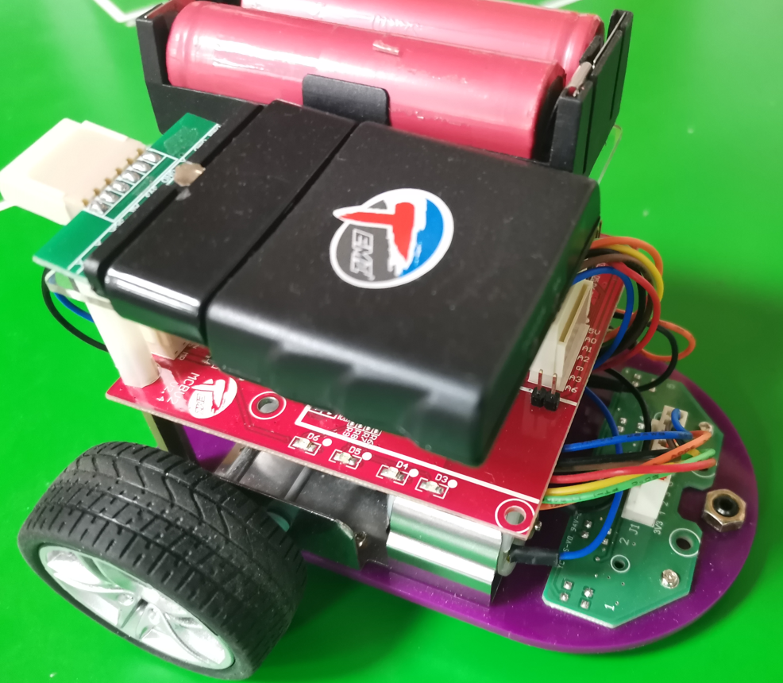
#### T1智能賽車使用MCBV2電路板，並利用齒輪組，進行減速推動2個輪子

### PS2無線搖桿控制
     T1智能賽車，連接PS2無線遙控器達到無線操控功能，本專題對應操作功能如下:
    ▶ SELECT 鍵，切換工作模式:  專題一共有2個模式，一為PS2 無線遙控車；另一為自動循跡車
    ▶ 利用左、右搖桿來控制T1智能賽車運動的方向(前進、後退、向左轉、向右轉、向左退、向右退)，左、右搖桿速度不同
    ▶ 利用方向鍵，控制T1智能賽車運動的方向(前進、後退、向左旋、向右旋)
    ▶ 利用L2、L1、R1、R2鍵來改變循跡時的車速
### 循跡自走車
#### 認識紅外線感測器
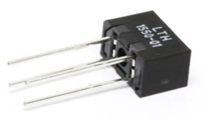
 

反射光電開關LTH1550-01，由紅外線LED及紅外線光電晶體及光隔離外殼所組成，紅外線LED發射出紅外線光源，如具有紅外線光反射物件靠近時，反射紅外線光，使紅外線光電晶體動作，達到偵測的效果。
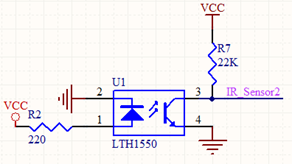
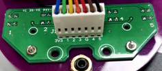
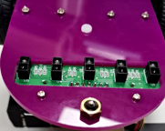
反射光電開關原理圖，紅外線LED串接220歐姆限流電阻接VCC，LED順向，發出紅外線光。
     反射的紅外線光，於紅外線光電晶體(比較黑的那顆)的B極，使光電晶體B極產生微小電流，經過電晶體放大，電晶體的C極串接22K歐姆電阻，當反射光很強時，等效CE的電阻很小，C極輸出電壓(IR_Sensor2)接近為0V，當反射量很少時，等效CE的電阻很大，C極輸出電壓接近VCC。
   白紙具備較佳的紅外線光反射能力，黑色電膠帶則會吸收大部分的紅外線光。利用此原理，製作黑色軌跡之循跡車地圖。
#### 黑線循跡模式
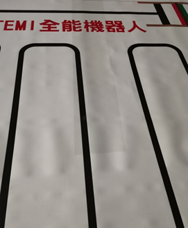
線循跡模式，利用紅外線光反射原理製成，黑色部分，吸收紅外線光，白色部分反射紅外線光。根據感測器電路，黑色區域，吸收紅外線光，光電晶體收到較少紅外線光，光電晶體呈現高阻抗狀態，提升電組R7分到較少電壓，光電晶體分到較多電壓，此時IR_Sensor腳位呈現HIGH狀態，即為1，當白色，IR光電晶體，呈現低阻抗，分到較少電壓，IR_Sensor腳位呈現LOW狀態，即為0。

## 電路介紹

### MCBV2 MCU區塊
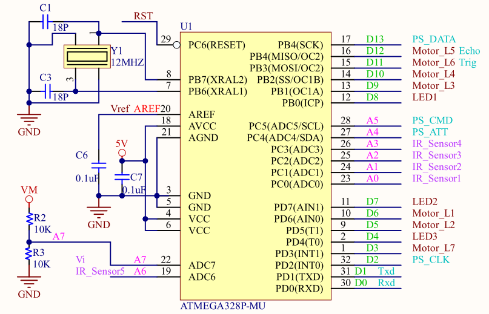

### MCBV2 伺服馬達連接埠
MCBV2電路板，MCU連接埠為D12、D11及D3，使用前請注意，在硬體部分D12、D11與超音波測距模組介面共用，無法同時使用兩者周邊裝置。
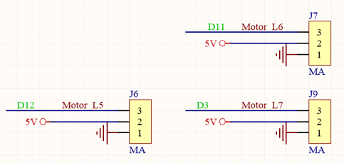

### MCBV2 PS2 搖桿介面電路

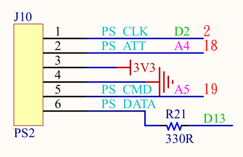

PS2遙桿Dongle使用DC3.3V電源，通訊協定使用4PIN通訊腳，PS_ATT為通訊致能腳，當PS_ATT(A4、D18)=Low，啟動通訊，PS_CLK(D2)為資料同步脈衝，PS_CMD(A5、D19)為MCU 的指令資料輸出腳，PS_DATA(D13)為PS2遙桿Dongle的資料輸出腳。
PS2搖桿內部使用MCU或ASIC處理晶片，讀取按鍵及搖桿軸需要時間，主機端不能一直訪問搖桿，訪問至少間隔16mS，讓搖桿接收器處裡收發遠端搖桿的數據。

PS_CLK  :   D2
PS_Att  :   D18
PS_CMD  :   D19
PS_Data :   D13
  
###  
* **無線PS2搖桿與MCBV2連接**
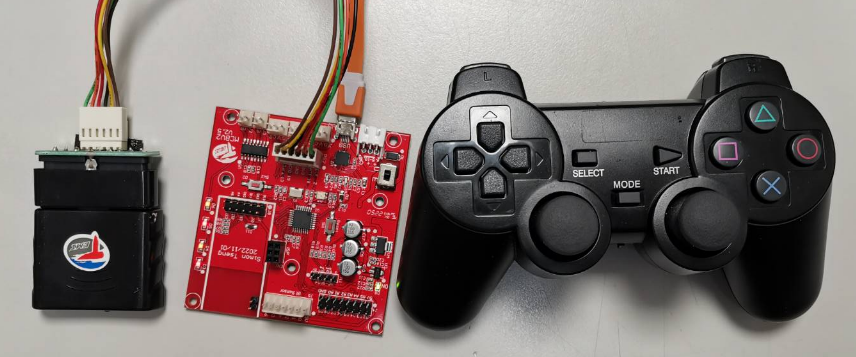
PS2無線搖桿接收器與MCBV2電路板，利用連接器串接起來，接線與插接接收器時，須注意腳位方向，錯誤的方向，會使接收器燒毀。

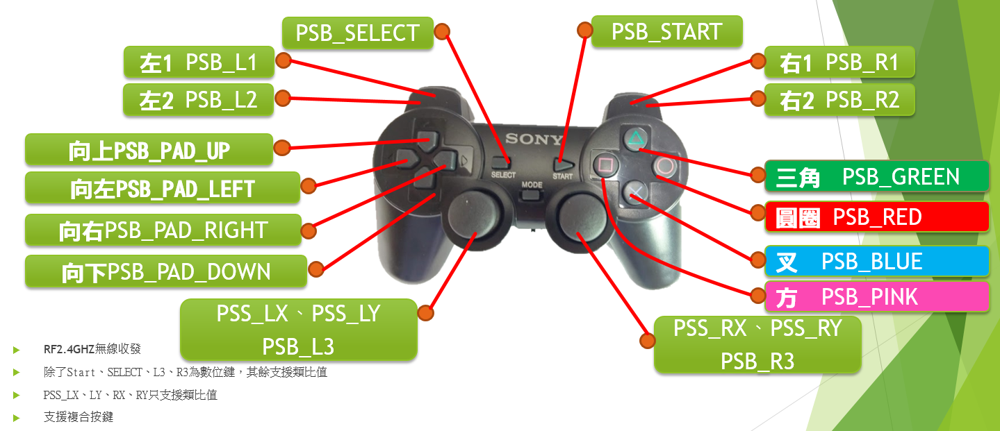 

## PS2搖桿積木與操作
## 讀取PS2X Game PAD(協議通訊)
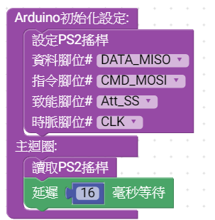

PS2無線搖桿接收器在Arduino初始化設定區塊，驅動MCBV2與接收器連接的腳位，使用預設即可。主迴圈安排讀取PS2積木，每次讀取後，需要延遲一段時間(大約16ms)，讓PS2搖桿接收器有時間與遠端的搖桿通訊，取得最新的狀態。

<a href="PS2_1.xml">下載積木程式檔 PS2_1.xml</a>

讀取PS2X Game PAD, Arduino 原始程式碼:

<pre><code>
#include  "PS2X_lib_temi.h"  // TEMI協會修改版本，PS2搖桿程式庫

PS2X ps2x; // create PS2 Controller Class //建立ps2x物件
byte  ps2x_vibrate = 0;  //ps2x搖桿振動變數，預設0不振動

void setup() {
  // 設定ps2x物件，輸入引數為接收器與MCBV2連接的腳位	
  ps2x.config_gamepad(2, 19, 18, 13, 0, 0);  //Setup PS2 Remote controller

}

void loop() {
      ps2x.read_gamepad(0, ps2x_vibrate);  //DualShock Controller//讀取PS2搖桿接收器的數據
  delay(16); //延遲16毫秒，給PS2接收器與搖桿通訊

}
</code></pre>

##
## PS2控制T1智能遙控車
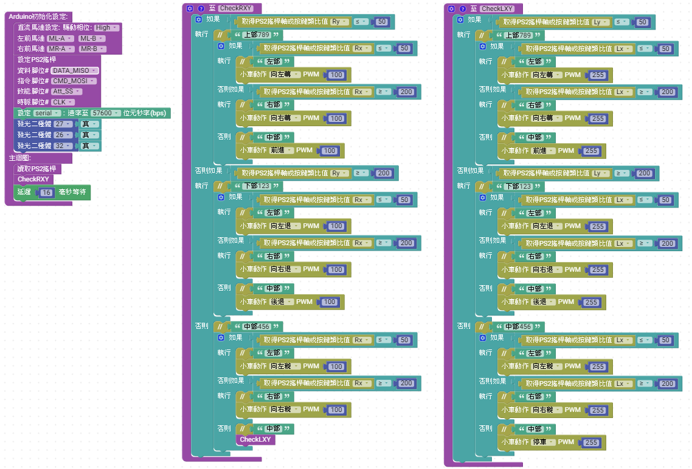
積木程式分成3部分，1. Arduino 初始化及主程式；2. T1賽車左搖桿控制(CheckLXY)；3. T1賽車左搖桿控制(CheckRXY)。
### 初始化與主迴圈
#### 初始化
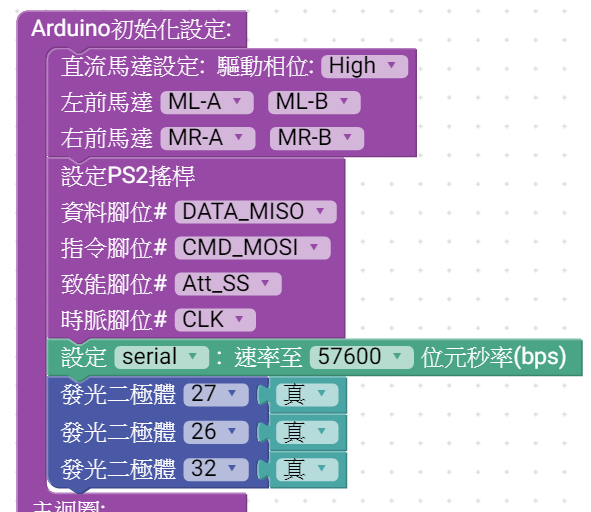
初始化階段，設定DC馬達驅動，須注意，DC馬達驅動，與原始設計給智能賽車，如果賽車的馬達線路焊接錯誤或左、右馬達插接到電路板的位置錯誤時，智能賽車動作也會發生錯誤，例如前進、後退動作相反，左右轉(退)動作相反，轉彎變成前進或後退，才能讓馬達轉向正常。
初始化階段，設定驅動PS2搖桿接收器、序列埠及RGB LED燈(LED燈可已設定不同顏色當作隊伍顏色)。

#### 左右搖桿控制輪胎馬達程式
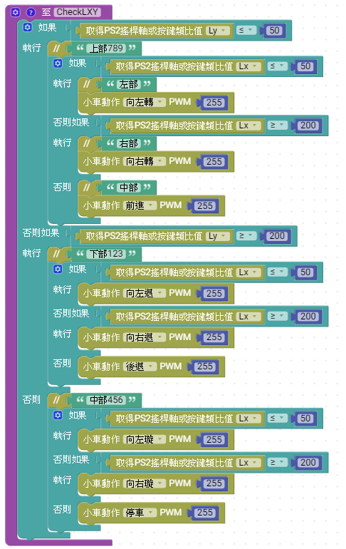
利用左右搖桿來進行無線操作T1賽車，撰寫CheckLXY函數(參考 基礎_連接PS2無線搖桿控制器)，將左搖桿X、Y軸的數值，利用條件判斷式，將左搖桿動作的範圍，分割成9個區域(對應到鍵盤數字鍵區的1~9)
▶ 當Y軸往前推，Y數值小(50以下)，判斷X軸數值0~255之間，切成3區，對應到7位置(X值50以下)、對應到9位置(X值200以上)、其他值為X軸的中間區域值8位置，由於是Y軸往前推，故令T1賽車前進(8)，前往左推(7)左轉彎，前往右推(9)右轉彎
▶ 當Y軸往後推，Y數值大(200以上)，判斷X軸數值0~255之間，切成3區，對應到1位置(X值50以下)、對應到3位置(X值200以上)、其他值為X軸的中間區域值2位置，由於是Y軸往後推，故令T1賽車後退(8)，後往左推(1)左後退，後往右推(3)右後退
▶ 當Y軸未往前或後推(中間)，Y數值介於(51~199以上)，中間值大約是127左右，判斷X軸數值0~255之間，切成3區，對應到4位置(X值50以下)、對應到6位置(X值200以上)、其他值為X軸的中間區域值5位置，由於是Y軸居中，故令X軸左推時，令T1賽車左旋(逆時針)轉(4)，X軸右推時，令T1賽車右旋(順時針)轉 6，Y、X軸居中(未操作搖桿)時，令T1賽車停車

左搖桿操作T1賽車時，給予小車動作 PWM的數值為255，當T1賽車馬達動作時，以最快的速度運行

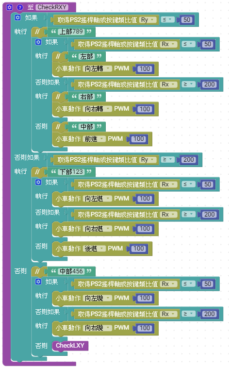

右搖桿進行無線操作T1賽車，動作與左搖桿雷同，撰寫CheckRXY函數，判斷的是右搖桿的X、Y數據，同樣的將搖桿動作，根據X、Y位置，切成9個區域，控制T1賽車動作相同，但在5號位置，則改呼叫CheckLXY函數，CheckLXY函數的5號位置是停車，也就是說，當CheckRXY函數5號位置為右搖桿沒動作時，呼叫CheckLXY函數來控制T1賽車

CheckRXY函數右搖桿操作T1賽車時，給予小車動作 PWM的數值為100，當T1賽車馬達動作時，以最慢速運行

#### 主迴圈
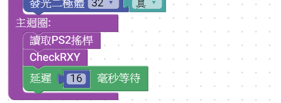
程式主迴圈，讀取無線PS2搖桿後，根據讀取的按鍵值及軸值，呼叫CheckRXY函數、控制T1賽車馬達動作。延遲16毫秒等待，提供PS2搖桿通訊用與伺服馬達動作時間單位。

#### 

### <a href="PS2_T1_Car.xml">下載積木程式檔 PS2_T1_Car.xml</a>

PS2搖桿控制智能賽車 Arduino 原始程式碼:

<pre><code>
#include "DCMotor.h"
#define _DCMotorPWM_Phase 1
#include  "PS2X_lib_temi.h"

DCMotor Motor = DCMotor(_DCMotorPWM_Phase);
PS2X ps2x; // create PS2 Controller Class
byte  ps2x_vibrate = 0;

// 描述該功能...
void CheckRXY() {
  if (ps2x.Analog(PSS_RY) <= 50) {
    // "上部789"
    if (ps2x.Analog(PSS_RX) <= 50) {
      // "左部"
      	Motor.RightForward(100);
    } else if (ps2x.Analog(PSS_RX) >= 200) {
      // "右部"
      	Motor.LeftForward(100);
    } else {
      // "中部"
      	Motor.Forward(100);
    }
  } else if (ps2x.Analog(PSS_RY) >= 200) {
    // "下部123"
    if (ps2x.Analog(PSS_RX) <= 50) {
      // "左部"
      	Motor.RightReverse(100);
    } else if (ps2x.Analog(PSS_RX) >= 200) {
      // "右部"
      	Motor.LeftReverse(100);
    } else {
      // "中部"
      	Motor.Reverse(100);
    }
  } else {
    // "中部456"
    if (ps2x.Analog(PSS_RX) <= 50) {
      // "左部"
      	Motor.Left(100);
    } else if (ps2x.Analog(PSS_RX) >= 200) {
      // "右部"
      	Motor.Right(100);
    } else {
      // "中部"
      CheckLXY();
    }
  }
}

// 描述該功能...
void CheckLXY() {
  if (ps2x.Analog(PSS_LY) <= 50) {
    // "上部789"
    if (ps2x.Analog(PSS_LX) <= 50) {
      // "左部"
      	Motor.RightForward(255);
    } else if (ps2x.Analog(PSS_LX) >= 200) {
      // "右部"
      	Motor.LeftForward(255);
    } else {
      // "中部"
      	Motor.Forward(255);
    }
  } else if (ps2x.Analog(PSS_LY) >= 200) {
    // "下部123"
    if (ps2x.Analog(PSS_LX) <= 50) {
      // "左部"
      	Motor.RightReverse(255);
    } else if (ps2x.Analog(PSS_LX) >= 200) {
      // "右部"
      	Motor.LeftReverse(255);
    } else {
      // "中部"
      	Motor.Reverse(255);
    }
  } else {
    // "中部456"
    if (ps2x.Analog(PSS_LX) <= 50) {
      // "左部"
      	Motor.Left(255);
    } else if (ps2x.Analog(PSS_LX) >= 200) {
      // "右部"
      	Motor.Right(255);
    } else {
      // "中部"
      	Motor.Stop(255);
    }
  }
}

void setup() {
      //Setup Motor
    Motor.setMotorL(5, 6);
    Motor.setMotorR(10, 9);

  ps2x.config_gamepad(2, 19, 18, 13, 0, 0);  //Setup PS2 Remote controller

  Serial.begin(57600);
  	pinMode(27, OUTPUT);
	pinMode(26, OUTPUT);
	pinMode(32, OUTPUT);

  digitalWrite(27,true);
  digitalWrite(26,true);
  digitalWrite(32,true);

}

void loop() {
      ps2x.read_gamepad(0, ps2x_vibrate);  //DualShock Controller
  CheckRXY();
  delay(16);

}
</code></pre>

## 智能循跡模式一

IR_SENSOR Bar,一共有5個感測器，當讀取5個，程式讀取將每一個感測器的狀態黑色設為1，白色設為0，故5個感測器一共產生32個排列組合變化，使得程式需要進行相當多的判斷，才能做出決策，不但程式效率差，且變得複雜；然而其中間3個感測器顯示智能車是否在軌道上，當智能車偏離最左及最右側的感測器，才需要用來當作扶助，協助智能車決策，其他狀態下，則沒有作用。

5個感測器，由左至右命名為: L2、L1、M、R1、R2
L2  : CH4
L1  : CH3
M   : CH2
R1  : CH1
R2  : CH0

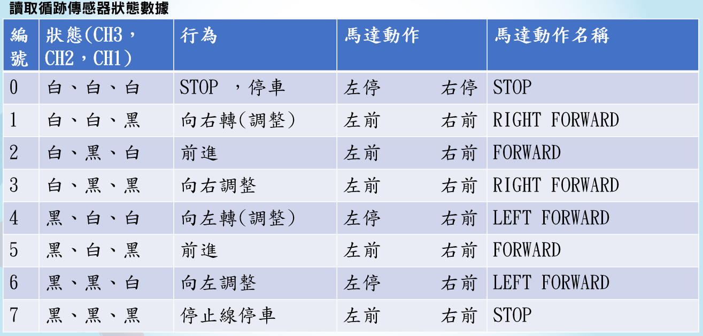
將5個感測器狀態，組合成一個位元組(Byte)，以2進位方式低位元在右邊，高位元在左邊，因此位元組的b0對應最右側R2感測器的狀態,b1對應右側R1感測器的狀態，b2對應中間M感測器的狀態，b3對應左側L1感測器的狀態，b4對應最左側L2感測器的狀態，利用中間的3個感測器一共有8狀態，當加權組合數值為0~7時，當全白時(脫軌)數值0，此時令智能車停車或根據R2、L2感測器進行調整，數值1:表示軌道於右側感測器位置，智能車此時姿態偏左令智能車右轉，數值4:表示軌道於左側感測器位置，智能車此時姿態偏右令智能車左轉，以此概念，調整智能車在軌道上運行。

### 智能循跡模式一積木程式
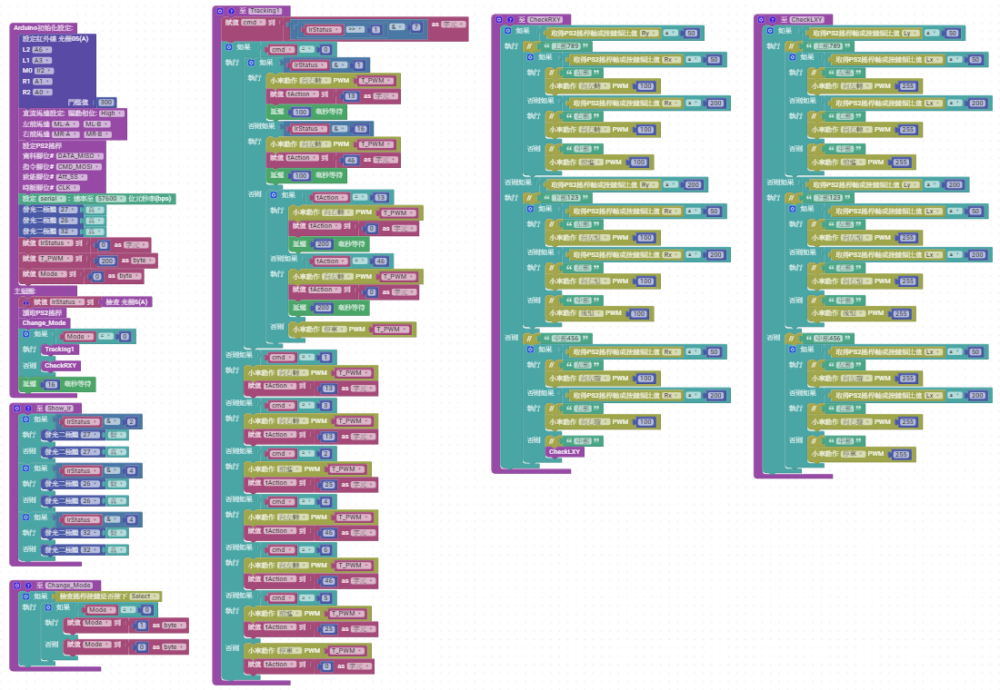
積木程式分成6部分，1. Arduino 初始化及主程式；2. T1賽車左搖桿控制(CheckLXY)；3. T1賽車左搖桿控制(CheckRXY)；4. Show_Ir函數，顯示IR感測的狀態；5. Change_Mode函數，利用PS2搖桿切換T1賽車為循跡模式或PS2搖桿控制模式；6. Tracking1函數，數位循跡導航。

### 初始化與主迴圈
#### 初始化
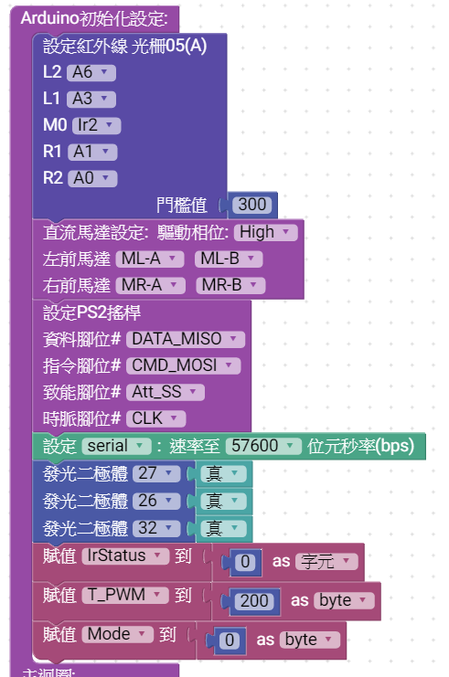

初始化階段，設定DC馬達驅動，須注意，DC馬達驅動，與原始設計給智能賽車，如果賽車的馬達線路焊接錯誤或左、右馬達插接到電路板的位置錯誤時，智能賽車動作也會發生錯誤，例如前進、後退動作相反，左右轉(退)動作相反，轉彎變成前進或後退，才能讓馬達轉向正常。
初始化階段，設定驅動PS2搖桿接收器、序列埠及RGB LED燈(LED燈可已設定不同顏色當作隊伍顏色)。

▶ 增加驅動設定紅外線光柵05(A)，預設腳位與MCVB2相同，由於採用類比數位轉換(ADC)方式讀取感測器的數據，門檻值300用來判斷感測器狀態為0或1的基準，當使用不同的軌道顏色或環境光線強弱，1和0的判斷標準可利用改變門檻值來調整
▶ 增加3個變數，分別是IrStatus，用來儲存紅外線光柵05(A)的數位狀態值。T_PWM變數，用來設定循跡模狀態，智能賽車的車速預設200。Mode變數儲存智能賽車的工作模式(0:循跡模式、1: PS2操控模式)，預設0

#### 5個紅外線感測之數位循跡程式
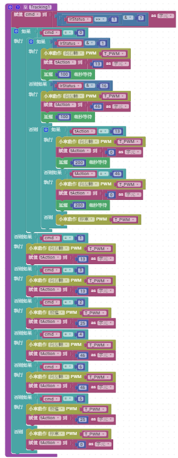
數位循跡程式，利用主迴圈讀取的IrStatus5個感測器的數位值(L2、L1、M、R1、R2)，對智能賽車進行軌道操作，數位循跡函數，命名為Tracking1。
首先目前的IrStatus變數值，右移1位後與7做邏輯和運算(AND)後存入CMD變數，此時CMD變數的內含為IrStatus的L1、M、R1數值(L1於b2，M於b1，R1於b0)數值0~7，利用如果、否則如果、否則條件判斷式，分析處裡對應的循跡動作。
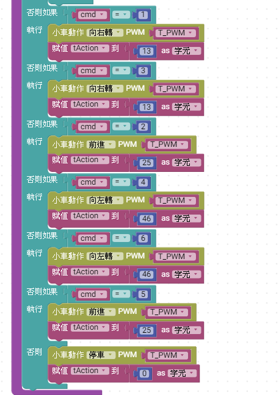
首先先說明否則如果與否則，判斷CMD的數值，當數值不為0時，執行判斷否則如果數值為1~6，否則數值為7；
▶ 當CMD=1或CMD=3時，表示目前黑色軌道，處於感測器右側，於R1與M感測器附近，智能賽車偏軌道左側，此時令智能賽車右轉，並將tAction變數設定為13，表示當前執行指令為13。

▶ 當CMD=2時，表示目前黑色軌道，處於感測器M位置，智能賽車正對準軌道，此時令智能賽車前進，tAction變數設定為25，表示當前執行指令為25。
▶ 當CMD=5時，表示目前黑色軌道，處於感測器M位置沒信號，但L1、R1感測器都感應到軌道，因此判斷，感測器可能被干擾，由於L1、R1都有反應，故假設智能賽車正對準軌道，此時令智能賽車前進，tAction變數設定為25，與CMD=2相同。

▶  當CMD=4或CMD=4時，表示目前黑色軌道，處於感測器左側，於L1與M感測器附近，智能賽車偏軌道右側，此時令智能賽車左轉，並將tAction變數設定為46，表示當前執行指令為46。

▶ 當CMD=7時(否則..)，表示目前智能賽車於循跡軌道的終點，此時令智能賽車停車，tAction變數設定為0。

如上，說明CMD於1~7等7種狀態，智能賽車於軌道上運作行為

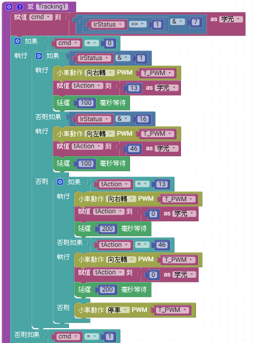
如果CMD=0時，這時候智能賽車可能運作超出軌道(脫軌)行為發生，此時進行處置，調整智能賽車回到軌道上運行。
▶ 如果CMD=0時，IrStatus&1為真(表示R2感測器有動作)，判斷目前軌道於R2感測器位置(極右)，動作與CMD=1或CMD=3相同，智能賽車右轉，tAction變數設定為13，並延遲0.1秒，智能賽車右轉命令送出後，智能賽車可能因為慣性，還沒反應，主程式迴圈就重新跑下一回，可能因此遺失R2感測器狀態，讓智能賽車有時間轉回來。
▶ 如果CMD=0時，IrStatus&16為真(16=0x10，表示L2感測器有動作)，判斷目前軌道於L2感測器位置(極右)，動作與CMD=4或CMD=6相同，智能賽車左轉，tAction變數設定為46，並延遲0.1秒，智能賽車左轉命令送出後，智能賽車可能因為慣性，還沒反應，主程式迴圈就重新跑下一回，可能因此遺失L2感測器狀態，讓智能賽車有時間轉回來。

▶ 如果CMD=0時，IrStatus(=0) 遺失了L2、R2感測器狀態，此時智能賽車真正處於脫軌狀態，判斷tAction變數的內容
    ◉  當tAction變數為13時，表示主程式迴圈上一輪，令智能賽車右轉，此時假設智能賽車處於軌道左側，令智能賽車右轉，延遲0.2秒，讓智能賽車回到軌道上，tAction變數設定為0，如果0.2秒後，智能賽車回不到軌道上，表示真的脫軌了。
    ◉  當tAction變數為46時，表示主程式迴圈上一輪，令智能賽車左轉，此時假設智能賽車處於軌道右側，令智能賽車左轉，延遲0.2秒，讓智能賽車回到軌道上，tAction變數設定為0，如果0.2秒後，智能賽車回不到軌道上，表示真的脫軌了。
    ◉  當tAction變數為0時，表示主程式迴圈上一輪，無法令智能賽車回到軌道上，表示真的脫軌了，此時令智能賽車停車。

▶◉  智能賽車於軌道循跡運作時，馬達速度PWM數值為T_PWM的內容，故改變T_PMW變數數值，就能改變循跡時的車速。

#### Change_Mode函數，改變智能賽車的工作模式
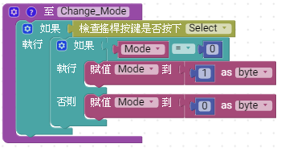
 Change_Mode函數，當PS2搖桿，按下SELEST鍵當下(只動作一次)，判斷Mode變數是否為0，如果為0，則設定Mode變數為1，否則設定Mode變數為0。

#### 左右搖桿控制輪胎馬達程式
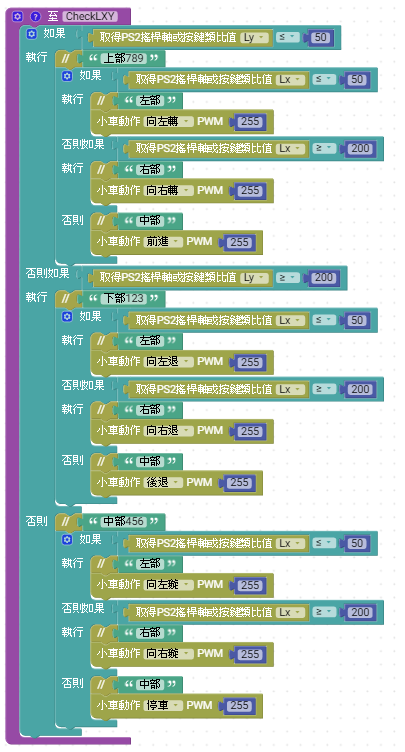

利用左搖桿來進行無線操作T1賽車，撰寫CheckLXY函數動作與PS2控制T1智能遙控車的CheckLXY函數相同車速預設255
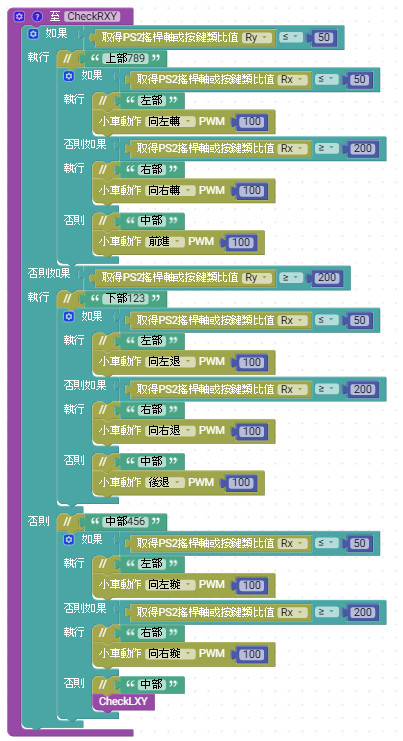
利用右搖桿來進行無線操作T1賽車，撰寫CheckRXY函數動作與PS2控制T1智能遙控車的CheckLXY函數相同車速預設100

#### 主迴圈
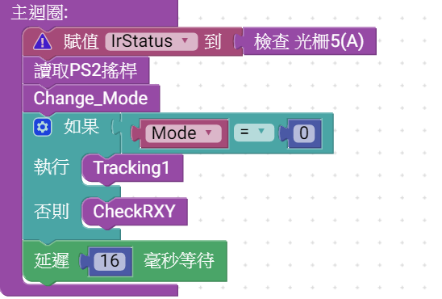
程式主迴圈
▶ 讀取紅外線光柵05(A)，並將感測器的0、1狀態，存入IrStatus變數中。
▶ 讀取無線PS2搖桿後，根據讀取的按鍵值及軸值
▶ 呼叫Change_Mode函數、判斷是否按下SELECT鍵切換模式。
▶ 如果Mode變數數值為0時，呼叫Tracking1函數，進行軌道循跡動作
   否則(Mode不等於0) 呼叫CheckRXY函數、PS2控制T1賽車
▶延遲16毫秒等待，提供PS2搖桿通訊用與伺服馬達動作時間單位

#### 

### <a href="PS2_Tracking21.xml">下載積木程式檔 PS2_Tracking21.xml</a>

PS2控制循跡智能賽車 Arduino 原始程式碼:

<pre><code>
#include "DCMotor.h"
#define _DCMotorPWM_Phase 1
#include  "PS2X_lib_temi.h"

char cmd;
char tAction;
char IrStatus;
byte T_PWM;
byte Mode;
DCMotor Motor = DCMotor(_DCMotorPWM_Phase);
PS2X ps2x; // create PS2 Controller Class
byte  ps2x_vibrate = 0;

char an_readSenaor05() {
    char inStatus=0;
    if(analogRead(A0)>300) inStatus +=1;  // R2
    if(analogRead(A1)>300) inStatus +=2;  // R1
    if(analogRead(A2)>300) inStatus +=4;  // M
    if(analogRead(A3)>300) inStatus +=8;  // L1
    if(analogRead(A6)>300) inStatus +=16; // L2
    return inStatus;
}

// 描述該功能...
void Tracking1() {
  cmd = (char)((IrStatus >> 1) & 7);
  if (cmd == 0) {
    if (IrStatus & 1) {
      	Motor.LeftForward(T_PWM);
      tAction = (char)(13);
      delay(100);
    } else if (IrStatus & 16) {
      	Motor.RightForward(T_PWM);
      tAction = (char)(46);
      delay(100);
    } else {
      if (tAction == 13) {
        	Motor.LeftForward(T_PWM);
        tAction = (char)(0);
        delay(200);
      } else if (tAction == 46) {
        	Motor.RightForward(T_PWM);
        tAction = (char)(0);
        delay(200);
      } else {
        	Motor.Stop(T_PWM);
      }
    }
  } else if (cmd == 1) {
    	Motor.LeftForward(T_PWM);
    tAction = (char)(13);
  } else if (cmd == 3) {
    	Motor.LeftForward(T_PWM);
    tAction = (char)(13);
  } else if (cmd == 2) {
    	Motor.Forward(T_PWM);
    tAction = (char)(25);
  } else if (cmd == 4) {
    	Motor.RightForward(T_PWM);
    tAction = (char)(46);
  } else if (cmd == 6) {
    	Motor.RightForward(T_PWM);
    tAction = (char)(46);
  } else if (cmd == 5) {
    	Motor.Forward(T_PWM);
    tAction = (char)(25);
  } else {
    	Motor.Stop(T_PWM);
    tAction = (char)(0);
  }
}

// 描述該功能...
void CheckRXY() {
  if (ps2x.Analog(PSS_RY) <= 50) {
    // "上部789"
    if (ps2x.Analog(PSS_RX) <= 50) {
      // "左部"
      	Motor.RightForward(100);
    } else if (ps2x.Analog(PSS_RX) >= 200) {
      // "右部"
      	Motor.LeftForward(100);
    } else {
      // "中部"
      	Motor.Forward(100);
    }
  } else if (ps2x.Analog(PSS_RY) >= 200) {
    // "下部123"
    if (ps2x.Analog(PSS_RX) <= 50) {
      // "左部"
      	Motor.RightReverse(100);
    } else if (ps2x.Analog(PSS_RX) >= 200) {
      // "右部"
      	Motor.LeftReverse(100);
    } else {
      // "中部"
      	Motor.Reverse(100);
    }
  } else {
    // "中部456"
    if (ps2x.Analog(PSS_RX) <= 50) {
      // "左部"
      	Motor.Left(100);
    } else if (ps2x.Analog(PSS_RX) >= 200) {
      // "右部"
      	Motor.Right(100);
    } else {
      // "中部"
      CheckLXY();
    }
  }
}

// 描述該功能...
void CheckLXY() {
  if (ps2x.Analog(PSS_LY) <= 50) {
    // "上部789"
    if (ps2x.Analog(PSS_LX) <= 50) {
      // "左部"
      	Motor.RightForward(255);
    } else if (ps2x.Analog(PSS_LX) >= 200) {
      // "右部"
      	Motor.LeftForward(255);
    } else {
      // "中部"
      	Motor.Forward(255);
    }
  } else if (ps2x.Analog(PSS_LY) >= 200) {
    // "下部123"
    if (ps2x.Analog(PSS_LX) <= 50) {
      // "左部"
      	Motor.RightReverse(255);
    } else if (ps2x.Analog(PSS_LX) >= 200) {
      // "右部"
      	Motor.LeftReverse(255);
    } else {
      // "中部"
      	Motor.Reverse(255);
    }
  } else {
    // "中部456"
    if (ps2x.Analog(PSS_LX) <= 50) {
      // "左部"
      	Motor.Left(255);
    } else if (ps2x.Analog(PSS_LX) >= 200) {
      // "右部"
      	Motor.Right(255);
    } else {
      // "中部"
      	Motor.Stop(255);
    }
  }
}

// 描述該功能...
void Show_Ir() {
  if (IrStatus & 2) {
    digitalWrite(27,false );
  } else {
    digitalWrite(27,true );
  }
  if (IrStatus & 4) {
    digitalWrite(26,false );
  } else {
    digitalWrite(26,true );
  }
  if (IrStatus & 8) {
    digitalWrite(32,false );
  } else {
    digitalWrite(32,true );
  }
}

// 描述該功能...
void Change_Mode() {
  if (ps2x.ButtonPressed(PSB_SELECT)) {
    if (Mode == 0) {
      Mode = (byte)(1);
    } else {
      Mode = (byte)(0);
    }
  }
}

void setup() {
    pinMode(A0, INPUT);
    pinMode(A1, INPUT);
    pinMode(A2, INPUT);
    pinMode(A3, INPUT);
    pinMode(A6, INPUT);
    digitalWrite(A0,HIGH);
    digitalWrite(A1,HIGH);
    digitalWrite(A2,HIGH);
    digitalWrite(A3,HIGH);
    digitalWrite(A6,HIGH);

      //Setup Motor
    Motor.setMotorL(5, 6);
    Motor.setMotorR(10, 9);

  ps2x.config_gamepad(2, 19, 18, 13, 0, 0);  //Setup PS2 Remote controller

  Serial.begin(57600);
  	pinMode(27, OUTPUT);
	pinMode(26, OUTPUT);
	pinMode(32, OUTPUT);

  	pinMode(27, OUTPUT);
  	pinMode(26, OUTPUT);
  	pinMode(32, OUTPUT);

  digitalWrite(27,true);
  digitalWrite(26,true);
  digitalWrite(32,true);
  IrStatus = (char)(0);
  T_PWM = (byte)(200);
  Mode = (byte)(0);

}

void loop() {
  IrStatus = an_readSenaor05();
      ps2x.read_gamepad(0, ps2x_vibrate);  //DualShock Controller
  Change_Mode();
  if (Mode == 0) {
    Tracking1();
  } else {
    CheckRXY();
  }
  delay(16);

}
</code></pre>

## 智能循跡模式二PID 控制(比例、積分、微分控制器)

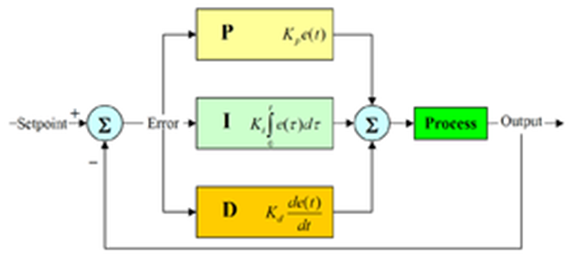

智能車循跡模式 PID 比例、積分、微分控制器，黑色軌道為系統的指令位置，智能車與軌道的差利用計算出當前誤差(Error)，誤差在送進PID計算公式中，算出調整量，改變軌道兩側馬達速度，將小車調整到軌道上。因此可以比較有效的使智能車於軌道上運行。
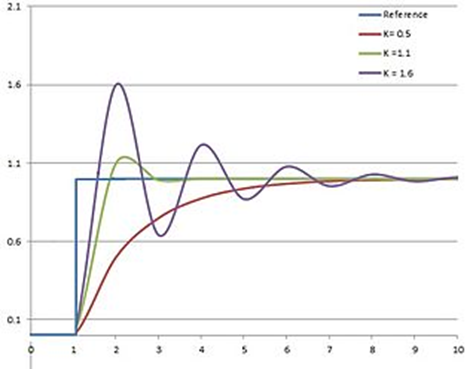
由上圖可知，計算 PID 調整量中，增益K值大小，反映出當誤差發生時，K值越大，產生的調整量越大，系統反應快，同時因調整量大，產生超出命令的過衝現象，智能車在軌道上會發生劇烈搖擺的震盪，無法穩定在軌道上運作，當增益K值小時，調整量小，當誤差大時，智能車需要很長的時間才能調整到軌道上。因此適當的調整增益K值，才能讓智能車快速穩定行駛。
增益K值分成Kp，Ki，Kd，3個，可以分別設定。

IR_SENSOR Bar,一共有5個感測器，當讀取5個，程式讀取將每一個感測器的狀態黑色設為1，白色設為0，對應的誤差(ERROR)數值。
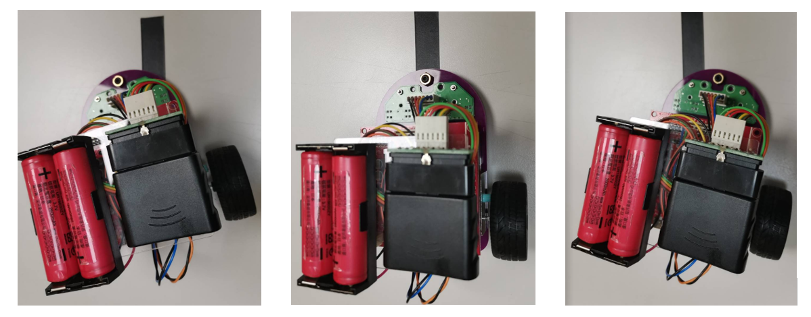
5個感測器，由左至右命名為: L2、L1、M、R1、R2對應不同的誤差量
L2  :  4
L1  :  2
M   :  0
R1  : -2
R2  : -4

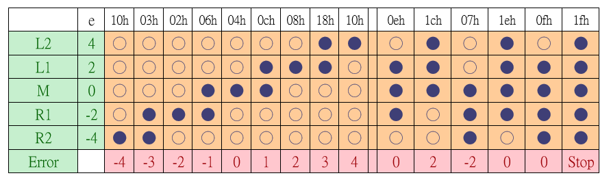
如上圖，智能車於軌道上，e是5個感測器轉換後的IrStatus數據，對應產收的Error誤差數值

### 智能循跡模式二積木程式(只有循跡)
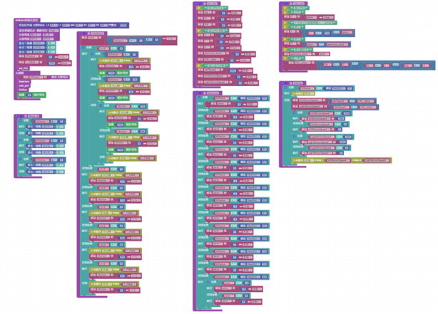

積木程式分包含上一個練習的程式及PID循跡程式，PID循跡積木程式包含4個函數，1. 初始化函數，建立變數及增益K值，2.誤差轉換函數，3.PID計算函數，4.智能車馬達調整函數。

### 初始化與主迴圈
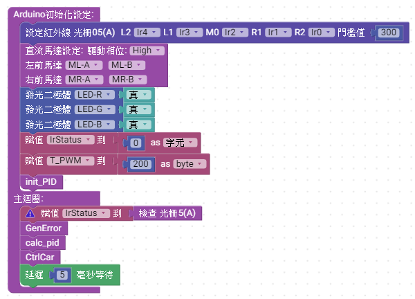
#### 初始化 

初始化階段，設定紅外線光柵05(A)、DC馬達驅動、RGB LED、產生IrStstus及T_PWM變數，最後呼叫init_PID函數，初始化PID運算的相關變數、參數
#### 主迴圈
▶ 讀取感測器狀態
▶ PID計算(包含計算誤差及計算出調整值)
▶ PID 控制智能車
▶ 延遲5毫秒，讓馬達PWM運作

#### 初始化PID運算變數的init_PID函數
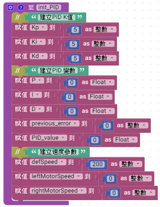
初始化PID運算的變數及常數，K值為增益，數值必須大於1，預設為5，可改變增益來調整系統反應。P、I、D變數，用於計算時，得到比例、積分、微分的結果，previous_error變數，用來儲存上個時間t-1的error值，用於微分運算。PID_value變數，為計算PID控制的結果值。
建立速度參數，defSpeed變數，用來設定小車的預設PWM值，leftMotorSpeed及rightMotorSpeed為經過PID運算後實際送到馬達驅動的PWM值。

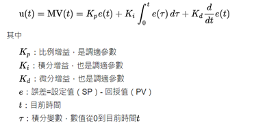

▶ 建立增益 Kp=5，Ki=5，Kd=5，3個參數，這3個參數是整數型態
▶ 建立PID變數 P=0，I=0，D=0，3個變數浮點數型態，為當下的P、I、D值
   ◉ previous_error: 上一次的誤差量(整數型態)
   ◉ PID_value: 利用公式算出的PID值(浮點數型態)
▶ 建立馬達速度變數 defSpeed，leftMotorSpeed，rightMotorSpeed，3個變數整數型態
  ◉ defSpeed，馬達速度的PWM數據預設值，數值越大，速度越快
  ◉ leftMotorSpeed，為計算出來的設定左馬達速度的PWM數據
  ◉ rightMotorSpeed，為計算出來的設定右馬達速度的PWM數據

#### GenError 函數
將得到的感測器狀態，轉換成錯誤值，如下表所示:
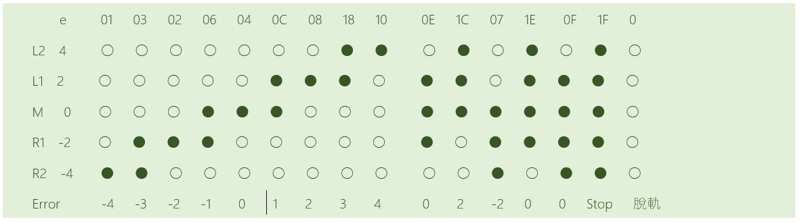
GenError 函數
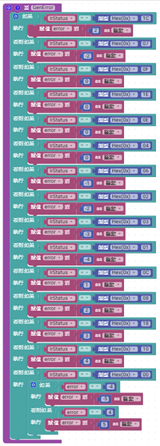

GenError 函數局部放大
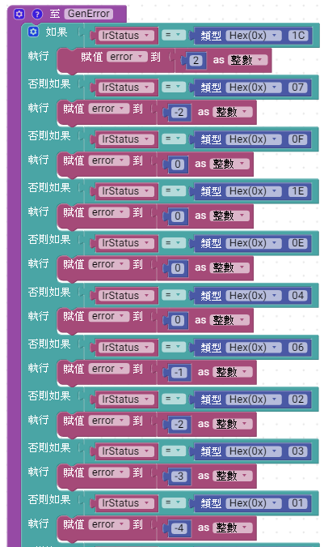
GenError函數，利用條件判斷式，根據得到的IrStatus數值，匹配出error值
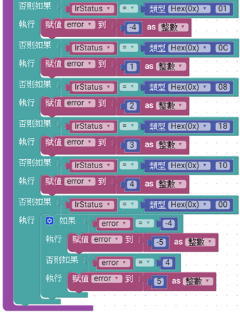
當小車脫軌時，IrStatus數據為0，此時依據目前的error值，給予此時間t的誤差值。
函數程式，利用如果、否則如果、否則條件判斷式，對應產生誤差值，當脫軌時，參考的未更新誤差值，如果誤差值為-4則更新誤差為-5，否則如果誤差值為4則更新誤差為5，其他數值，不變動。

#### calc_pid 函數，計算PID

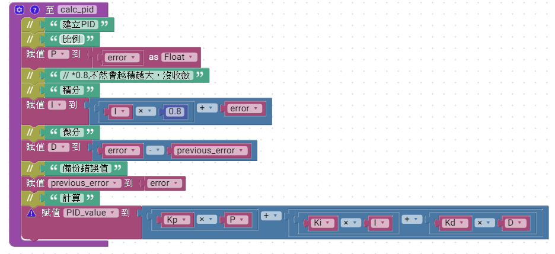

P: 比例值，為當前的誤差量
I: 積分值，前一時間的積分值乘以一定的比例(0.8)後加當前的誤差量
    前一時間的積分值不可大於1，否則會產生震盪，無法收斂
D: 微分值，當前誤差量與前一時間誤差量的差值

PID控制量為 P*Kp+I*Ki+D*Kd，PID各自乘上增益後總和。

可改變的參數如下:
  ▶  I*0.8: 前一時間的積分值乘以一定的比例值0.8，新的積分值，會加上前一個時間的積分值，其實就是之前的累積量，目前設定比例為0.8，可變更調整。
  ▶ K值: PID各自的K增益，目前設定為5，可調整嘗試小車反應。

#### CtrlCar 函數
根據計算出來的PID值調整小車馬達轉速，達到控制小車姿態。
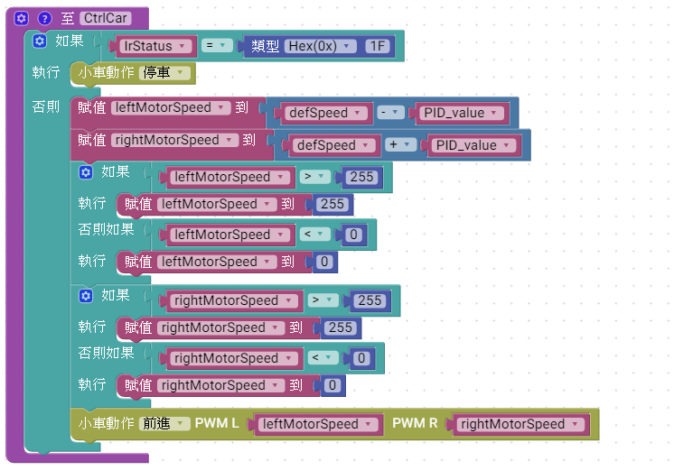

1.先判斷IrSataus狀態是否是0x1F，當所有感測器狀態都為1時，表示小車正在停止線上，故令小車停車。
2. PID值計算小車左、右馬達的速度參數PWM值，defSpeed為預設的PWM值200，左馬達為減，右馬達為加，這與錯誤值產生的方法有關。因為error錯誤值為正時，軌道在小車左側，需要降低左側馬達速度，增加右側馬達速度，來達到調整位置的目的。
3. 確認左右馬達的數據在範圍內，馬達PWM設定數據範圍(byte)為0~255，當數據超過255或低於0時，必須強制設定範圍內，避免動作錯誤。
4. 設定小車左右馬達PWM速度數據。

### <a href="T1_TrackingPID_01.xml">下載積木程式檔 T1_TrackingPID_01.xml 沒有遙控功能</a>

PID控制循跡智能賽車 Arduino 原始程式碼:

<pre><code>
#include "DCMotor.h"
#define _DCMotorPWM_Phase 1

int Kp;
int Ki;
int Kd;
float P;
float I;
float D;
int previous_error;
float PID_value;
int defSpeed;
int leftMotorSpeed;
int rightMotorSpeed;
char IrStatus;
byte T_PWM;
char cmd;
char tAction;
int error;
DCMotor Motor = DCMotor(_DCMotorPWM_Phase);

char an_readSenaor05() {
    char inStatus=0;
    if(analogRead(A0)>300) inStatus +=1;  // R2
    if(analogRead(A1)>300) inStatus +=2;  // R1
    if(analogRead(A2)>300) inStatus +=4;  // M
    if(analogRead(A3)>300) inStatus +=8;  // L1
    if(analogRead(A6)>300) inStatus +=16; // L2
    return inStatus;
}

// 描述該功能...
void init_PID() {
  // "建立PID K值"
  Kp = (int)(5);
  Ki = (int)(5);
  Kd = (int)(5);
  // "建立PID 變數"
  P = (float)(0);
  I = (float)(0);
  D = (float)(0);
  previous_error = (int)(0);
  PID_value = (float)(0);
  // "建立速度參數"
  defSpeed = (int)(200);
  leftMotorSpeed = (int)(0);
  rightMotorSpeed = (int)(0);
}

// //****計算PID
void calc_pid() {
  // "建立PID"
  // "比例"
  P = (float)(error);
  // "// *0.8,不然會越積越大，沒收斂"
  // "積分"
  I = (I * 0.8) + error;
  // "微分"
  D = error - previous_error;
  // "備份錯誤值"
  previous_error = error;
  // "計算"
  PID_value = (Kp * P) + ((Ki * I) + (Kd * D));
}

// 描述該功能...
void Tracking1() {
  cmd = (char)((IrStatus >> 1) & 7);
  if (cmd == 0) {
    if (IrStatus & 1) {
      	Motor.LeftForward(T_PWM);
      tAction = (char)(13);
      delay(100);
    } else if (IrStatus & 16) {
      	Motor.RightForward(T_PWM);
      tAction = (char)(46);
      delay(100);
    } else {
      if (tAction == 13) {
        	Motor.LeftForward(T_PWM);
        tAction = (char)(0);
        delay(200);
      } else if (tAction == 46) {
        	Motor.RightForward(T_PWM);
        tAction = (char)(0);
        delay(200);
      } else {
        	Motor.Stop(T_PWM);
      }
    }
  } else if (cmd == 1) {
    	Motor.LeftForward(T_PWM);
    tAction = (char)(13);
  } else if (cmd == 3) {
    	Motor.LeftForward(T_PWM);
    tAction = (char)(13);
  } else if (cmd == 2) {
    	Motor.Forward(T_PWM);
    tAction = (char)(25);
  } else if (cmd == 4) {
    	Motor.RightForward(T_PWM);
    tAction = (char)(46);
  } else if (cmd == 6) {
    	Motor.RightForward(T_PWM);
    tAction = (char)(46);
  } else if (cmd == 5) {
    	Motor.Forward(T_PWM);
    tAction = (char)(25);
  } else {
    	Motor.Stop(T_PWM);
    tAction = (char)(0);
  }
}

// //** 換算PWM，控制馬達
void CtrlCar() {
  if (IrStatus == 0x1F) {
    	Motor.Stop( _DCMotorPWM_Phase );
  } else {
    leftMotorSpeed = defSpeed - PID_value;
    rightMotorSpeed = defSpeed + PID_value;
    if (leftMotorSpeed > 255) {
      leftMotorSpeed = 255;
    } else if (leftMotorSpeed < 0) {
      leftMotorSpeed = 0;
    }
    if (rightMotorSpeed > 255) {
      rightMotorSpeed = 255;
    } else if (rightMotorSpeed < 0) {
      rightMotorSpeed = 0;
    }
    	Motor.Forward(leftMotorSpeed,rightMotorSpeed);
  }
}

//     /*
//         e     01  03   02  06  04   0C  08   18  10     0E  1C  07   1E   0F  1F   0
//     L2  4     ○   ○   ○   ○   ○   ○   ○   ●   ●     ○   ●   ○   ●   ○   ●   ○
//     L1  2     ○   ○   ○   ○   ○   ●   ●   ●   ○     ●   ●   ○   ●   ●   ●   ○
//     M   0     ○   ○   ○   ●   ●   ●   ○   ○   ○     ●   ●   ●   ●   ●   ●   ○
//     R1  -2    ○   ●   ●   ●   ○   ○   ○   ○   ○     ●   ○   ●   ●   ●   ●   ○
//     R2  -4    ●   ●   ○   ○   ○   ○   ○   ○   ○     ○   ○   ●   ○   ●   ●   ○
//     Error    -4   -3  -2   -1   0    1   2   3    4     0    2  -2    0   0  Stop   脫軌
//     */
void GenError() {
  if (IrStatus == 0x1C) {
    error = (int)(2);
  } else if (IrStatus == 0x07) {
    error = (int)(-2);
  } else if (IrStatus == 0x0F) {
    error = (int)(0);
  } else if (IrStatus == 0x1E) {
    error = (int)(0);
  } else if (IrStatus == 0x0E) {
    error = (int)(0);
  } else if (IrStatus == 0x04) {
    error = (int)(0);
  } else if (IrStatus == 0x06) {
    error = (int)(-1);
  } else if (IrStatus == 0x02) {
    error = (int)(-2);
  } else if (IrStatus == 0x03) {
    error = (int)(-3);
  } else if (IrStatus == 0x01) {
    error = (int)(-4);
  } else if (IrStatus == 0x0C) {
    error = (int)(1);
  } else if (IrStatus == 0x08) {
    error = (int)(2);
  } else if (IrStatus == 0x18) {
    error = (int)(3);
  } else if (IrStatus == 0x10) {
    error = (int)(4);
  } else if (IrStatus == 0x00) {
    if (error == -4) {
      error = (int)(-5);
    } else if (error == 4) {
      error = (int)(5);
    }
  }
}

// 描述該功能...
void Show_Ir() {
  if (IrStatus & 2) {
    digitalWrite(4,false );
  } else {
    digitalWrite(4,true );
  }
  if (IrStatus & 4) {
    digitalWrite(7,false );
  } else {
    digitalWrite(7,true );
  }
  if (IrStatus & 4) {
    digitalWrite(8,false );
  } else {
    digitalWrite(8,true );
  }
}

void setup() {
    pinMode(A0, INPUT);
    pinMode(A1, INPUT);
    pinMode(A2, INPUT);
    pinMode(A3, INPUT);
    pinMode(A6, INPUT);
    digitalWrite(A0,HIGH);
    digitalWrite(A1,HIGH);
    digitalWrite(A2,HIGH);
    digitalWrite(A3,HIGH);
    digitalWrite(A6,HIGH);

      //Setup Motor
    Motor.setMotorL(5, 6);
    Motor.setMotorR(10, 9);

  	pinMode(4, OUTPUT);
	pinMode(7, OUTPUT);
	pinMode(8, OUTPUT);

  	pinMode(4, OUTPUT);
  	pinMode(7, OUTPUT);
  	pinMode(8, OUTPUT);

  digitalWrite(4,true);
  digitalWrite(7,true);
  digitalWrite(8,true);
  IrStatus = (char)(0);
  T_PWM = (byte)(200);
  init_PID();

}

void loop() {
  IrStatus = an_readSenaor05();
  GenError();
  calc_pid();
  CtrlCar();
  delay(5);

}

</code></pre>

### 智能循跡模式二積木程式(具備PS2遙控)
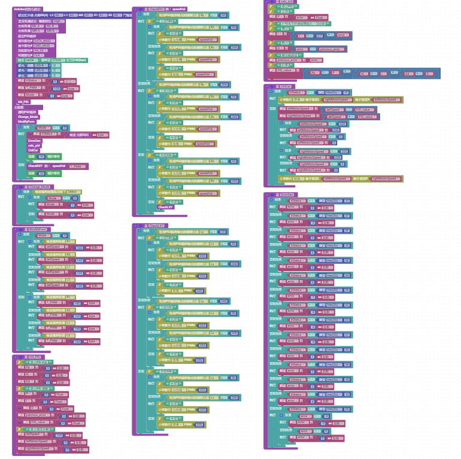
增加PS2遙控功能的PID 智能賽車積木程式
### <a href="PS2_PID.xml">下載積木程式檔 PS2_PID.xml</a>

PS2 控制PID循跡智能賽車 Arduino 原始程式碼:

<pre><code>
#include "DCMotor.h"
#define _DCMotorPWM_Phase 1
#include  "PS2X_lib_temi.h"

char IrStatus;
byte T_PWM;
byte Mode;
float P;
float I;
int D;
int previous_error;
int PID_value;
int leftMotorSpeed;
int rightMotorSpeed;
int error;
int defSpeed;
int Kp;
int Ki;
int Kd;
DCMotor Motor = DCMotor(_DCMotorPWM_Phase);
PS2X ps2x; // create PS2 Controller Class
byte  ps2x_vibrate = 0;

char an_readSenaor05() {
    char inStatus=0;
    if(analogRead(A0)>300) inStatus +=1;  // R2
    if(analogRead(A1)>300) inStatus +=2;  // R1
    if(analogRead(A2)>300) inStatus +=4;  // M
    if(analogRead(A3)>300) inStatus +=8;  // L1
    if(analogRead(A6)>300) inStatus +=16; // L2
    return inStatus;
}

// //****計算PID
void calc_pid() {
  // "建立PID"
  // "比例"
  P = (float)(error);
  // "// *0.8,不然會越積越大，沒收斂"
  // "積分"
  I = (I * 0.7) + error;
  // "微分"
  D = error - previous_error;
  // "備份錯誤值"
  previous_error = error;
  // "計算"
  PID_value = (Kp * P) + ((Ki * I) + (Kd * D));
}

// 描述該功能...
void CheckRXY(byte speedVal) {
  if (ps2x.Analog(PSS_RY) <= 50) {
    // "上部789"
    if (ps2x.Analog(PSS_RX) <= 50) {
      // "左部"
      	Motor.RightForward(speedVal);
    } else if (ps2x.Analog(PSS_RX) >= 200) {
      // "右部"
      	Motor.LeftForward(speedVal);
    } else {
      // "中部"
      	Motor.Forward(speedVal);
    }
  } else if (ps2x.Analog(PSS_RY) >= 200) {
    // "下部123"
    if (ps2x.Analog(PSS_RX) <= 50) {
      // "左部"
      	Motor.RightReverse(speedVal);
    } else if (ps2x.Analog(PSS_RX) >= 200) {
      // "右部"
      	Motor.LeftReverse(speedVal);
    } else {
      // "中部"
      	Motor.Reverse(speedVal);
    }
  } else {
    // "中部456"
    if (ps2x.Analog(PSS_RX) <= 50) {
      // "左部"
      	Motor.Left(speedVal);
    } else if (ps2x.Analog(PSS_RX) >= 200) {
      // "右部"
      	Motor.Right(speedVal);
    } else {
      // "中部"
      CheckLXY();
    }
  }
}

// //** 換算PWM，控制馬達
void CtrlCar() {
  if (IrStatus == 0x1F) {
    	Motor.Stop();
  } else {
    leftMotorSpeed = defSpeed - PID_value;
    rightMotorSpeed = defSpeed + PID_value;
    if (leftMotorSpeed > 255) {
      leftMotorSpeed = 255;
    } else if (leftMotorSpeed < 0) {
      leftMotorSpeed = 0;
    }
    if (rightMotorSpeed > 255) {
      rightMotorSpeed = 255;
    } else if (rightMotorSpeed < 0) {
      rightMotorSpeed = 0;
    }
    	Motor.Forward(leftMotorSpeed,rightMotorSpeed);
  }
}

// 描述該功能...
void Change_Mode() {
  if (ps2x.ButtonPressed(PSB_SELECT)) {
    if (Mode == 0) {
      Mode = (byte)(1);
    } else {
      Mode = (byte)(0);
    }
  }
}

//     /*
//         e     01  03   02  06  04   0C  08   18  10     0E  1C  07   1E   0F  1F   0
//     L2  4     ○   ○   ○   ○   ○   ○   ○   ●   ●     ○   ●   ○   ●   ○   ●   ○
//     L1  2     ○   ○   ○   ○   ○   ●   ●   ●   ○     ●   ●   ○   ●   ●   ●   ○
//     M   0     ○   ○   ○   ●   ●   ●   ○   ○   ○     ●   ●   ●   ●   ●   ●   ○
//     R1  -2    ○   ●   ●   ●   ○   ○   ○   ○   ○     ●   ○   ●   ●   ●   ●   ○
//     R2  -4    ●   ●   ○   ○   ○   ○   ○   ○   ○     ○   ○   ●   ○   ●   ●   ○
//     Error    -4   -3  -2   -1   0    1   2   3    4     0    2  -2    0   0  Stop   脫軌
//     */
void ErrorGen() {
  if (IrStatus == 0x1C) {
    error = (int)(2);
  } else if (IrStatus == 0x07) {
    error = (int)(-2);
  } else if (IrStatus == 0x0F) {
    error = (int)(0);
  } else if (IrStatus == 0x1E) {
    error = (int)(0);
  } else if (IrStatus == 0x0E) {
    error = (int)(0);
  } else if (IrStatus == 0x04) {
    error = (int)(0);
  } else if (IrStatus == 0x06) {
    error = (int)(-1);
  } else if (IrStatus == 0x02) {
    error = (int)(-2);
  } else if (IrStatus == 0x03) {
    error = (int)(-3);
  } else if (IrStatus == 0x01) {
    error = (int)(-4);
  } else if (IrStatus == 0x0C) {
    error = (int)(1);
  } else if (IrStatus == 0x08) {
    error = (int)(2);
  } else if (IrStatus == 0x18) {
    error = (int)(3);
  } else if (IrStatus == 0x10) {
    error = (int)(4);
  } else if (IrStatus == 0x00) {
    if (error == -4) {
      error = (int)(-5);
    } else if (error == 4) {
      error = (int)(5);
    }
  }
}

// 描述該功能...
void ModifyPwm() {
  if (Mode == 0) {
    if (ps2x.Button(PSB_R1)) {
      defSpeed = (int)(160);
    } else if (ps2x.Button(PSB_R2)) {
      defSpeed = (int)(140);
    } else if (ps2x.Button(PSB_L1)) {
      defSpeed = (int)(120);
    } else if (ps2x.Button(PSB_L2)) {
      defSpeed = (int)(100);
    }
  } else {
    if (ps2x.Button(PSB_R1)) {
      T_PWM = (byte)(185);
    } else if (ps2x.Button(PSB_R2)) {
      T_PWM = (byte)(160);
    } else if (ps2x.Button(PSB_L1)) {
      T_PWM = (byte)(140);
    } else if (ps2x.Button(PSB_L2)) {
      T_PWM = (byte)(120);
    }
  }
}

// 描述該功能...
void CheckLXY() {
  if (ps2x.Analog(PSS_LY) <= 50) {
    // "上部789"
    if (ps2x.Analog(PSS_LX) <= 50) {
      // "左部"
      	Motor.RightForward(255);
    } else if (ps2x.Analog(PSS_LX) >= 200) {
      // "右部"
      	Motor.LeftForward(255);
    } else {
      // "中部"
      	Motor.Forward(255);
    }
  } else if (ps2x.Analog(PSS_LY) >= 200) {
    // "下部123"
    if (ps2x.Analog(PSS_LX) <= 50) {
      // "左部"
      	Motor.RightReverse(255);
    } else if (ps2x.Analog(PSS_LX) >= 200) {
      // "右部"
      	Motor.LeftReverse(255);
    } else {
      // "中部"
      	Motor.Reverse(255);
    }
  } else {
    // "中部456"
    if (ps2x.Analog(PSS_LX) <= 50) {
      // "左部"
      	Motor.Left(255);
    } else if (ps2x.Analog(PSS_LX) >= 200) {
      // "右部"
      	Motor.Right(255);
    } else {
      // "中部"
      	Motor.Stop(255);
    }
  }
}

// 描述該功能...
void init_PID() {
  // "建立PID K值"
  Kp = (int)(5);
  Ki = (int)(5);
  Kd = (int)(5);
  // "建立PID 變數"
  P = (float)(0);
  I = (float)(0);
  D = (float)(0);
  previous_error = (int)(0);
  PID_value = (float)(0);
  // "建立速度參數"
  defSpeed = (int)(120);
  leftMotorSpeed = (int)(0);
  rightMotorSpeed = (int)(0);
}

void setup() {
    pinMode(A0, INPUT);
    pinMode(A1, INPUT);
    pinMode(A2, INPUT);
    pinMode(A3, INPUT);
    pinMode(A6, INPUT);
    digitalWrite(A0,HIGH);
    digitalWrite(A1,HIGH);
    digitalWrite(A2,HIGH);
    digitalWrite(A3,HIGH);
    digitalWrite(A6,HIGH);

      //Setup Motor
    Motor.setMotorL(5, 6);
    Motor.setMotorR(10, 9);

  ps2x.config_gamepad(2, 19, 18, 13, 0, 0);  //Setup PS2 Remote controller

  Serial.begin(57600);
  	pinMode(4, OUTPUT);
	pinMode(7, OUTPUT);
	pinMode(8, OUTPUT);

  digitalWrite(4,false);
  digitalWrite(7,true);
  digitalWrite(8,true);
  IrStatus = (char)(0);
  T_PWM = (byte)(120);
  Mode = (byte)(1);
  init_PID();

}

void loop() {
      ps2x.read_gamepad(0, ps2x_vibrate);  //DualShock Controller
  Change_Mode();
  ModifyPwm();
  if (Mode == 0) {
    IrStatus = (byte)(an_readSenaor05());
    ErrorGen();
    calc_pid();
    CtrlCar();
    delay(16);
  } else {
    CheckRXY(T_PWM);
    delay(16);
  }

}

</code></pre>