## 說明  
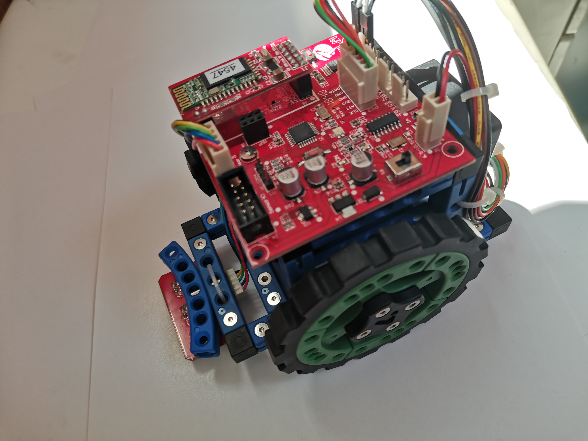
 
  TBot 輪型機器人，參加TIRT 國際機器人大賽，TBot 3對3足球賽，TBot輪型機器人，包含下列元素:
  1. 主控板使用TEMI MCBV2電路板
  2. 使用PS2無線搖桿當作控制操作介面
  3. 使用祥儀公司的機構組件
  4. 使用祥儀公司的DC減速馬達組件
  5. 使用18650 *2 充電電池
 

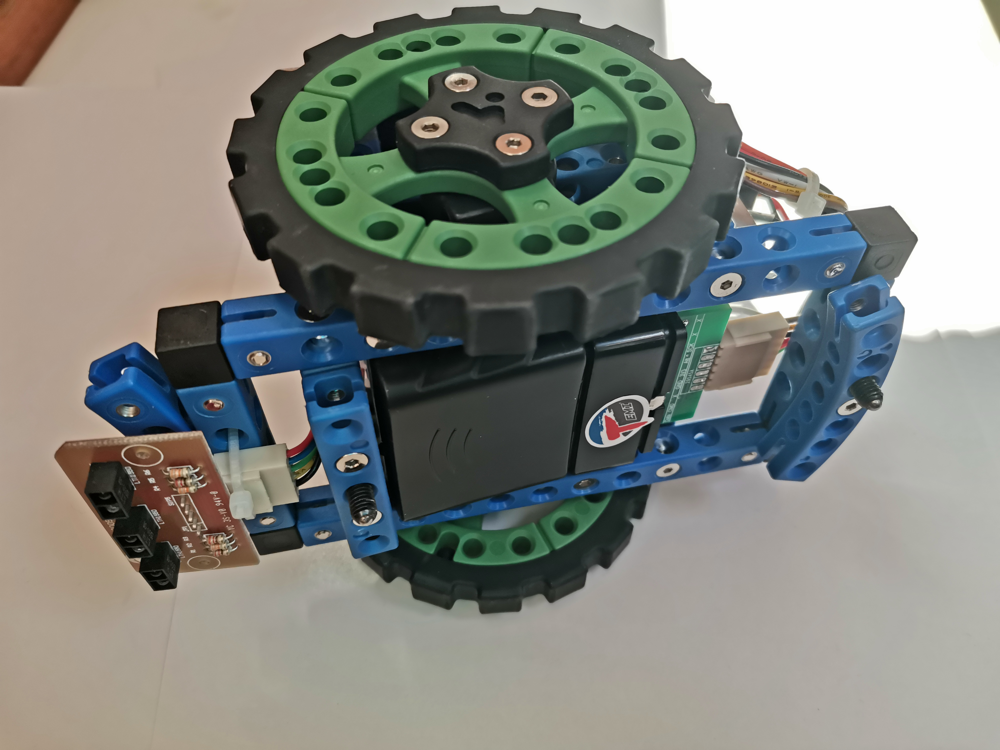

	第二個練習承上，改判斷三角形按鍵(綠色)按下時點亮綠色LED燈,判斷圓形按鍵(紅色)按下時點亮紅色LED燈,判斷X形按鍵(藍色)按下時點亮藍色LED燈；
	第三個練習承上，撰寫一個函數，將左右搖桿的XY數據，輸出到電腦的COM埠上；
	第四個練習承上，撰寫函數，將左右搖桿的XY數據，控制MCBV2的DC直流馬達驅動埠，利用左搖桿的XY數據，控制控制 小車，前進、後退、左轉、右轉....等功能

## 電路圖

### MCBV2 MCU區塊

### MCBV2 LED電路

 
電路中使用RGB共陽極之三色LED燈，
R、G、B LED的陽極連接330 歐姆的電阻，與MCBV2 MCU的 D4、D7、D8連接

故韌體程式令D4、D7、D8其中一腳輸出低準位(0、LOW、false)，即可使對應的LED亮。
其中:
紅色LED燈為LED_R ，接於D4
綠色LED燈為LED_G ，接於D7
藍色LED燈為LED_B ，接於D8

### MCBV2 PS2 搖桿介面電路

PS2遙桿Dongle使用DC3.3V電源，通訊協定使用4PIN通訊腳，PS_ATT為通訊致能腳，當PS_ATT(A4、D18)=Low，啟動通訊，PS_CLK(D2)為資料同步脈衝，PS_CMD(A5、D19)為MCU 的指令資料輸出腳，PS_DATA(D13)為PS2遙桿Dongle的資料輸出腳。
PS2搖桿內部使用MCU或ASIC處理晶片，讀取按鍵及搖桿軸需要時間，主機端不能一直訪問搖桿，訪問至少間隔16mS，讓搖桿接收器處裡收發遠端搖桿的數據。

PS_CLK  :   D2
PS_Att  :   D18
PS_CMD  :   D19
PS_Data :   D13
  
###  
* **無線PS2搖桿與MCBV2連接**
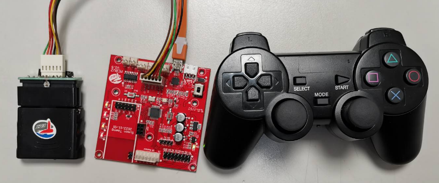
PS2無線搖桿接收器與MCBV2電路板，利用連接器串接起來，接線與插接接收器時，須注意腳位方向，錯誤的方向，會使接收器燒毀。

 

## PS2搖桿積木與操作
* **無線PS2搖桿積木**

無線PS2搖桿積木，於工具列 ==> IOT ==> 通訊 ==> PS2X搖桿控制器中，首先使用"設定PS2搖桿"，驅動MCBV2與PS2接收器連接，再使用"讀取PS2搖桿"獲取最新的搖桿狀態，最後利用檢查的積木，取出搖桿對應的按鍵或軸的數據，進行操作。

## 讀取PS2X Game PAD(協議通訊)
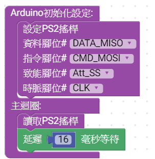

PS2無線搖桿接收器在Arduino初始化設定區塊，驅動MCBV2與接收器連接的腳位，使用預設即可。主迴圈安排讀取PS2積木，每次讀取後，需要延遲一段時間(大約16ms)，讓PS2搖桿接收器有時間與遠端的搖桿通訊，取得最新的狀態。

<a href="PS2_1.xml">下載積木程式檔 PS2_1.xml</a>

讀取PS2X Game PAD, Arduino 原始程式碼:

<pre><code>
#include  "PS2X_lib_temi.h"  // TEMI協會修改版本，PS2搖桿程式庫

PS2X ps2x; // create PS2 Controller Class //建立ps2x物件
byte  ps2x_vibrate = 0;  //ps2x搖桿振動變數，預設0不振動

void setup() {
  // 設定ps2x物件，輸入引數為接收器與MCBV2連接的腳位	
  ps2x.config_gamepad(2, 19, 18, 13, 0, 0);  //Setup PS2 Remote controller

}

void loop() {
      ps2x.read_gamepad(0, ps2x_vibrate);  //DualShock Controller//讀取PS2搖桿接收器的數據
  delay(16); //延遲16毫秒，給PS2接收器與搖桿通訊

}
</code></pre>

## 練習
### 第一個練習驅動PS2搖桿後定時讀取數據後，判斷按下的按鍵，如果 UP方向鍵按下時，點亮紅色LED燈
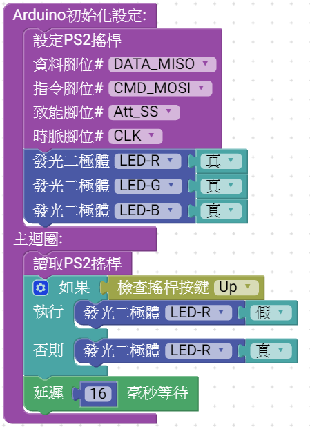
當讀取PS2搖桿後，即可利用取得的數據，判斷遠端PS2搖桿是否按下UP按鍵，當按下UP按鍵按下時，UP按鍵數據為1，反之為0，故當UP按鍵數據為1時，點亮紅色LED燈，否則則關閉紅色LED燈。處裡PS2搖桿的數據後，延遲16毫秒，給PS2搖桿接收器與搖桿通訊。

<a href="PS2_2.xml">下載積木程式檔 PS2_2.xml</a>

PS2搖桿控制紅色LED燈亮滅 Arduino 原始程式碼:

<pre><code>
#include  "PS2X_lib_temi.h"  // TEMI協會修改版本，PS2搖桿程式庫

PS2X ps2x; // create PS2 Controller Class //建立ps2x物件
byte  ps2x_vibrate = 0;  //ps2x搖桿振動變數，預設0不振動

void setup() {
  // 設定ps2x物件，輸入引數為接收器與MCBV2連接的腳位	
  ps2x.config_gamepad(2, 19, 18, 13, 0, 0);  //Setup PS2 Remote controller

  	pinMode(4, OUTPUT);
	pinMode(7, OUTPUT);
	pinMode(8, OUTPUT);

  	pinMode(4, OUTPUT);
  //初始化設定 LED燈，不亮
  digitalWrite(4,true);  //共陽極，給HIGH 不亮
  digitalWrite(7,true);
  digitalWrite(8,true);

}

void loop() {
      ps2x.read_gamepad(0, ps2x_vibrate);  //DualShock Controller//讀取PS2搖桿接收器的數據
  if (ps2x.Button(PSB_PAD_UP)) { // 判斷PS2搖桿數據，如果UP按鍵為1
    digitalWrite(4,false );      //    點亮紅色LED燈(共陽極，給LOW亮)
  } else {                       // 否則
    digitalWrite(4,true );      //    關閉紅色LED燈  
  }
  delay(16);                    //延遲16毫秒，給PS2接收器與搖桿通訊

}

</code></pre>

### 第二個練習承上，改判斷三角形按鍵(綠色)按下時點亮綠色LED燈,判斷圓形按鍵(紅色)按下時點亮紅色LED燈,判斷X形按鍵(藍色)按下時點亮藍色LED燈
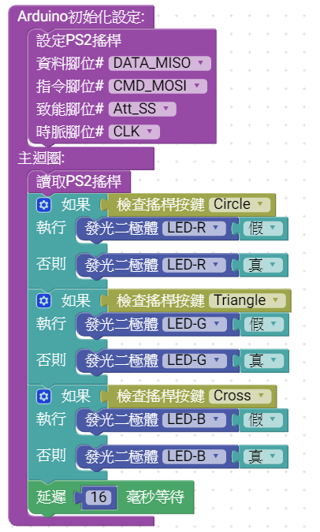 

當取得PS2搖桿接收器的數據後，判斷遠端PS2搖桿是否按下UP按鍵，當按下圓(紅)按鍵、三角形(綠)按鍵、X(藍)按鍵按下時，分別控制RGB 三色LED燈。

<a href="PS2_3.xml">下載積木程式檔 PS2_3.xml</a>

PS2搖桿控制R、G、B LED燈 Arduino 原始程式碼:

<pre><code>
#include  "PS2X_lib_temi.h"  // TEMI協會修改版本，PS2搖桿程式庫

PS2X ps2x; // create PS2 Controller Class //建立ps2x物件
byte  ps2x_vibrate = 0;  //ps2x搖桿振動變數，預設0不振動

void setup() {
  ps2x.config_gamepad(2, 19, 18, 13, 0, 0);  //Setup PS2 Remote controller

  	pinMode(4, OUTPUT);
  	pinMode(7, OUTPUT);
  	pinMode(8, OUTPUT);
}

void loop() {
      ps2x.read_gamepad(0, ps2x_vibrate);  //DualShock Controller
  if (ps2x.Button(PSB_CIRCLE)) {// 判斷PS2搖桿數據，如果CIRCLE按鍵為1
    digitalWrite(4,false );
  } else {
    digitalWrite(4,true );
  }
  if (ps2x.Button(PSB_TRIANGLE)) { // 判斷PS2搖桿數據，如果TRIANGLE按鍵為1
    digitalWrite(7,false );
  } else {
    digitalWrite(7,true );
  }
  if (ps2x.Button(PSB_CROSS)) {  // 判斷PS2搖桿數據，如果CROSS按鍵為1
    digitalWrite(8,false );
  } else {
    digitalWrite(8,true );
  }
  delay(16);

}

</code></pre>

由於PS2按鍵各自獨立有自己的數據，故三色LED燈可獨自控制亮滅，按鍵按下與釋放的組合，可控制LED燈有紅、綠、藍、黃、青、紫、白7種顏色的變化。

## 第三個練習承上，撰寫一個函數，將左右搖桿的XY數據，輸出到電腦的COM埠上

當取得PS2搖桿接收器的數據後，左、右側搖桿，分別是X及Y方向的可變電阻的位置數據。

其數據的範圍為0 ~ 255
X軸由左至右數據0 ~ 255變化，中間值為127
Y軸由上至下數據0 ~ 255變化，中間值為127
XY軸，可同時動作，依據位置拆解出X、Y值。

由於X、Y的數據是根據位置不同，數據動態變化，故本練習使用序列埠物件來將數據傳送到電腦以利觀察，並且建立一個 SerialPrintXY函數，來處理搖桿數據。

序列埠的通訊協定為500K BPS。

<a href="PS2_4.xml">下載積木程式檔 PS2_4.xml</a>

PS2搖桿左側X、Y軸數據傳送到電腦， Arduino 原始程式碼:

<pre><code>
#include  "PS2X_lib_temi.h"  // TEMI協會修改版本，PS2搖桿程式庫

PS2X ps2x; // create PS2 Controller Class //建立ps2x物件
byte  ps2x_vibrate = 0;  //ps2x搖桿振動變數，預設0不振動

// Describe this function...
void SerialPrintXY() {   //SerialPrintXY 函數
  // "輸出搖桿值"
  Serial.print(" LX:");                  // 序列埠傳送 " LX:" 字串
  Serial.print((ps2x.Analog(PSS_LX)));   // 序列埠PSS_LX軸數據(左X 0 ~ 255)
  Serial.print("       LY:");            // 序列埠傳送 "       LY:" 字串
  Serial.print((ps2x.Analog(PSS_LY)));   // 序列埠PSS_LY軸數據(左Y 0 ~ 255)
  Serial.print("      RX:");             // 序列埠傳送 "      RX:" 字串
  Serial.print((ps2x.Analog(PSS_RX)));   // 序列埠PSS_RX軸數據(右X 0 ~ 255)
  Serial.print("      RY:");             // 序列埠傳送 "      RY:" 字串
  Serial.println((ps2x.Analog(PSS_RY))); // 序列埠PSS_RY軸數據(右X 0 ~ 255)，並送出換行符號
}

void setup() {
  ps2x.config_gamepad(2, 19, 18, 13, 0, 0);  //Setup PS2 Remote controller

  Serial.begin(500000);   // 設定序列埠使用500000BPS來收發資料
}

void loop() {
      ps2x.read_gamepad(0, ps2x_vibrate);  //DualShock Controller
  SerialPrintXY();  // 呼叫SerialPrintXY函數
  delay(20);

}
</code></pre>

#### 編譯上傳程式到MCBV2電路板之後，啟動Arduino 的序列埠監控視窗

啟動後，點選 500000 bund

#### 可觀察收到PS2搖桿的左右搖桿的數據

#### 當改變PS2搖桿的左右搖桿的數據位置時，可觀察到數據變化。

## 第四個練習承上，撰寫函數，將左右搖桿的XY數據，控制MCBV2的DC直流馬達驅動埠，利用左搖桿的XY數據，控制控制 小車，前進、後退、左轉、右轉....等功能

### 定義PS2搖桿控制  小車運動方向

在操作PS2搖桿時，由於機構的關係，在搖桿中間區域，存在一些搖桿已經推動，但搖桿數據沒有變化的
死區，在搖桿上下，左右極限區域也同樣存在死區，為了讓搖桿控制 小車能夠更明確，如下表所示

將搖桿X、Y數據，個切割成3的區塊分別是左、中、右與上、中、下等，於是在搖桿操作範圍中，切割出9個動作區塊，以X、Y組合，分別是中上、中中、中下(X為中)，左上、左中、左下(X為左)，右上、右中、右下(X為右)，如將這九個區域，對應到電腦鍵盤數字鍵區的1 ~ 9。
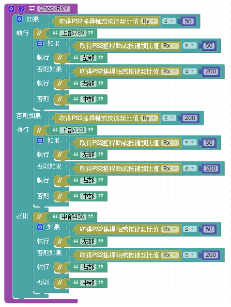

修改上表，對應控制 的功能如下

* **對應數字 1、2、3，分別是左退、後退與右退；**
  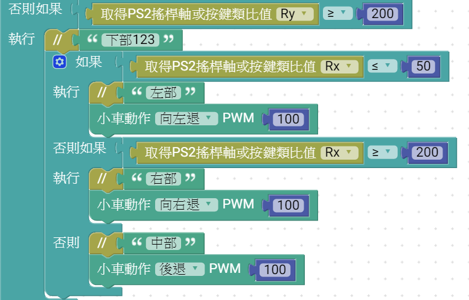
  插入控制 小車的積木，條件判斷式根據Y軸數據，當Y數據大於200時，即為Y軸處於下半區域數字1、2、3的位置，在判斷X軸的數值，X小於50時為左部(1)，X大於2000時為右部(3)，反之為中間(2)。
* **對應數字 7、8、9，分別是左轉、前進與右轉；**
  
    插入控制 小車的積木，條件判斷式根據Y軸數據，當Y數據小於50時，即為Y軸處於上半區域數字7、8、9的位置，在判斷X軸的數值，X小於50時為左部(7)，X大於2000時為右部(9)，反之為中間(8)。
* **對應數字 4、5、6，為停車；**

插入控制 小車的積木，條件判斷式根據Y軸數據，當Y數據介於50～200時，即為Y軸處於中間區域數字4、5、6的位置，在判斷X軸的數值，X小於50時為左部(4)，X大於2000時為右部(6)，反之為中間(5)。
### 完整的積木程式
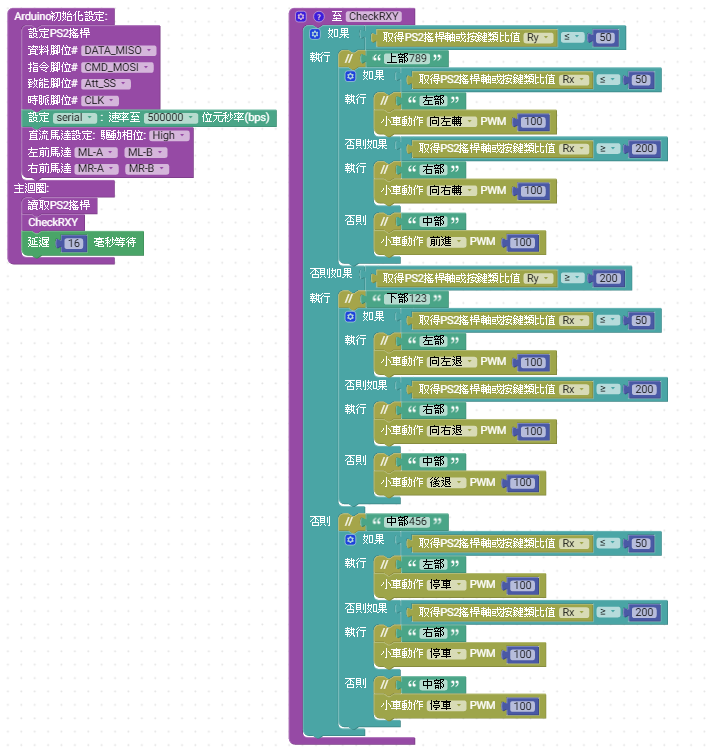
<a href="PS2_5.xml">下載積木程式檔 PS2_5.xml</a>

PS2搖桿控制  小車 Arduino 原始程式碼:

<pre><code>
#include  "PS2X_lib_temi.h"

#include "DCMotor.h"
#define _DCMotorPWM_Phase 1

PS2X ps2x; // create PS2 Controller Class
byte  ps2x_vibrate = 0;
DCMotor Motor = DCMotor(_DCMotorPWM_Phase);

// 描述該功能...
void CheckRXY() {
  if (ps2x.Analog(PSS_RY) <= 50) {
    // "上部789"
    if (ps2x.Analog(PSS_RX) <= 50) {
      // "左部"
      	Motor.RightForward(100);
    } else if (ps2x.Analog(PSS_RX) >= 200) {
      // "右部"
      	Motor.LeftForward(100);
    } else {
      // "中部"
      	Motor.Forward(100);
    }
  } else if (ps2x.Analog(PSS_RY) >= 200) {
    // "下部123"
    if (ps2x.Analog(PSS_RX) <= 50) {
      // "左部"
      	Motor.RightReverse(100);
    } else if (ps2x.Analog(PSS_RX) >= 200) {
      // "右部"
      	Motor.LeftReverse(100);
    } else {
      // "中部"
      	Motor.Reverse(100);
    }
  } else {
    // "中部456"
    if (ps2x.Analog(PSS_RX) <= 50) {
      // "左部"
      	Motor.Stop(100);
    } else if (ps2x.Analog(PSS_RX) >= 200) {
      // "右部"
      	Motor.Stop(100);
    } else {
      // "中部"
      	Motor.Stop(100);
    }
  }
}

void setup() {
  ps2x.config_gamepad(2, 19, 18, 13, 0, 0);  //Setup PS2 Remote controller

  Serial.begin(500000);
      //Setup Motor
    Motor.setMotorL(5, 6);
    Motor.setMotorR(10, 9);

}

void loop() {
      ps2x.read_gamepad(0, ps2x_vibrate);  //DualShock Controller
  CheckRXY();
  delay(16);

}
</code></pre>

### 利用左右搖桿控制小車，左搖桿快，右搖桿慢
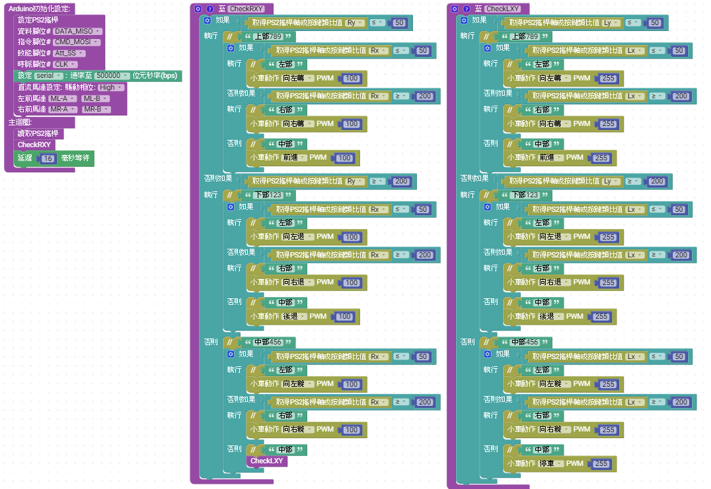

<a href="PS2_6.xml">下載積木程式檔 PS2_6.xml</a>

PS2搖桿控制小車，左右搖桿不同車速 Arduino 原始程式碼:

<pre><code>
#include  "PS2X_lib_temi.h"

#include "DCMotor.h"
#define _DCMotorPWM_Phase 1

PS2X ps2x; // create PS2 Controller Class
byte  ps2x_vibrate = 0;
DCMotor Motor = DCMotor(_DCMotorPWM_Phase);

// 描述該功能...
void CheckRXY() {
  if (ps2x.Analog(PSS_RY) <= 50) {
    // "上部789"
    if (ps2x.Analog(PSS_RX) <= 50) {
      // "左部"
      	Motor.RightForward(100);
    } else if (ps2x.Analog(PSS_RX) >= 200) {
      // "右部"
      	Motor.LeftForward(100);
    } else {
      // "中部"
      	Motor.Forward(100);
    }
  } else if (ps2x.Analog(PSS_RY) >= 200) {
    // "下部123"
    if (ps2x.Analog(PSS_RX) <= 50) {
      // "左部"
      	Motor.RightReverse(100);
    } else if (ps2x.Analog(PSS_RX) >= 200) {
      // "右部"
      	Motor.LeftReverse(100);
    } else {
      // "中部"
      	Motor.Reverse(100);
    }
  } else {
    // "中部456"
    if (ps2x.Analog(PSS_RX) <= 50) {
      // "左部"
      	Motor.Left(100);
    } else if (ps2x.Analog(PSS_RX) >= 200) {
      // "右部"
      	Motor.Right(100);
    } else {
      // "中部"
      CheckLXY();
    }
  }
}

// 描述該功能...
void CheckLXY() {
  if (ps2x.Analog(PSS_LY) <= 50) {
    // "上部789"
    if (ps2x.Analog(PSS_LX) <= 50) {
      // "左部"
      	Motor.RightForward(255);
    } else if (ps2x.Analog(PSS_LX) >= 200) {
      // "右部"
      	Motor.LeftForward(255);
    } else {
      // "中部"
      	Motor.Forward(255);
    }
  } else if (ps2x.Analog(PSS_LY) >= 200) {
    // "下部123"
    if (ps2x.Analog(PSS_LX) <= 50) {
      // "左部"
      	Motor.RightReverse(255);
    } else if (ps2x.Analog(PSS_LX) >= 200) {
      // "右部"
      	Motor.LeftReverse(255);
    } else {
      // "中部"
      	Motor.Reverse(255);
    }
  } else {
    // "中部456"
    if (ps2x.Analog(PSS_LX) <= 50) {
      // "左部"
      	Motor.Left(255);
    } else if (ps2x.Analog(PSS_LX) >= 200) {
      // "右部"
      	Motor.Right(255);
    } else {
      // "中部"
      	Motor.Stop(255);
    }
  }
}

void setup() {
  ps2x.config_gamepad(2, 19, 18, 13, 0, 0);  //Setup PS2 Remote controller

  Serial.begin(500000);
      //Setup Motor
    Motor.setMotorL(5, 6);
    Motor.setMotorR(10, 9);

}

void loop() {
      ps2x.read_gamepad(0, ps2x_vibrate);  //DualShock Controller
  CheckRXY();
  delay(16);

}
</code></pre>

## TBOT PS2積木程式

軟體功能:
1. 利用PS2 左、右搖桿搖桿操控TBOT遙控車，操作功能相同，但右搖桿為全速運作，左搖桿的運作速度可調 
2. 利用PS2搖桿的L2、L1、R2、R1等按鍵，調整左搖桿的運作速度  
   L2最慢(100)，L1最慢(150)，R2(200)，R1最快(255) 
3. 左、右搖桿搖桿操控TBOT遙控車動作:
    

| 軸值 | X=0 ~ 50 |  X=51 ~ 199 | X=200 ~ 255 |
| :-----| ----: | :----: | :----: |
| Y=0 ~ 50 | 向左轉 | 前進 | 向右轉 |
| Y=51 ~ 199 | 左旋 | 停車 | 右旋 |
| Y=200 ~ 255 | 向左退 | 後退 | 向右退 |

4. PS2 方向鍵(Up、 Down、Left、Right)及右邊三角形、X、方形、圓形等鍵，可操作控制，速度與左搖桿相同 

### 利用左右搖桿控制小車，左搖桿快，右搖桿慢
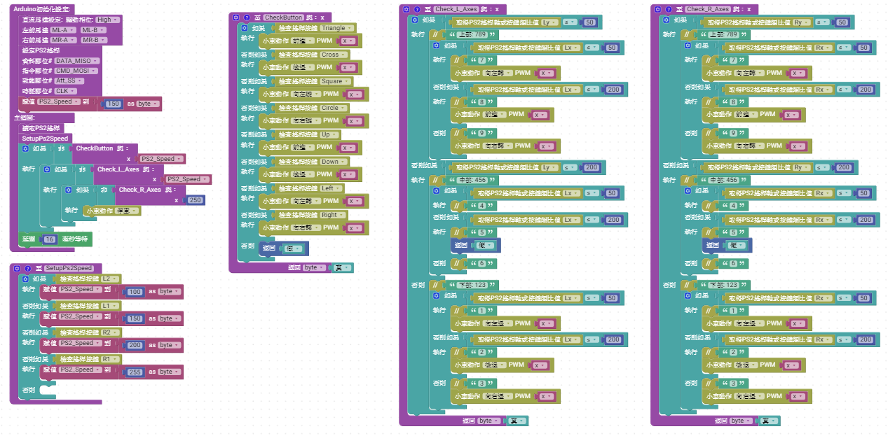  

### Arduino 初始化設定與主迴圈
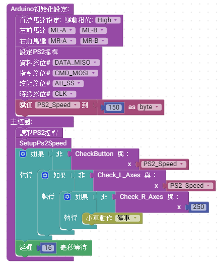 
#### 初始化設定: 
##### 驅動直流馬達及PS2搖桿接收器，建立一個PS2_Speed的變數，預設值為150。
##### PS2_Speed變數，提供設定直流馬達控制TBOT輪子的速度，由於祥儀公司TBOT的直流馬達轉速快，且TBOT的輪子直徑較大，故車速快時，不易操控，且容易打滑，操作時應適當調整車速。
##### 

#### 主迴圈:
##### ◆ 讀取PS2搖桿的狀態 
##### ◆ 呼叫SetupPs2Speed函數，根據搖桿的狀態，設定PS2_Speed變數的數值
##### ◆ 條件判斷式，呼叫相關函數，如果函數回傳值為0時，執行陳述句。
##### ▶條件判斷式-> 呼叫CheckButton函數傳入PS2_Speed變數的數值，檢查PS2搖桿的按鍵，來控制TBOT車，如果函數回傳1，表示函數內有對控制TBOT車進行操作，反之回傳0
##### ▶呼叫CheckButton函數回傳0時，執行條件判斷式-> 呼叫Check_L_Axes函數傳入PS2_Speed變數的數值，檢查PS2左搖桿控制TBOT車，如果函數回傳1，表示函數內有對控制TBOT車進行操作，反之回傳0
##### ▶呼叫Check_L_Axes函數回傳0時，執行條件判斷式-> 呼叫Check_R_Axes函數傳入250數值，檢查PS2左搖桿控制TBOT車，如果函數回傳1，表示函數內有對控制TBOT車進行操作，反之回傳0
##### ▶呼叫Check_R_Axes函數回傳0時，表示槽狀條件判斷式中呼叫的函數，都沒有對TBOT車進行操作，故令TBOT停車

### 設定左搖桿PWM速度參數 SetupPs2Speed
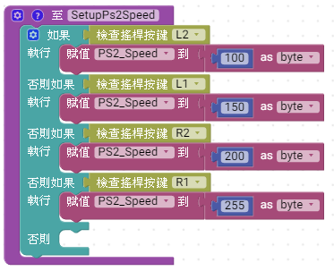 
SetupPs2Speed函數，條件判斷式，判斷PS2搖桿是否按下L2或L1或R2或R1鍵，
當按下L2鍵時，設定PS2_Speed的變數為100
否則如果當按下L1鍵時，設定PS2_Speed的變數為 150
否則如果當按下R2鍵時，設定PS2_Speed的變數為 200
否則如果當按下R1鍵時，設定PS2_Speed的變數為 255

PS2_Speed數值用來設定直流馬達驅動的PWM數據，數值0 ~ 255之間。

### PS2搖桿方向鍵操控 CheckButton
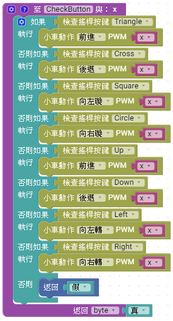 
CheckButton函數，條件判斷式，判斷PS2搖桿是否按下搖桿左右兩側的按鍵，函數傳入值，存入X

當按下三角形鍵時，令TBOT車前進
否則如果當按下X鍵時，令TBOT車後退，PWM傳入X數值
否則如當按下三角形鍵時，令TBOT車前進，PWM傳入X數值
否則如果當按下方形鍵時，令TBOT車向左旋，PWM傳入X數值
否則如果當按下圓形鍵時，令TBOT車向右旋，PWM傳入X數值
否則如果當按下UP鍵時，令TBOT車前進，PWM傳入X數值
否則如果當按下Down鍵時，令TBOT車後退，PWM傳入X數值
否則如果當按下Left鍵時，令TBOT車向左轉，PWM傳入X數值
否則如果當按下Right鍵時，令TBOT車向右轉，PWM傳入X數值
否則  函數返回，回傳0
函數返回，回傳1

### PS2搖桿左、右搖桿操控 Check_L_Axes
 
Check_L_Axes函數與Check_R_Axes函數，內容相同，但Check_L_Axes判斷LX、LY，Check_R_Axes判斷RX、RY，函數傳入值，存入X
判斷根據X、Y值，控制TBOT前進、後退、向左轉、向右轉、向左退、向右退
搖桿沒動作，函數返回傳0
搖桿有動作、函數返回傳1

主迴圈，呼叫Check_L_Axes函數，傳入PS2_Speed內容，故Check_L_Axes函數控制控制TBOT時，車速受PS2_Speed影響
Check_R_Axes函數，傳入200固定值，故Check_R_Axes函數控制控制TBOT時，車速 PWM= 200

### 下載積木程式檔
<a href="PS2_TBOT_01.xml">下載積木程式檔 PS2_TBOT_01.xml</a>

###  Arduino 原始程式碼

PS2搖桿控制小車，左右搖桿不同車速 Arduino 原始程式碼:

<pre><code>
#include "DCMotor.h"
#define _DCMotorPWM_Phase 1
#include  "PS2X_lib_temi.h"

byte PS2_Speed;
DCMotor Motor = DCMotor(_DCMotorPWM_Phase);
PS2X ps2x; // create PS2 Controller Class
byte  ps2x_vibrate = 0;

// Describe this function...
byte CheckButton(long x) {
  if (ps2x.Button(PSB_TRIANGLE)) {
    	Motor.Forward(x);
  } else if (ps2x.Button(PSB_CROSS)) {
    	Motor.Reverse(x);
  } else if (ps2x.Button(PSB_SQUARE)) {
    	Motor.Left(x);
  } else if (ps2x.Button(PSB_CIRCLE)) {
    	Motor.Right(x);
  } else if (ps2x.Button(PSB_PAD_UP)) {
    	Motor.Forward(x);
  } else if (ps2x.Button(PSB_PAD_DOWN)) {
    	Motor.Reverse(x);
  } else if (ps2x.Button(PSB_PAD_LEFT)) {
    	Motor.RightForward(x);
  } else if (ps2x.Button(PSB_PAD_RIGHT)) {
    	Motor.LeftForward(x);
  } else {
      return false;
  }
  return true;
}

// Describe this function...
byte Check_L_Axes(byte x) {
  if (ps2x.Analog(PSS_LY) <= 50) {
    // "上部: 789"
    if (ps2x.Analog(PSS_LX) <= 50) {
      // "7"
      	Motor.RightForward(x);
    } else if (ps2x.Analog(PSS_LX) <= 200) {
      // "8"
      	Motor.Forward(x);
    } else {
      // "9"
      	Motor.LeftForward(x);
    }
  } else if (ps2x.Analog(PSS_LY) <= 200) {
    // "中部: 456"
    if (ps2x.Analog(PSS_LX) <= 50) {
      // "4"
    } else if (ps2x.Analog(PSS_LX) <= 200) {
      // "5"
        return false;
    } else {
      // "6"
    }
  } else {
    // "下部: 123"
    if (ps2x.Analog(PSS_LX) <= 50) {
      // "1"
      	Motor.RightReverse(x);
    } else if (ps2x.Analog(PSS_LX) <= 200) {
      // "2"
      	Motor.Reverse(x);
    } else {
      // "3"
      	Motor.LeftReverse(x);
    }
  }
  return true;
}

// Describe this function...
byte Check_R_Axes(byte x) {
  if (ps2x.Analog(PSS_RY) <= 50) {
    // "上部: 789"
    if (ps2x.Analog(PSS_RX) <= 50) {
      // "7"
      	Motor.RightForward(x);
    } else if (ps2x.Analog(PSS_RX) <= 200) {
      // "8"
      	Motor.Forward(x);
    } else {
      // "9"
      	Motor.LeftForward(x);
    }
  } else if (ps2x.Analog(PSS_RY) <= 200) {
    // "中部: 456"
    if (ps2x.Analog(PSS_RX) <= 50) {
      // "4"
    } else if (ps2x.Analog(PSS_RX) <= 200) {
      // "5"
        return false;
    } else {
      // "6"
    }
  } else {
    // "下部: 123"
    if (ps2x.Analog(PSS_RX) <= 50) {
      // "1"
      	Motor.RightReverse(x);
    } else if (ps2x.Analog(PSS_RX) <= 200) {
      // "2"
      	Motor.Reverse(x);
    } else {
      // "3"
      	Motor.LeftReverse(x);
    }
  }
  return true;
}

// Describe this function...
void SetupPs2Speed() {
  if (ps2x.Button(PSB_L2)) {
    PS2_Speed = (byte)(100);
  } else if (ps2x.Button(PSB_L1)) {
    PS2_Speed = (byte)(150);
  } else if (ps2x.Button(PSB_R2)) {
    PS2_Speed = (byte)(200);
  } else if (ps2x.Button(PSB_R1)) {
    PS2_Speed = (byte)(255);
  } else {
  }
}

void setup() {
      //Setup Motor
    Motor.setMotorL(5, 6);
    Motor.setMotorR(10, 9);

  ps2x.config_gamepad(2, 19, 18, 13, 0, 0);  //Setup PS2 Remote controller

  PS2_Speed = (byte)(150);

}

void loop() {
      ps2x.read_gamepad(0, ps2x_vibrate);  //DualShock Controller
  SetupPs2Speed();
  if (!CheckButton(PS2_Speed)) {
    if (!Check_L_Axes(PS2_Speed)) {
      if (!Check_R_Axes(250)) {
        	Motor.Stop( _DCMotorPWM_Phase );
      }
    }
  }
  delay(16);

}

</code></pre>

