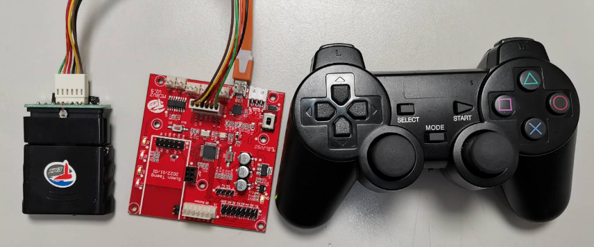

## 龍舟機器人 船身

## 龍舟機器人 船槳
船槳使用TT馬達驅動，MCBV2可以驅動2顆TT馬達，單馬達龍舟，連接於左馬達連接埠，使用PS2左、右搖桿的Y軸來控制。

## 龍舟機器人 船舵
船舵使用5V標準伺服馬達，連接於MCBV的J9(D3)，來驅動。預設伺服馬達的動作角度為90度。由於伺服馬達與船舵的連桿並非平行，故相同角度推拉，對船舵而言，產生不同的轉角。
   韌體部分，利用搖桿L1，R1，L2，R2來控制舵機的轉動角度。
船向右轉轉，舵機轉動角度小角度15及26度，向左轉轉，舵機轉動角度小角度20及33度。可得到接近的船舵轉角。

## 龍舟機器人 奪標龍頭
船首使用5V標準伺服馬達，連接於MCBV的J7(D11)，來驅動。預設伺服馬達的動作角度為90度。
   韌體部分，利用搖桿Up、三角形及Left、圓形等鍵來控制龍頭伺服馬達的動作。Left、圓形鍵令船首放下，進入奪標位置，角度為70度。Up、三角形為奪標鍵，令角度為110度(70度  110度)，動作0.3秒，產生上拋的動作後，回到90度位置。

## 電路圖

### MCBV2 MCU區塊

#### 5V伺服馬達Servo Motor
因為伺服電機具有回饋訊號控制，與藉由輸入脈沖訊號頻率，相位等，經解碼回饋控制轉速、角度或機構位置。標準型5V伺服馬達，為控制軸心角度，控制範圍0~180度。

#### ► 使用標準型伺服馬達時，請注意不要使用外力直接旋轉軸心，避免損壞伺服馬達內部機構。
#### ► 當機構及伺服馬達動作角度還沒定位前，請勿組裝鎖定。

### MCBV2 伺服馬達連接埠
MCBV2電路板，MCU連接埠為D12、D11及D3，使用前請注意，在硬體部分D12、D11與超音波測距模組介面共用，無法同時使用兩者周邊裝置。

### MCBV2 PS2 搖桿介面電路

PS2遙桿Dongle使用DC3.3V電源，通訊協定使用4PIN通訊腳，PS_ATT為通訊致能腳，當PS_ATT(A4、D18)=Low，啟動通訊，PS_CLK(D2)為資料同步脈衝，PS_CMD(A5、D19)為MCU 的指令資料輸出腳，PS_DATA(D13)為PS2遙桿Dongle的資料輸出腳。
PS2搖桿內部使用MCU或ASIC處理晶片，讀取按鍵及搖桿軸需要時間，主機端不能一直訪問搖桿，訪問至少間隔16mS，讓搖桿接收器處裡收發遠端搖桿的數據。

PS_CLK  :   D2
PS_Att  :   D18
PS_CMD  :   D19
PS_Data :   D13
  
###  
* **無線PS2搖桿與MCBV2連接**

PS2無線搖桿接收器與MCBV2電路板，利用連接器串接起來，接線與插接接收器時，須注意腳位方向，錯誤的方向，會使接收器燒毀。

 

## PS2搖桿積木與操作
## 讀取PS2X Game PAD(協議通訊)

PS2無線搖桿接收器在Arduino初始化設定區塊，驅動MCBV2與接收器連接的腳位，使用預設即可。主迴圈安排讀取PS2積木，每次讀取後，需要延遲一段時間(大約16ms)，讓PS2搖桿接收器有時間與遠端的搖桿通訊，取得最新的狀態。

<a href="PS2_1.xml">下載積木程式檔 PS2_1.xml</a>

讀取PS2X Game PAD, Arduino 原始程式碼:

<pre><code>
#include  <PS2X_lib_temi.h>  // TEMI協會修改版本，PS2搖桿程式庫

PS2X ps2x; // create PS2 Controller Class //建立ps2x物件
byte  ps2x_vibrate = 0;  //ps2x搖桿振動變數，預設0不振動

void setup() {
  // 設定ps2x物件，輸入引數為接收器與MCBV2連接的腳位	
  ps2x.config_gamepad(2, 19, 18, 13, 0, 0);  //Setup PS2 Remote controller

}

void loop() {
      ps2x.read_gamepad(0, ps2x_vibrate);  //DualShock Controller//讀取PS2搖桿接收器的數據
  delay(16); //延遲16毫秒，給PS2接收器與搖桿通訊

}
</code></pre>

##
## PS2控制小龍舟積木程式

積木程式分成4部分，1. Arduino 初始化及主程式；2. 小龍舟龍頭控制(HeadCtrl)；3. 小龍舟舵機控制(RudderCtrl)；4. 船槳控制(CheckRL_XY)。
### 初始化與主迴圈
#### 初始化

初始化階段，設定DC馬達驅動，須注意，DC馬達驅動，與原始設計給小車，由於小車馬達，左右兩邊的A¬-B輸入端，相反，如果使用單馬達驅動小船時，要將右馬達的驅動腳對調，才能讓馬達轉向正常。
驅動PS2搖桿接收器，即設定伺服馬達 D3，D11。
T_PWM 小船划槳速度設定變數。ServorCMDHold3、ServorCMDHold11用來延遲時間，等待伺服馬達指令到位後，關閉指令追蹤。RudderChangeFlag、HeadChangeFlag旗標，用來記錄伺服馬達動作中。

#### 主迴圈

程式主迴圈，讀取無線PS2搖桿後，根據讀取的按鍵值及軸值，控制小龍舟舵機(RudderCtrl)函數、小龍舟龍頭控制(HeadCtrl)函數及控制船槳程式(CheckRL_XY)函數。延遲16毫秒等待，提供PS2搖桿通訊用與伺服馬達動作時間單位。

#### HeadCtrl 龍舟龍頭控制(奪標)

利用搖桿Up、三角形及Left、圓形等鍵來控制龍頭伺服馬達的動作。Left、圓形鍵令船首放下，進入奪標位置，角度為70度。Up、三角形為奪標鍵，令角度為110度(70度  110度)，動作0.3秒，產生上拋的動作後，回到90度位置。
HeadCtrl函數，先利用邏輯條件判斷式(if elseif else)判斷如果ServoHold11變數大於0時，表示伺服馬達在動作中，則進入條件判斷式執行的陳述句，執行內容判斷ServoHold11是否等於1，如果等於1，表示伺服馬達在動作時間結束，讀取伺服馬達埠，使伺服馬達回饋追蹤功能停止。ServoHold11減一。
如果ServoHold11 等於0時，則執行否則陳述句。檢查紅色或向左鍵是否按下，如果按下，則檢查HeadChangeFlag旗標是否為假(否)，如果為否，表示剛按下，沒有執行過，則令伺服馬達動作至70度的位置，設定ServoHold11=20，動作持續20個時間單位(20*16ms)，設定HeadChangeFlag旗標為真(是)，表示已經使伺服馬達動作。
如果ServoHold11 等於0時，則執行否則陳述句。檢查綠色或向上鍵是否按下，如果按下，則檢查HeadChangeFlag旗標是否為假(否)，如果為否，表示剛按下，沒有執行過，則令伺服馬達動作至110度的位置，延遲0.3秒等待伺服馬達動作至110度後，伺令服馬達動作至90度，復位，設定ServoHold11=20，動作持續20個時間單位(20*16ms)，設定HeadChangeFlag旗標為真(是)，表示已經使伺服馬達動作。
如上，當按鍵按下時，HeadChangeFlag旗標為是，故其他可動作的按鍵將失效，等待全部可動作的按鍵放開後，檢查按鍵的程式會執行條件判斷式的否則陳述句，清除HeadChangeFlag旗標為否，讓下次按鍵按下時能再動作。
動作持續20個時間單位中，時間單位為主迴圈的”延遲16毫秒等待”積木所定義。

#### RudderCtrl 龍舟舵機控制(船行駛方向)

利用搖桿L1，R1，L2，R2來控制舵機的轉動角度。
船向右轉轉，舵機轉動角度小角度15及26度，向左轉轉，舵機轉動角度小角度20及33度。可得到接近的船舵轉角。
RudderCtrl函數，動作原理與HeadCtrl函數雷同，先利用邏輯條件判斷式(if elseif else)判斷對應的按鍵是否按下，按下則執行判斷檢查RudderChangeFlag旗標是否為假(否)，表示伺服馬達未於動作中，則根據按鍵，令伺服馬達轉至對應的角度後，設定ServoHold3=20，動作持續20個時間單位(20*16ms)，設定RudderChangeFlag旗標為真(是)，互斥其他按鍵動作，動作按鍵部分有L1、L2、R1、R2等鍵，控制不同的角度。當沒有按鍵按下時，否則陳述句判斷RudderChangeFlag旗標為真時，表示伺服馬達有觸發動作過，此時令伺服馬達回到90度位置，設定ServoHold3=20，動作持續20個時間單位(20*16ms)，設定RudderChangeFlag旗標為假(否)完成復歸船舵。
如果ServoHold3變數大於0時，表示伺服馬達在動作中，則進入條件判斷式執行的陳述句，執行內容判斷ServoHold3是否等於1，如果等於1，表示伺服馬達在動作時間結束，讀取伺服馬達埠，使伺服馬達回饋追蹤功能停止。ServoHold3減一。

#### CheckRL_XY 龍舟船槳控制(船行駛速度)

CheckL_XY函數，動作原理與控制小車動作雷同，驅動DC TT馬達，使用右搖桿的Y軸來控制，當系統使用伺服馬達時，MCBV2右馬達驅動將失去PWM的功能，因此龍舟使用左馬達(ML)來連接船槳的TT馬達。當搖桿往上推，則馬達正轉，船前進，往下推則船後退；操作時，如果動作相反，則需要在初始化階段，對調馬達的接腳。
函數先將右搖桿的X軸數值，輸入到T_PWM變數中，用來調整划槳的速度，判斷式將YY軸分成低於50、高於200及51~199之間，3部分，低於50令左馬達前進，高於200令左馬達後退，其他則停止左馬達。

####  速度與操控性調校

利用LY軸，來控制龍舟划槳速度為全速前進。如上所示，可以利用PS2搖桿的其他按鍵來定義T_PWM數值，達到分段控制速度的效果。
#### 

<a href="PS2_DragonBoat_0.xml">下載積木程式檔 PS2_DragonBoat_0.xml</a>

PS2搖桿控制  小龍舟 Arduino 原始程式碼:

<pre><code>
#include "DCMotor.h"
#define _DCMotorPWM_Phase 1
#include  <PS2X_lib_temi.h>

#include <Servo.h>

byte T_PWM;
byte ServorCMDHold3;
byte ServorCMDHold11;
boolean RudderChangeFlag;
boolean HeadChangeFlag;
byte temp;
DCMotor Motor = DCMotor(_DCMotorPWM_Phase);
PS2X ps2x; // create PS2 Controller Class
byte  ps2x_vibrate = 0;

Servo myServo3;
Servo myServo11;

// 描述該功能...
void RudderCtrl() {
  if (ps2x.Button(PSB_R1)) {
    if (RudderChangeFlag == false) {
      myServo3.write(57);
      ServorCMDHold3 = (byte)(20);
      RudderChangeFlag = (boolean)(true);
    }
  } else if (ps2x.Button(PSB_L1)) {
    if (RudderChangeFlag == false) {
      myServo3.write(116);
      ServorCMDHold3 = (byte)(20);
      RudderChangeFlag = (boolean)(true);
    }
  } else if (ps2x.Button(PSB_R2)) {
    if (RudderChangeFlag == false) {
      myServo3.write(70);
      ServorCMDHold3 = (byte)(20);
      RudderChangeFlag = (boolean)(true);
    }
  } else if (ps2x.Button(PSB_L2)) {
    if (RudderChangeFlag == false) {
      myServo3.write(105);
      ServorCMDHold3 = (byte)(20);
      RudderChangeFlag = (boolean)(true);
    }
  } else {
    if (RudderChangeFlag == true) {
      myServo3.write(90);
      ServorCMDHold3 = (byte)(20);
      RudderChangeFlag = (boolean)(false);
    }
  }
  if (ServorCMDHold3 > 0) {
    if (ServorCMDHold3 == 1) {
      temp = (byte)(myServo3.read());
    }
    ServorCMDHold3 -= 1;
  }
}

// 描述該功能...
void HeadCtrl() {
  if (ServorCMDHold11 > 0) {
    if (ServorCMDHold11 == 1) {
      temp = (byte)(myServo11.read());
    }
    ServorCMDHold11 -= 1;
  } else {
    if (ps2x.Button(PSB_RED) || ps2x.Button(PSB_PAD_LEFT)) {
      if (HeadChangeFlag == false) {
        myServo11.write(70);
        ServorCMDHold11 = (byte)(20);
        HeadChangeFlag = (boolean)(true);
      }
    } else if (ps2x.Button(PSB_GREEN) || ps2x.Button(PSB_PAD_UP)) {
      if (HeadChangeFlag == false) {
        myServo11.write(110);
        delay(300);
        myServo11.write(90);
        ServorCMDHold11 = (byte)(20);
        HeadChangeFlag = (boolean)(true);
      }
    } else {
      HeadChangeFlag = (boolean)(false);
    }
  }
}

// 描述該功能...
void CheckL_XY() {
  T_PWM = (byte)(ps2x.Analog(PSS_RX));
  if (ps2x.Analog(PSS_RY) <= 50) {
    Motor.motorLForward(T_PWM);
  } else if (ps2x.Analog(PSS_RY) >= 200) {
    Motor.motorLReverse(T_PWM);
  } else {
    Motor.motorLStop( _DCMotorPWM_Phase );
  }
}

void setup() {
      //Setup Motor
    Motor.setMotorL(5, 6);
    Motor.setMotorR(10, 9);

  ps2x.config_gamepad(2, 19, 18, 13, 0, 0);  //Setup PS2 Remote controller

  myServo3.attach(3);
  myServo11.attach(11);
  Serial.begin(57600);

  T_PWM = (byte)(255);
  ServorCMDHold3 = (byte)(20);
  ServorCMDHold11 = (byte)(20);
  RudderChangeFlag = (boolean)(false);
  HeadChangeFlag = (boolean)(false);
  myServo3.write(90);
  myServo11.write(90);

}

void loop() {
      ps2x.read_gamepad(0, ps2x_vibrate);  //DualShock Controller
  RudderCtrl();
  HeadCtrl();
  CheckL_XY();
  delay(16);

}
</code></pre>

### <a href="PS2_DragonBoat_01.xml">修改版 PS2_DragonBoat_01.xml</a>
### <a href="PS2_DragonBoat_11.xml">修改版 PS2_DragonBoat_11.xml</a>
PS2_DragonBoat_22.xml 版本，利用左搖桿，控制龍舟前進後退，龍頭部分，原綠色鍵及紅色鍵控制奪標動作，改到R1，R2鍵，右邊功能鍵(綠色鍵,紅色鍵,藍色鍵,粉紅色鍵)，取代LX功能，用來控制划槳的速度，右搖桿的X軸，取代原L2,L1,R2,R1，控制舵的角度。
### <a href="PS2_DragonBoat_22.xml">修改版 PS2_DragonBoat_22.xml</a>
